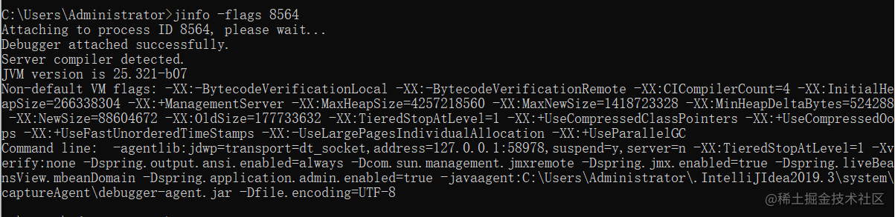

# JVM调优-常见的调优工具

[](https://juejin.cn/user/1680466685209543)

[llsydn](https://juejin.cn/user/1680466685209543)

2022年08月03日 21:34 · 阅读 5734

携手创作，共同成长！这是我参与「掘金日新计划 · 8 月更文挑战」的第8天，[点击查看活动详情](https://juejin.cn/post/7123120819437322247)

------

## 1.写在前面

前面分享了**常见的垃圾回收器**，详情可查看：[这里](https://juejin.cn/post/7127268544743473160)

基于该文章，我们了解了，**7种不同的垃圾回收器**，**以及这些垃圾回收器**底层是使用了什么算法，和它们的一些特点，运行机制等内容。

对于**老年代，新生代之间，垃圾回收器是如何搭配使用的**，这个话题，我们也给出了详细的说明。

既然，已经掌握了这些，那我们可以继续往下深入学习。例如：**如何进行jvm调优？**

在进行jvm调优前，那我们就得掌握一些jvm调优的一些工具！！！^_^

好，那今天我们继续的分享一下：**常见的调优工具**

好了，废话不多说，直接上干货。


## 2.Minor GC 、Major GC和 Full GC 有什么区别？

在分享**JVM调优工具**前，我们先来谈谈gc的一些知识点。

- 新生代收集（**Minor GC/Young GC**）：指目标只是新生代的垃圾收集。Minor GC 非常频繁，回收速度比较快。
- 老年代收集（**Major GC/Old GC**）：指目标只是老年代的垃圾收集， Major GC 一般比 Minor GC慢 10 倍以上。目前只有CMS收集器会有单独收集老年代的行为。
- 整堆收集（**Full GC**）：收集整个Java堆和方法区的垃圾收集。
- 混合收集（**Mixed GC**）：指目标是收集整个新生代以及部分老年代的垃圾收集。目前只有G1收集器会有这种行为。


## 3.JVM调优工具

### 3.1 JDK工具包

#### 3.1.1 jps

**jps**:Java Virtual Machine Process Status Tool

查看Java进程 ，相当于Linux下的ps命令，只不过它只列出Java进程。

```css
jps ：列出Java程序进程ID和Main函数名称
jps -q ：只输出进程ID
jps -m ：输出传递给Java进程（主函数）的参数
jps -l ：输出主函数的完整路径
jps -v ：显示传递给Java虚拟的参数
复制代码
```


> 可以**jps -l**看到，打印出我们的主函数类

#### 3.1.2 jstat

**jstat**:JVM Statistics Monitoring Tool

jstat可以查看Java程序运行时相关信息，可以通过它查看堆信息的相关情况

```xml
jstat -<options> [-t] [-h<lines>] <vmid> [<interval> [<count>]]
复制代码
options：由以下值构成
-class：显示ClassLoader的相关信息
-compiler：显示JIT编译的相关信息
-gc：显示与GC相关信息
-gccapacity：显示各个代的容量和使用情况
-gccause：显示垃圾收集相关信息（同-gcutil），同时显示最后一次或当前正在发生的垃圾收集的诱发原因
-gcnew：显示新生代信息
-gcnewcapacity：显示新生代大小和使用情况
-gcold：显示老年代信息
-gcoldcapacity：显示老年代大小
-gcpermcapacity：显示永久代大小
-gcutil：显示垃圾收集信息
复制代码
```

**示例：**

```bash
jstat -gcutil pid 5s 5
# 5s每隔 5 秒采样一次
# 5采样五次
复制代码
```


```properties
S0  年轻代中第一个survivor（幸存区）已使用的占当前容量百分比
S1  年轻代中第二个survivor（幸存区）已使用的占当前容量百分比
E   年轻代中Eden（伊甸园）已使用的占当前容量百分比
O   old代已使用的占当前容量百分比
M   metaspace已使用的占当前容量百分比
CCS 压缩使用比例
YGC 从应用程序启动到采样时年轻代中gc次数
YGCT 从应用程序启动到采样时年轻代中gc所用时间(s)
FGC 从应用程序启动到采样时old代(全gc)gc次数
FGCT 从应用程序启动到采样时old代(全gc)gc所用时间(s)
GCT 从应用程序启动到采样时gc用的总时间(s)
复制代码
```

#### 3.1.3 jinfo

**jinfo**：Java Configuration Info

jinfo可以用来查看正在运行的java程序的扩展参数，甚至支持运行时，修改部分参数

```shell
jinfo [option] <pid>
复制代码
-flags 打印虚拟机 VM 参数
-flag <name> 打印指定虚拟机 VM 参数
-flag [+|-]<name> 打开或关闭虚拟机参数
-flag <name>=<value> 设置指定虚拟机参数的值
复制代码
```

示例：



#### 3.1.4 jmap

**jmap**:Memory Map

jmap用来查看堆内存使用状况，一般结合jhat使用。

**参数：**

```properties
option： 选项参数。
pid： 需要打印配置信息的进程ID。
executable： 产生核心dump的Java可执行文件。
core： 需要打印配置信息的核心文件。
server-id： 可选的唯一id，如果相同的远程主机上运行了多台调试服务器，用此选项参数标识服务器。
remote server IP or hostname 远程调试服务器的IP地址或主机名。

option
no option： 查看进程的内存映像信息,类似 Solaris pmap 命令。
heap： 显示Java堆详细信息
histo[:live]： 显示堆中对象的统计信息
clstats：打印类加载器信息
finalizerinfo： 显示在F-Queue队列等待Finalizer线程执行finalizer方法的对象

dump:<dump-options>：生成堆转储快照
F： 当-dump没有响应时，使用-dump或者-histo参数. 在这个模式下,live子参数无效.
help：打印帮助信息
J<flag>：指定传递给运行jmap的JVM的参数

复制代码
```

**示例：heap**

命令：jmap -heap pid

描述：显示Java堆详细信息

打印一个堆的摘要信息，包括使用的GC算法、堆配置信息和各内存区域内存使用信息


哈哈，命令，有点多！！！

> 记住，这些命令，不需要死记硬背的，用到的时候，面向百度即可！！！


### 3.2 VisualVM工具

开发大型 Java 应用程序的过程中难免遇到内存泄露、性能瓶颈等问题，比如文件、网络、数据库的连接未释放，未优化的算法等。

随着应用程序的持续运行，可能会造成整个系统运行效率下降，严重的则会造成系统崩溃。为了找出程序中隐藏的这些问题，在项目开发后期往往会使用性能分析工具来对应用程序的性能进行分析和优化。

**VisualVM** 是一款免费的性能分析工具。同时，它能自动选择更快更轻量级的技术尽量减少性能分析对应用程序造成的影响，提高性能分析的精度。

一般来说，jdk都会自带该工具，具体的路径，为安装的jdk路径下面。


> 直接双击即可打开。


直接可以监控到java进程，双击打开需要监控的java进程即可。

### 3.3 MemoryAnalyzer工具

Memory Analyzer (Eclipse MAT)是一个跨平台的开源工具，您不仅可以用它来分析内存问题，也可以用来监控整个 Java 应用程序的状态和行为。通过读取应用程序运行时由 Java 运行时环境生成的转储文件快照，Memory Analyzer 使您能够分析那些调试代码可能无法发现的复杂问题。

> 这里分享一个下载连接:

```arduino
链接：https://pan.baidu.com/s/1Cy4owFs8SM6ZgAUDfIy2NA 
提取码：0hly
复制代码
```

下载后，直接解压即可使用：


装入heap dump文件


分析：


> 这样就可以分析我们的heap dump文件，快速找到内存泄漏的地方。

### 3.4 第三方 GCEasy

> [gceasy.io/](https://link.juejin.cn/?target=https%3A%2F%2Fgceasy.io%2F)

业界首先采用机器学习算法解决GC日志分析问题，GCeasy内置机器智能可以自动检测JVM和Android GC日志中的问题，并推荐解决方案。

GC日志分析是免费的， **Machine Learning** 收费

- 几秒内解决GC和内存问题
- JVM堆优化建议
- 机器学习算法

------

好了，以上就是常见的调优工具的分享了。

个人理解，可能也不够全面，班门弄斧了。

今天就先到这里了，掰掰了！！！^_^

如果觉得有收获的，帮忙`点赞、评论、收藏`一下呗！！！

