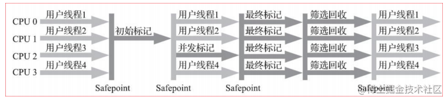

## 1.写在前面

前面分享了**GC基本原理和调优关键分析**，详情可查看：[这里](https://juejin.cn/post/7126918474646945800)

基于该文章，我们了解了，**如何找到垃圾**，**如何使用垃圾回收器清除垃圾**。

我们之前已经给出了**有 7 种不同的垃圾回收器**，大概的讲了一下，这些垃圾回收器的搭配，对应于那个**年代(老年代、新生代)** 的垃圾回收。

那今天我们继续详细的分享一下：**JVM垃圾收集器**

这些垃圾回收器，具体的一些原理。

好了，废话不多说，直接上干货。(纯理论比较多，大家伙耐心点看)

> 哈哈，绝对有收获，没收获的轻点喷！！！^_^

| 新生代            | 老年代       |
| ----------------- | ------------ |
| Serial            | Serial Old   |
| Serial            | CMS          |
| ParNew            | Serial Old   |
| ParNew            | CMS          |
| Parallel Scavenge | Serial Old   |
| Parallel Scavenge | Parallel Old |
| G1                | G1           |

> 这里先贴一下，常见的垃圾回收器。

## 2.JVM垃圾收集器

### 2.1.串行收集器(Serial)

#### 2.1.1 基本概念

使用**单线程**进行垃圾回收的收集器，每次回收时，串行收集器只有一个工作线程，对于**并行能力较弱**的计算机来说，串行收集器的专注性和独占性往往有更好的性能表现。

串行收集器可以在**新生代**和**老年代**中使用，根据作用于不同的堆空间，分为新生代串行收集器和老年代收集器。

配置参数 **-XX:+UseSerialGC** ：年轻串行（**Serial**），老年串行（**Serial Old**）

#### 2.1.2 Serial收集器：年轻串行

Serial收集器是一个新生代收集器，单线程执行，使用**复制算法**。它在进行垃圾收集时，必须暂停其他所有的工作线程(用户线程)。是JVM Client模式下默认的新生代收集器。对于限定单个CPU的环境来说，Serial收集器由于没有线程交互的开销，专心做垃圾收集自然可以获得最高的**单线程收集效率**。

> 这里说的**复制算法**，大家伙，还有记得不？
>
> 就是我们上一篇说得的**三种垃圾清除算法**。
>
> 哈哈，估计都忘了吧？这里，咋们再回顾一下

1. Mark-Sweep 标记清除算法
2. Copying 拷贝算法
3. Mark-Compact 标记压缩算法

#### 2.1.3 Serial Old收集器：老年串行

- Serial收集器的老年代版本，它同样是一个单线程收集器，使用 **“标记-整理”算法**。
- 主要意义也是在于给Client模式下的虚拟机使用。

这里，解析一下**什么是safe point？**

挂起线程的点

- 从全局观点来看，所有线程必须在GC 运行前，在一个safepoint处阻塞（block）。
- 从局部观点来看，safepoint是一个代码块中特殊的一点，该处正在执行的线程可以因GC而阻塞。
- GC的标记阶段需要stop the world，让所有Java线程挂起，这样JVM才可以安全地来标记对象。

**safepoint**可以用来实现让所有Java线程挂起的需求。这是一种 **"主动式"**(Voluntary Suspension)的实现

safe point指的特定位置主要有:

1. 循环的末尾 (防止大循环的时候一直不进入safepoint，而其他线程在等待它进入safepoint)
2. 方法返回前
3. 调用方法的call之后
4. 抛出异常的位置

> 以上的两种，就是**串行的垃圾收集器**了，下面继续分析**并行的垃圾收集器**。

### 2.2. 并行收集器

#### 2.2.1 Parallel Scavenge收集器

配置参数：**-XX:+UseParallelGC**

目标是达到一个可控制的吞吐量（Throughput）。

吞吐量 = 运行用户代码时间 /（运行用户代码时间+垃圾收集时间）。

虚拟机总共运行了 100 分钟，其中垃圾收集花掉 1 分钟，那吞吐量就是99%。

特点：

- 新生代使用**并行回收收集器**，老年代使用**串行收集器**
- 吞吐量优先收集器
- 新生代收集器**复制算法**，是并行的多线程收集器。

这里，有必要，解析一下**什么是并发，什么是并行？**

- **并行（Parallel）**：指多条垃圾收集线程并行工作，但此时用户线程仍然处于等待态。
- **并发（Concurrent）**：指用户线程与垃圾收集线程同时执行（但不一定是并行的，可能会交替执行），用户程序在继续运行，而垃圾收集程序运行于另一个CPU上。

> 答应我，别再傻傻分不清楚了！

#### 2.2.2 Parallel Old收集器

配置参数：**-XX:+UseParallelOldGC**

特点：

- Parallel Scavenge收集器的老年代版本，使用多线程和 **“标记-整理”算法**。
- 在注重吞吐量以及CPU资源敏感的场合，都可以优先考虑**Parallel Scavenge**加**Parallel Old**收集器。

#### 2.2.3 ParNew收集器

配置参数：**-XX:+UseParNewGC**

配置参数：**-XX:ParallelGCThreads=n** 设置并行收集器收集时使用的并行收集线程数。一般最好和计算机的CPU相当

特点：

- 新生代并行（ParNew），老年代串行（Serial Old）
- Serial收集器的多线程版本
- 单CPU性能并不如Serial，因为存在线程交互的开销

#### 2.2.4 CMS收集器

配置参数：**-XX:+UseConcMarkSweepGC** 应用CMS收集器。

尽管CMS收集器采用的是 **并发回收（非独占式）** ，但是在其**初始标记**和**重新标记**这两个阶段中仍然需要执行“Stop-the-World”机制暂停程序中的工作线程，不过暂停时间并不会太长。

因此可以说明 **目前所有的垃圾收集器都做不到完全不需要“stop-the-World** ， **只是尽可能地缩短暂停时间** 。

由于最耗费时间的**并发标记**与**并发清除**阶段都不需要暂停工作，所以整体的回收是低停顿的。

另外，由于在垃圾收集阶段**用户线程没有中断** ，所以在CMS回收过程中，还应该确保应用程序用户线程有足够的内存可用。

**特点:**

- 低延迟： 减少STW对用户体验的影响【响应时间和延迟要求高】
- 并发收集：可以同时执行用户线程
- CMS收集器 不能像其他收集器那样等到老年代几乎完全被填满了再进行收集 ，而是当堆内存使用率达到某一阈值时，便开始进行回收。
- CMS收集器的垃圾收集算法采用的是标记清除算法。
- 会产生内存碎片，导致并发清除后，用户线程可用的空间不足。
- CMS收集器对CPU资源非常敏感。

CMS垃圾回收器：

CMS整个过程比之前的收集器要复杂，整个过程分为 4 个主要阶段，即**初始标记阶段**、**并发标记阶段**、**重新标记阶段**和**并发清除阶段**。

> ( 涉及STW的阶段主要是：**初始标记** 和 **重新标记** )

- **初始标记**（Initial-Mark）阶段 ：在这个阶段中，程序中所有的工作线程都将会因为“stop-the-world”机制而出现短暂的暂停，这个阶段的主要任务仅仅只是标记出GCRoots能直接关联到的对象。一旦标记完成之后就会恢复之前被暂停的所有应用线程。由于直接关联对象比较小，所以这里的速度非常快。【STW】
- **并发标记**（Concurrent-Mark）阶段 ：从GC Roots的直接关联对象开始遍历整个对象图的过程，这个过程耗时较长但是不需要停顿用户线程，可以与垃圾收集线程一起并发运行。
- **重新标记**（Remark）阶段 ：由于在并发标记阶段中，程序的工作线程会和垃圾收集线程同时运行或者交叉运行，因此为了 修正并发标记期间，因用户程序继续运作而导致标记产生变动的那一部分对象的标记记录 ，这个阶段的停顿时间通常会比初始标记阶段稍长一些，但也远比并发标记阶段的时间短。【STW】
- **并发清除**（Concurrent-Sweep）阶段 ：此阶段清理删除掉标记阶段判断的已经死亡的对象，释放内存空间。由于不需要移动存活对象，所以这个阶段也是可以与用户线程同时并发的。

> 好吧，有点长了，坚持一下，快完了！！！

#### 2.2.5 G1（Garbage-First）收集器

配置参数：**-XX:+UseG1Gc** 应用G1收集器

配置参数：**-XX:MaxGCPauseMillis** 指定最大停顿时间

配置参数：**-XX:ParallelGCThreads** 设置并行回收的线程数量

Garbage-First当今收集器技术发展的最前沿成果之一，G1是一款面向服务端应用的垃圾收集器。大内存，企业配置的垃圾收集器大多都是G1。

特点：

1. 并行与并发：充分利用多CPU、多核环境下的硬件优势
2. 分代收集：不需要其他收集器配合就能独立管理整个GC堆
3. 空间整合：“标记—整理”算法实现的收集器，局部上基于“复制”算法不会产生内存空间碎片
4. 可预测的停顿：能让使用者明确指定在一个长度为M毫秒的时间片段内，消耗在垃圾收集上的时间不得超过N毫秒

G1收集器的运作大致可划分为以下几个步骤：

1. **初始标记**：标记一下GC Roots能直接关联到的对象，需要停顿线程，但耗时很短
2. **并发标记**：是从GC Root开始对堆中对象进行可达性分析，找出存活的对象，这阶段耗时较长，但可与用户程序并发执行
3. **最终标记**：修正在并发标记期间因用户程序继续运作而导致标记产生变动的那一部分标记记录
4. **筛选回收**：对各个Region的回收价值和成本进行排序，根据用户所期望的GC停顿时间来制定回收计划

> 好了，以上就是**并行收集器**的描述了。
>
> 哈哈，可能有点长，耐心点看吧！！！

**总结**

在众多的垃圾回收器中，没有最好的，只有最适合应用的回收器，根据应用软件的特性以及硬件平台的特点，选择不同的垃圾回收器，才能有效的提高系统性能。

------

好了，以上就是我个人的经验的分享了。

个人理解，可能也不够全面，班门弄斧了。

今天就先到这里了，掰掰了！！！^_^

如果觉得有收获的，帮忙`点赞、评论、收藏`一下呗！！！

作者：llsydn
链接：https://juejin.cn/post/7127268544743473160
来源：稀土掘金
著作权归作者所有。商业转载请联系作者获得授权，非商业转载请注明出处。