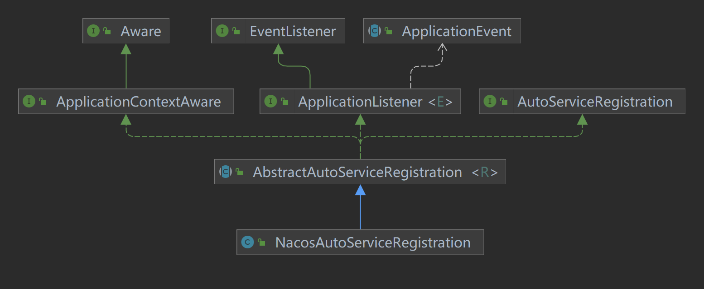

#NacosAutoServiceRegistration类，实现了接口ApplicationListener类；




```java
//实现该接口的类，都需要实现onApplicationEvent方法。
@FunctionalInterface
public interface ApplicationListener<E extends ApplicationEvent> extends EventListener {
    void onApplicationEvent(E var1);
}
```


```java
public interface EventListener {
}
```


```java
//org.springframework.cloud.client.serviceregistry.AbstractAutoServiceRegistration#onApplicationEvent 
//WebServerInitializedEvent：webServer初始化完成事件。
public void onApplicationEvent(WebServerInitializedEvent event) {
        this.bind(event);//开始执行 bind方法
    }
//org.springframework.cloud.client.serviceregistry.AbstractAutoServiceRegistration#bind
    @Deprecated
    public void bind(WebServerInitializedEvent event) {
        ApplicationContext context = event.getApplicationContext();
        if (!(context instanceof ConfigurableWebServerApplicationContext) || !"management".equals(((ConfigurableWebServerApplicationContext)context).getServerNamespace())) {
            this.port.compareAndSet(0, event.getWebServer().getPort());
            this.start();//开始注册服务和实例
        }
    }


//org.springframework.cloud.client.serviceregistry.AbstractAutoServiceRegistration#start
public void start() {
        if (!this.isEnabled()) {
            if (logger.isDebugEnabled()) {
                logger.debug("Discovery Lifecycle disabled. Not starting");
            }

        } else {
            if (!this.running.get()) {
                //发布实例注册前事件
                this.context.publishEvent(new InstancePreRegisteredEvent(this, this.getRegistration()));
                this.register();//注册服务和实例
                if (this.shouldRegisterManagement()) {
                    this.registerManagement();
                }
//发布实例注册后事件
                this.context.publishEvent(new InstanceRegisteredEvent(this, this.getConfiguration()));
                this.running.compareAndSet(false, true);
            }

        }
    }
//org.springframework.cloud.client.serviceregistry.AbstractAutoServiceRegistration#register
    protected void register() {
        this.serviceRegistry.register(this.getRegistration());
    }
```


```java
//com.alibaba.cloud.nacos.registry.NacosServiceRegistry#register
public void register(Registration registration) {
        if (StringUtils.isEmpty(registration.getServiceId())) {
            log.warn("No service to register for nacos client...");
        } else {
            NamingService namingService = this.namingService();//获得NamingService服务
            String serviceId = registration.getServiceId();//获取ServiceId
            String group = this.nacosDiscoveryProperties.getGroup();//获取组名称
            Instance instance = this.getNacosInstanceFromRegistration(registration);//获取实例

            try {
                namingService.registerInstance(serviceId, group, instance);//注册实例
                log.info("nacos registry, {} {} {}:{} register finished", new Object[]{group, serviceId, instance.getIp(), instance.getPort()});
            } catch (Exception var7) {
                if (this.nacosDiscoveryProperties.isFailFast()) {
                    log.error("nacos registry, {} register failed...{},", new Object[]{serviceId, registration.toString(), var7});
                    ReflectionUtils.rethrowRuntimeException(var7);
                } else {
                    log.warn("Failfast is false. {} register failed...{},", new Object[]{serviceId, registration.toString(), var7});
                }
            }

        }
    }
```


```java
//com.alibaba.nacos.client.naming.NacosNamingService#registerInstance
public void registerInstance(String serviceName, String groupName, Instance instance) throws NacosException {
        NamingUtils.checkInstanceIsLegal(instance);//检查实例是否合法
        String groupedServiceName = NamingUtils.getGroupedName(serviceName, groupName);
        if (instance.isEphemeral()) {//判断是否是瞬时实例
            BeatInfo beatInfo = this.beatReactor.buildBeatInfo(groupedServiceName, instance);
            this.beatReactor.addBeatInfo(groupedServiceName, beatInfo);
        }
		//注册服务方法
        this.serverProxy.registerService(groupedServiceName, groupName, instance);
    }
```


```java
//com.alibaba.nacos.client.naming.net.NamingProxy#registerService
public void registerService(String serviceName, String groupName, Instance instance) throws NacosException {
        LogUtils.NAMING_LOGGER.info("[REGISTER-SERVICE] {} registering service {} with instance: {}", new Object[]{this.namespaceId, serviceName, instance});
    	//开始设置Api的参数
        Map<String, String> params = new HashMap(16);
        params.put("namespaceId", this.namespaceId);
        params.put("serviceName", serviceName);
        params.put("groupName", groupName);
        params.put("clusterName", instance.getClusterName());
        params.put("ip", instance.getIp());
        params.put("port", String.valueOf(instance.getPort()));
        params.put("weight", String.valueOf(instance.getWeight()));
        params.put("enable", String.valueOf(instance.isEnabled()));
        params.put("healthy", String.valueOf(instance.isHealthy()));
        params.put("ephemeral", String.valueOf(instance.isEphemeral()));
        params.put("metadata", JacksonUtils.toJson(instance.getMetadata()));
    //调用API
        this.reqApi(UtilAndComs.nacosUrlInstance, params, "POST");
    }
```


```java
//:com/alibaba/nacos/client/naming/utils/UtilAndComs.class
static {
        VERSION = "Nacos-Java-Client:v" + VersionUtils.version;
        webContext = "/nacos";
        nacosUrlBase = webContext + "/v1/ns";//URL的基础
        nacosUrlInstance = nacosUrlBase + "/instance";//注册实例的URL
        nacosUrlService = nacosUrlBase + "/service";//注册实例的URL
        DEFAULT_CLIENT_BEAT_THREAD_COUNT = Runtime.getRuntime().availableProcessors() > 1 ? Runtime.getRuntime().availableProcessors() / 2 : 1;
        DEFAULT_POLLING_THREAD_COUNT = Runtime.getRuntime().availableProcessors() > 1 ? Runtime.getRuntime().availableProcessors() / 2 : 1;
    }
```


```java
//com.alibaba.nacos.client.naming.net.NamingProxy#reqApi
public String reqApi(String api, Map<String, String> params, Map<String, String> body, List<String> servers, String method) throws NacosException {
        params.put("namespaceId", this.getNamespaceId());
        if (CollectionUtils.isEmpty(servers) && StringUtils.isBlank(this.nacosDomain)) {
            throw new NacosException(400, "no server available");
        } else {
            NacosException exception = new NacosException();
            //nacosDomain:localhost:8848;Nacos服务的域名和端口
            if (StringUtils.isNotBlank(this.nacosDomain)) {
                int i = 0;

                while(i < this.maxRetry) {//this.maxRetry:最大重试次数，默认为3；
                    try {
                        //真正的调用服务的方法
                        return this.callServer(api, params, body, this.nacosDomain, method);
                    } catch (NacosException var12) {
                        exception = var12;
                        if (LogUtils.NAMING_LOGGER.isDebugEnabled()) {
                            LogUtils.NAMING_LOGGER.debug("request {} failed.", this.nacosDomain, var12);
                        }

                        ++i;
                    }
                }
            } else {
                Random random = new Random(System.currentTimeMillis());
                int index = random.nextInt(servers.size());
                int i = 0;

                while(i < servers.size()) {
                    String server = (String)servers.get(index);

                    try {
                        //真正的调用服务的方法
                        return this.callServer(api, params, body, server, method);
                    } catch (NacosException var13) {
                        exception = var13;
                        if (LogUtils.NAMING_LOGGER.isDebugEnabled()) {
                            LogUtils.NAMING_LOGGER.debug("request {} failed.", server, var13);
                        }

                        index = (index + 1) % servers.size();
                        ++i;
                    }
                }
            }

            LogUtils.NAMING_LOGGER.error("request: {} failed, servers: {}, code: {}, msg: {}", new Object[]{api, servers, exception.getErrCode(), exception.getErrMsg()});
            throw new NacosException(exception.getErrCode(), "failed to req API:" + api + " after all servers(" + servers + ") tried: " + exception.getMessage());
        }
    }
```


```java
//com.alibaba.nacos.client.naming.net.NamingProxy#callServer
public String callServer(String api, Map<String, String> params, Map<String, String> body, String curServer, String method) throws NacosException {
        long start = System.currentTimeMillis();
        long end = 0L;
        this.injectSecurityInfo(params);
        Header header = this.builderHeader();
        String url;
    //拼接完整的URI
        if (!curServer.startsWith("https://") && !curServer.startsWith("http://")) {
            if (!IPUtil.containsPort(curServer)) {
                curServer = curServer + ":" + this.serverPort;
            }

            url = NamingHttpClientManager.getInstance().getPrefix() + curServer + api;
        } else {
            url = curServer + api;
        }

        try {
            //通过封装的RestTemplate发起远程通讯(对于程序来讲，不是自己服务的其他服务就是远程通讯)
            //restResult：返回结果。
            HttpRestResult<String> restResult = this.nacosRestTemplate.exchangeForm(url, header, Query.newInstance().initParams(params), body, method, String.class);
            end = System.currentTimeMillis();
            MetricsMonitor.getNamingRequestMonitor(method, url, String.valueOf(restResult.getCode())).observe((double)(end - start));
            if (restResult.ok()) {
                return (String)restResult.getData();
            } else if (304 == restResult.getCode()) {
                return "";
            } else {
                throw new NacosException(restResult.getCode(), restResult.getMessage());
            }
        } catch (Exception var13) {
            LogUtils.NAMING_LOGGER.error("[NA] failed to request", var13);
            throw new NacosException(500, var13);
        }
    }
```

