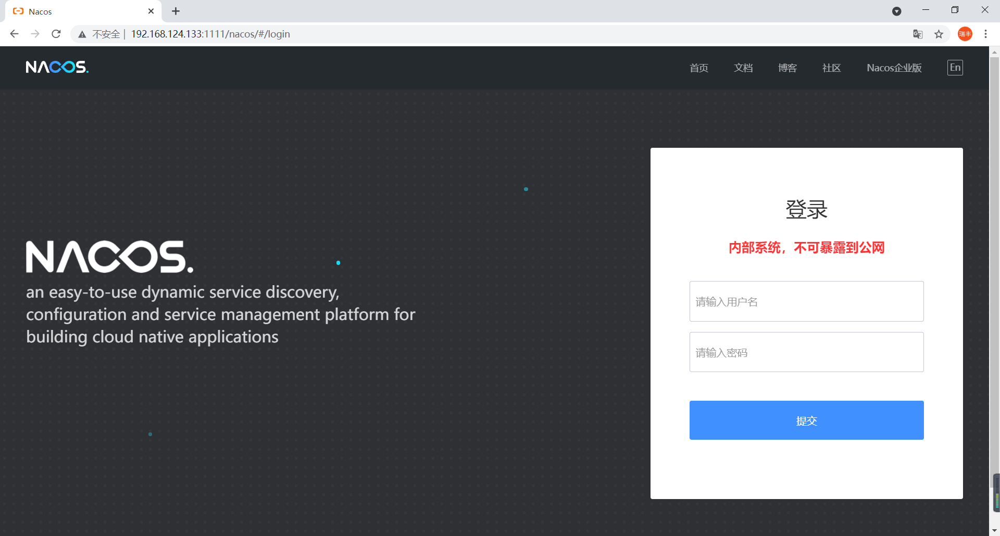
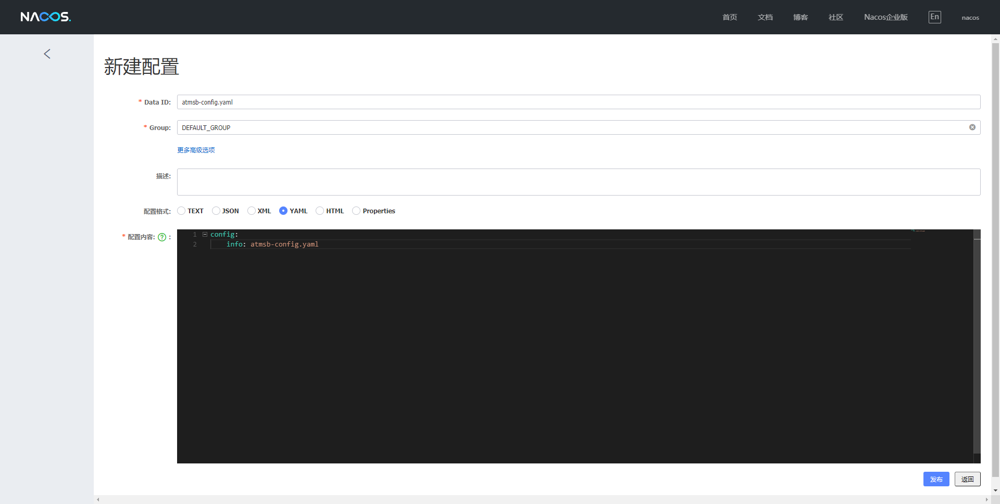

# Nacos集群配置

 

## 更改Nacos启动命令配置原理

我们现在知道，想要启动Naocs只需要启动startup.sh命令即可，但是如果启动3个Nacos那？所以如果我们需要启动多个Nacos，其实Nacos本身默认启动就是集群模式。

注意点：如果是linux虚拟机，需要分配至少4g以上内存

## 具体配置

### Linux服务器上MySql数据库配置

1. 在Linux系统上执行SQL脚本，具体位置在nacos目录下的conf中，这里的操作和之前是一样的，我们可以直接打开这个文件然后拷贝到数据库中执行，当然也是要创建数据库使用数据库然后在复制脚本内容，执行即可

```java
create database nacos_config;
use nacos_config;
```


2. 修改application.properties配置文件，但是修改之前我们最好做一个备份。

```java
cp application.properties application.properties.init
```

3. 这里的修改和我们之间的在win上的修改是完全一样的，所以我们只要打开这个文件，加上对应的内容即可

```java
spring.datasource.platform=mysql

db.num=1
db.url.0=jdbc:mysql://127.0.0.1:3306/nacos_config?characterEncoding=utf8&connectTimeout=1000&socketTimeout=3000&autoReconnect=true&serverTimezone=UTC
db.user=root
db.password=123456
```


### Linux服务器上Nacos的集群配置cluster.conf

1. 这里开始正式配置集群，首先我们要更改cluter.conf这个配置文件，当然我们也需要备份，但是这里它的原始名称为：cluster.conf.example，我们需要把它保留同时复制出一个cluster.conf来进行更改

```java
cp cluster.conf.example cluster.conf
```


2. 具体配置内容，这里我们在配置集群的时候不能直接写127.0.0.1这样，这样分不清楚，所以我们需要知道具体的IP地址，我们可以通过：

```java
ip a #查看具体ip	
```


具体需修改内容，这里注意，我们在修改端口的时候一定要有一定的偏移量，因为Nacos2.0本身新增了占用端口，所以我们在设置端口号的时候注意要避开，不要占用端口，以下是官网截图：


```java
# 格式： ip地址:端口号
192.168.189.129:8848
192.168.189.129:8868
192.168.189.129:8888
```

### 启动三个阶段的Nacos测试

当上方配置完成之后，我们此时就可以启动三个节点的Nacos进行测试，启动方式和Win上区别不大：

1. 但是要注意一点，因为我们要开放端口测试，所以我们在启动nacos之前，要进行关闭防火墙操作：

```java
// 关闭防火墙服务-但是开启还会自动启动
systemctl stop firewalld
// 彻底关闭-开机不会启动防火墙
systemctl disable firewalld
```

2. 启动三个nacos节点，分别进入到三个Nacos节点的bin目录中进行启动：


```java
sh startup.sh //启动命令
```

3. 启动完成以后，我们可以分别看一下启动日志，防止启动出现问题，启动路径：


4. 这里我们可以通过cat命令或者tail -f命令

```java
cat /home/msb/opt/nacos3/logs/start.out
tail -f /home/msb/opt/nacos3/logs/start.out
```


5. 通过浏览器分别访问三个阶段的Nacos，测试是否成功启动

在看到所有服务都启动成功之后，我们通过浏览器访问对应地址，就可以进入到对应节点的Nacos控制台上，然后我们可以查看集群管理，节点列表


### Nginx配置

1. 我们需要找到Nginx的配置文件，然后做备份

```java
cd /usr/local/nginx
cp nginx.conf nginx.conf.bk
```


2. 修改nginx.conf

```java
worker_processes  1;

events {
    worker_connections  1024;
}

stream {
      upstream nacos {
        server 192.168.189.129:8848;
        server 192.168.189.129:8868;
        server 192.168.189.129:8888;
      }


     server {
        listen  81;
        proxy_pass nacos;
     }
}
```

## 测试启动

1. 首先进入到Nginx目录下，启动Nginx，同时要带着我们设置过得配置文件启动

```java
cd /usr/local/nginx/sbin
./nginx
```

2. 通过访问Nginx来测试是否能够访问到Nacos，在win系统浏览器网址上输入：

```java
http://192.168.189.129:81/nacos/
```



3. 使用账号密码nacos，nacos成功登录就表示此时已经完成全部配置


### 添加配置

1. 在Nacos平台上添加配置



2. 在数据库中检查是否有这一条配置，如果有表示成功添加


### 配置微服务为Linux版Nacos集群并注册进Nacos

1. 我们以9002为例，此时我们要修改application.yaml文件，把之前的Nacos端口换成Nacos集群

```java
server:
  port: 9002
spring:
  application:
    name: nacos-provider
  cloud:
    nacos:
      discovery:
        # server-addr: localhost:8848
        # 换成nginx的81端口，做集群
        server-addr: http://192.168.189.129:81


management:
  endpoint:
    web:
      exponsure:
        include: '*'

```

2. 配置完成启动服务，我们就可以在Naocs平台上看见对应的微服务了，此时表示服务注册成功


### 总结


