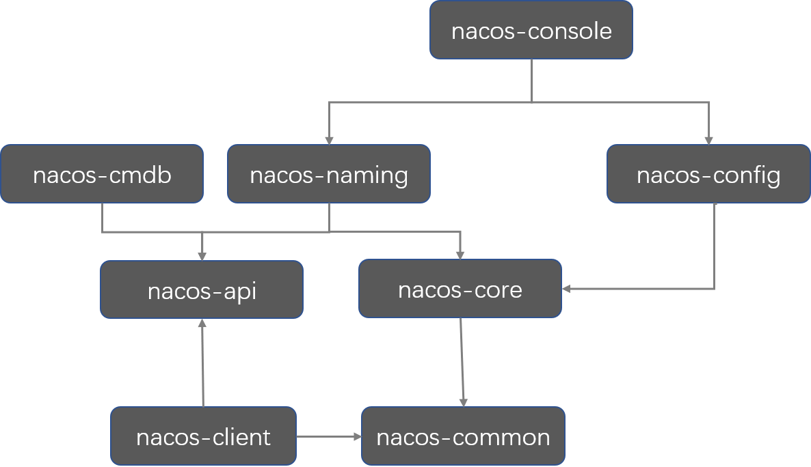
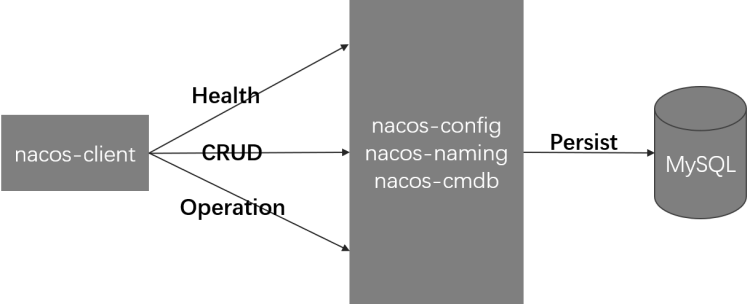
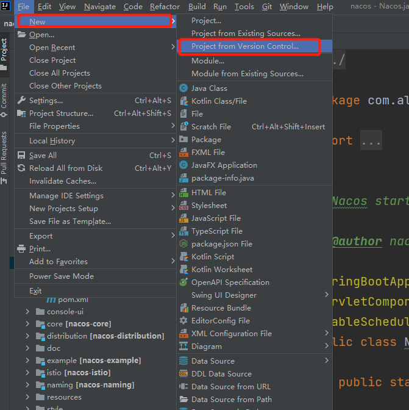
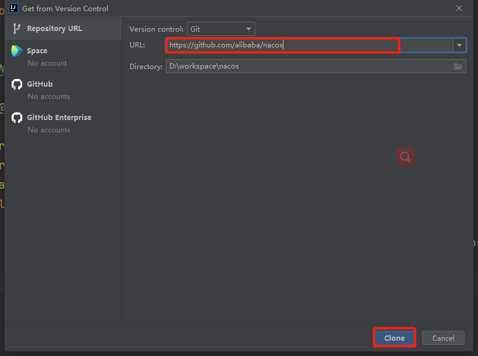
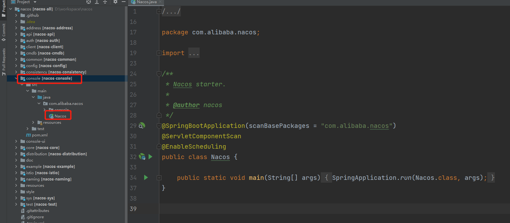
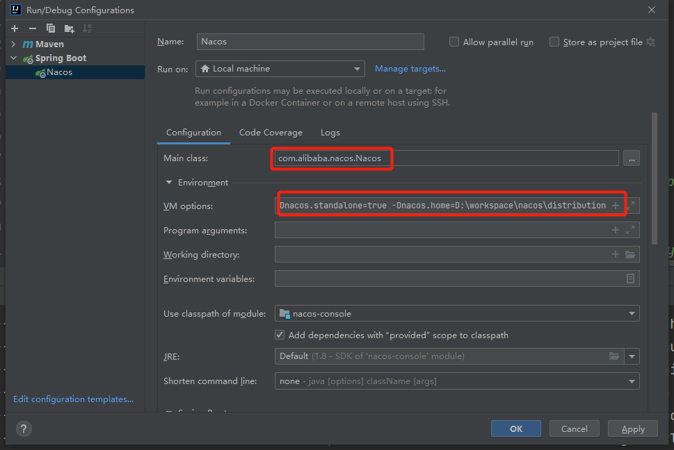
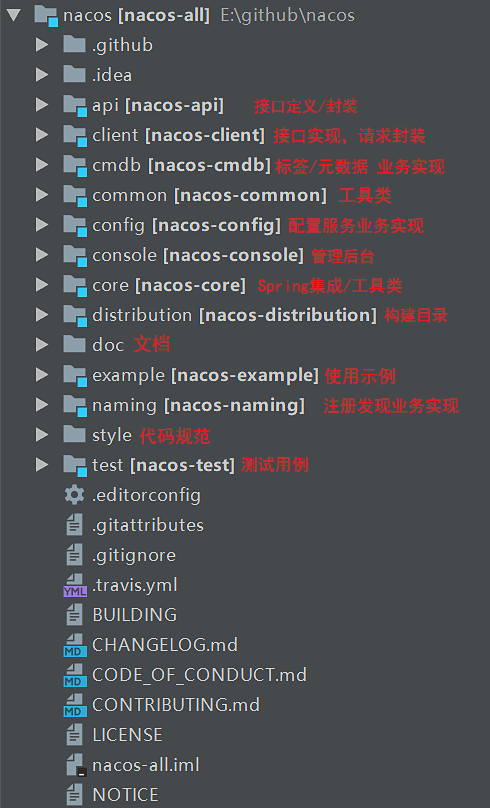

# Nacos源码开篇


## 为什么要分析源码

1. **提升技术功底：**学习源码里面的优秀的设计思想，比如一些问题的解决问题思路，还有一些优秀的设计模式，提升自己的技术功底。
2. **深度掌握框架：**源码看多了，对于一个新技术或者框架的掌握速度会有大幅度提升，看下框架的演示Demo就基本上知道了底层实现原理，学习框架的速度会非常快。
3. **快速定位问题：**遇到问题，特别是框架源码的Bug问题，能够快速定位，这就是多看源码所带来的的好处和优势。
4. **提高面试成功率：**面试一线互联网大厂，一般都会问题到框架源码级别的实现，如果掌握了源码，会大大提升面试成功几率和薪资待遇。
5.  **参与开源社区：**参与到开源项目的研发，结识更多大牛，对于自己以后的提升好处多多。


## 看源码的方法

1. **先使用：**先看官方网站提供的文档，快速掌握框架的基本使用
2. **关注核心功能：**在使用的过程中关注框架的核心功能，然后来观察这些核心功能的代码
3.  **总结归纳：**总结源码中的一些核心点，同时最好能够跟着源码来做出核心流程图，这样就可以把源码中的核心亮点找出并且标记，后续就可能会借鉴到实际工作项目中，同时要善于用Debug，来观看源码的执行过程，观察一些关键变量的值的变化。当我们把框架的所有功能点的源码都分析完成后，回到主流程在梳理一遍，最后在自己脑袋中形成一个闭环，这样源码的核心内容和主流程就基本上理解了。


## Nacos服务注册与发现源码剖析

### Nacos核心功能点

**服务注册**：Nacos Client会通过发送REST请求的方式向Nacos Server注册自己的服务，提供自身的元数据，比如ip地址、端口等信息。Nacos Server接收到注册请求后，就会把这些元数据信息存储在一个双层的内存Map中。 

**服务心跳**：在服务注册后，Nacos Client会维护一个定时心跳来持续通知Nacos Server，说明服务一直处于可用状态，防止被剔除。默认5s发送一次心跳。

**服务健康检查**：Nacos Server会开启一个定时任务用来检查注册服务实例的健康情况，对于超过15s没有收到客户端心跳的实例会将它的healthy属性置为false(客户端服务发现时不会发现)，如果某个实例超过30秒没有收到心跳，直接剔除该实例(被剔除的实例如果恢复发送心跳则会重新注册)

**服务发现**：服务消费者（Nacos Client）在调用服务提供者的服务时，会发送一个REST请求给Nacos Server，获取上面注册的服务清单，并且缓存在Nacos Client本地，同时会在Nacos Client本地开启一个定时任务定时拉取服务端最新的注册表信息更新到本地缓存

**服务同步**：Nacos Server集群之间会互相同步服务实例，用来保证服务信息的一致性。 


### Nacos服务端原理




### Nacos客户端原理




​	其实从以上的两张图中我们就能够找到突破口了，其实核心内容就集中在nacos-console、nacos-naming、nacos-config，这几个模块中。那么知道了这些，现在我们就来进行Nacos的源码下载，然后我们具体分析。

### Nacos源码下载

我们本次需要通过Nacos来运行Nacos，所以下载地址为：https://github.com/alibaba/nacos，我们需要通过Idea来进行下载，以下是具体下载步骤






下载好之后我们需要启动Nacos，那么我们首先要找到nacos-console这个模块，找到启动类，同时还要配置启动模式为单机（我们还是以单机模式为演示）



设置单机运行

```java
-Dnacos.standalone=true -Dnacos.home=C:\\nacos
```




项目配置好之后，我们来看一下Nacos所有的模块 




​	配置好之后就可以运行测试，和启动普通的SpringBoot聚合项目一样，启动之后我们也可以直接访问：http://localhost:8848/nacos，这个时候就能看到我们以前看到的对应客户端页面了，到此为止我们的Nacos源码启动就完成了。


 
