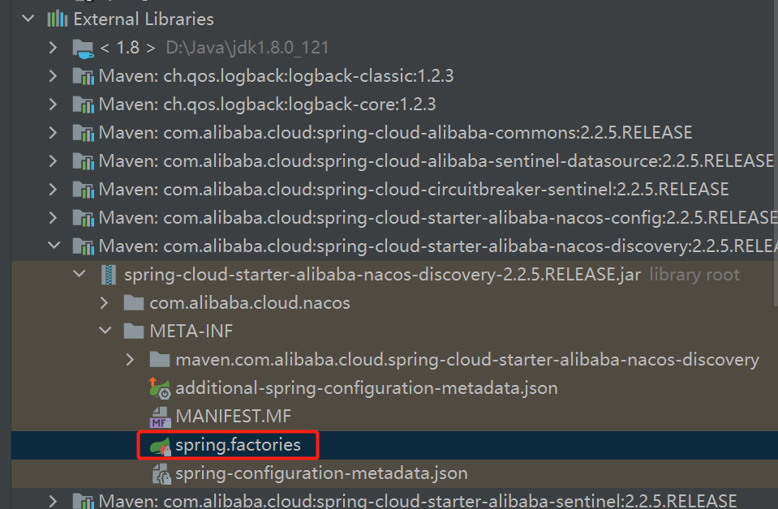
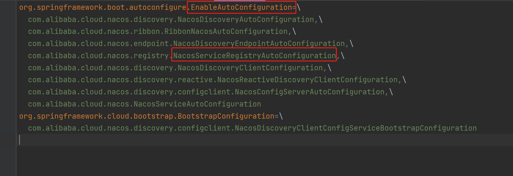
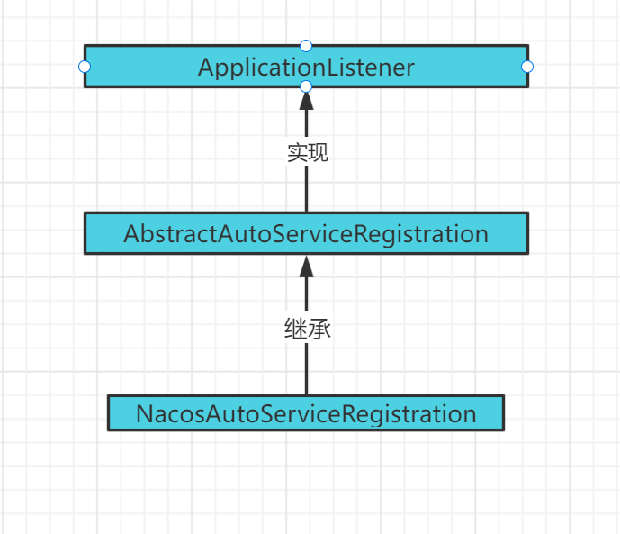
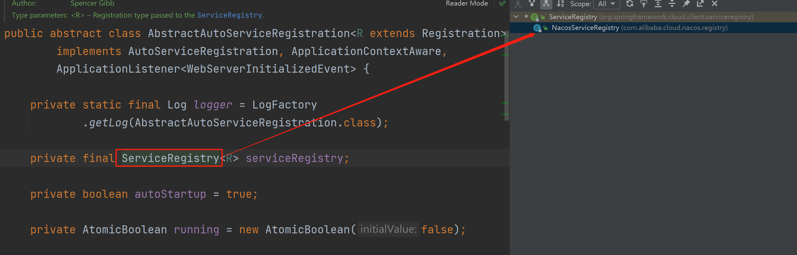
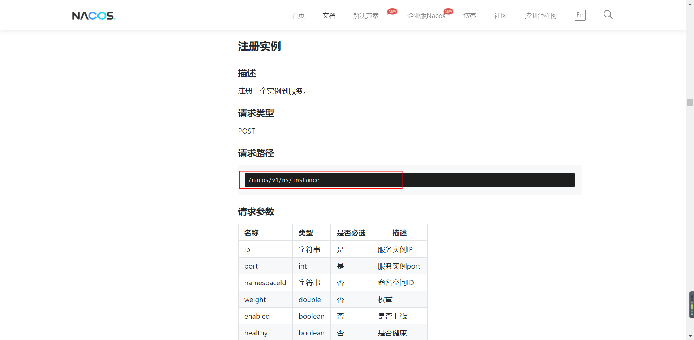
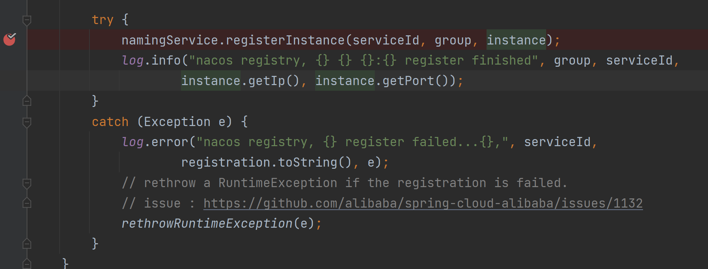
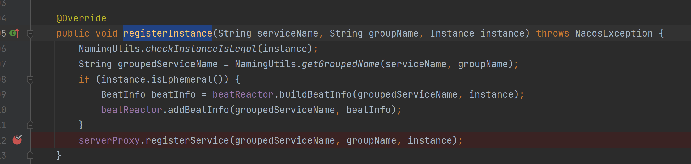
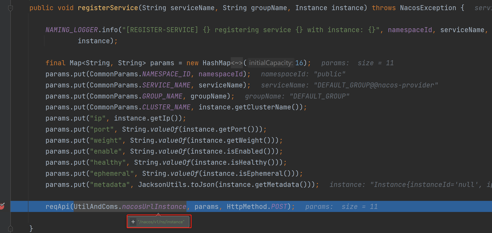
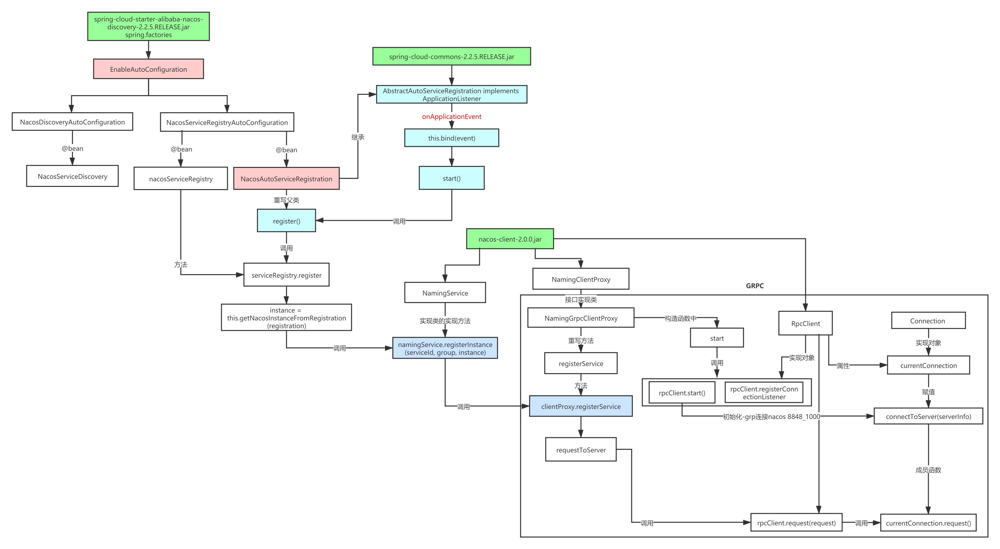

# Nacos客户端实例注册源码分析

## 实例客户端注册入口

流程图：


实际上我们在真实的生产环境中，我们要让某一个服务注册到Nacos中，我们首先要引入一个依赖：

```
<dependency>
    <groupId>com.alibaba.cloud</groupId>
    <artifactId>spring-cloud-starter-alibaba-nacos-discovery</artifactId>
</dependency>
```

在引入这个依赖以后，我们要找到SpringBoot自动装配文件META-INF/spring.factories文件



然后再通过SpingBoot的自动装配（首先找到）来加载EnableAutoConfiguration对应的类，然后这里我们就能看见很多Nacos相关的内容，那我们怎么能知道这个服务在注册的时候具体走的时候哪一个，其实一般这种文件我们都会找“Auto”关键子的文件来进行查看，然后我们现在要了解的是客户端的注册，所以我们要找“NacosServiceRegistryAutoConfiguration”。



然后在当前这个类中会有很多的Bean组件，这些都是Spring容器启动时候自动注入的，一般情况下可能我们会看一下每一个Bean组件初始化具体干了什么，但是实际上这里最核心的是“NacosAutoServiceRegistration”

```JAVA
/**
 * @author xiaojing
 * @author <a href="mailto:mercyblitz@gmail.com">Mercy</a>
 */
@Configuration(proxyBeanMethods = false)
@EnableConfigurationProperties
@ConditionalOnNacosDiscoveryEnabled
@ConditionalOnProperty(value = "spring.cloud.service-registry.auto-registration.enabled",
      matchIfMissing = true)
@AutoConfigureAfter({ AutoServiceRegistrationConfiguration.class,
      AutoServiceRegistrationAutoConfiguration.class,
      NacosDiscoveryAutoConfiguration.class })
public class NacosServiceRegistryAutoConfiguration {

   @Bean
   public NacosServiceRegistry nacosServiceRegistry(
         NacosDiscoveryProperties nacosDiscoveryProperties) {
      return new NacosServiceRegistry(nacosDiscoveryProperties);
   }

   @Bean
   @ConditionalOnBean(AutoServiceRegistrationProperties.class)
   public NacosRegistration nacosRegistration(
         ObjectProvider<List<NacosRegistrationCustomizer>> registrationCustomizers,
         NacosDiscoveryProperties nacosDiscoveryProperties,
         ApplicationContext context) {
      return new NacosRegistration(registrationCustomizers.getIfAvailable(),
            nacosDiscoveryProperties, context);
   }

   @Bean
   @ConditionalOnBean(AutoServiceRegistrationProperties.class)
   public NacosAutoServiceRegistration nacosAutoServiceRegistration(
         NacosServiceRegistry registry,
         AutoServiceRegistrationProperties autoServiceRegistrationProperties,
         NacosRegistration registration) {
      return new NacosAutoServiceRegistration(registry,
            autoServiceRegistrationProperties, registration);
   }

}
```


## NacosAutoServiceRegistration

​	其实这个类就是注册的核心，所以我们来看一下它的继承关系：



通过这里我们可以清楚的知道：

​	NacosAutoServiceRegistration继承了AbstractAutoServiceRegistration而这个类型实现了ApplicationListener接口，所以我们由此得出一般实现ApplicationListener接口的类型都会实现一个方法"onApplicationEvent"，这个方法会在项目启动的时候触发

```java
public void onApplicationEvent(WebServerInitializedEvent event) {
    bind(event);
}

@Deprecated
public void bind(WebServerInitializedEvent event) {
    ApplicationContext context = event.getApplicationContext();
    if (context instanceof ConfigurableWebServerApplicationContext) {
        if ("management".equals(((ConfigurableWebServerApplicationContext) context)
                                .getServerNamespace())) {
            return;
        }
    }
    this.port.compareAndSet(0, event.getWebServer().getPort());
    this.start();
}
```

然后在start()方法中调用register()方法来注册服务

```java
public void start() {
    if (!isEnabled()) {
        if (logger.isDebugEnabled()) {
            logger.debug("Discovery Lifecycle disabled. Not starting");
        }
        return;
    }

    // only initialize if nonSecurePort is greater than 0 and it isn't already running
    // because of containerPortInitializer below
    if (!this.running.get()) {
        this.context.publishEvent(
            new InstancePreRegisteredEvent(this, getRegistration()));
        register();//调用注册方法，进行实例注册
        if (shouldRegisterManagement()) {
            registerManagement();
        }
        this.context.publishEvent(
            new InstanceRegisteredEvent<>(this, getConfiguration()));
        this.running.compareAndSet(false, true);
    }

}
```


## serviceRegistry.register

​	分析到这里，我们已经知道了真实服务注册的入口和具体调用那个方法来注册，那我们再来分析一下register这个方法

```java
protected void register() {
    this.serviceRegistry.register(getRegistration());
}
```

但是这里要注意serviceRegistry实际上是一个接口，所以我们来看一下它的具体实现类NacosServiceRegistry:



找到这个实现类然后我们来查看register方法，到这里其实大家应该已经明白了，因为这里调用了我们上节课讲过的registerInstance注册实例方法

```java
@Override
public void register(Registration registration) {

    if (StringUtils.isEmpty(registration.getServiceId())) {
        log.warn("No service to register for nacos client...");
        return;
    }
	
    NamingService namingService = namingService();
    String serviceId = registration.getServiceId();
    String group = nacosDiscoveryProperties.getGroup();
	//构建instance实例
    Instance instance = getNacosInstanceFromRegistration(registration);

    try {
        //向服务端注册此服务
        namingService.registerInstance(serviceId, group, instance);
        log.info("nacos registry, {} {} {}:{} register finished", group, serviceId,
                 instance.getIp(), instance.getPort());
    }
    catch (Exception e) {
        log.error("nacos registry, {} register failed...{},", serviceId,
                  registration.toString(), e);
        // rethrow a RuntimeException if the registration is failed.
        // issue : https://github.com/alibaba/spring-cloud-alibaba/issues/1132
        rethrowRuntimeException(e);
    }
}
```


## 调用接口

​	其实到这里大家应该已经明白Nacos客户端的服务注册过程了，但是其实再给大家补充一点，就是其实注册本身就是访问了Nacos提供的一个接口，我们可以在官网上看到



那我们可以通过deBug来看一下，在NacosServiceRegistry中的register方法中，在注册实例方法中打断点



然后在NamingService的实现类NacosNamingService中registerInstance方法中打断点



然后进入到这个registerService方法中进行查看，就会发现这里就会把实例信息放到散列表中然后调用reqApi方法来发送请求访问接口/nacos/v1/ns/instance




总结：


