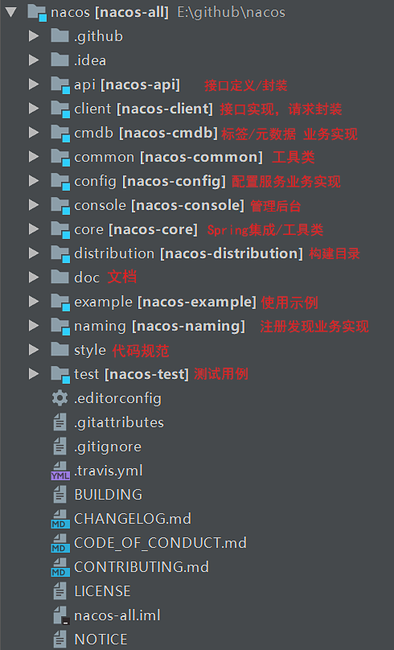

# Nacos服务端服务注册源码分析


## 服务端调用接口

​	通过上节课的学习我们已经知道客户端在注册服务的时候实际上是调用的**NamingService.registerInstance**这个方法来完成实例的注册，而且在最后我们也告诉了大家实际上从本质上讲服务注册就是调用的对应接口nacos/v1/ns/instance，那咱们现在就在服务端先找到这个接口，然后来看具体服务端的操作。


​	这是从Nacos官网上我们看到的Nacos架构图，其实在这里我们已经就能分析出我们要找的接口应该在NamingService这个服务中，从源码角度来看，其实通过一下这个项目结构图中我们也能清楚的看见naming这个子模块，而且在源码的第一节课就和大家分析过这个naming实际上就是实现服务的注册的。



​	那我们接着来向下看这个项目中的**controller**，因为我们知道所有的接口其实都在controller中，从这些Controller中我们就会明显的看到一个**InstanceController**，所以很明显注册实例一定和它有关


​		所以我们打开**InstanceController**来深入研究一下，这个时候会发现@RequestMapping注解中的值就是我们访问的**注册接口**


​	接下来我们再来寻找RESTful API接口POST请求类型的方法register，在这个方法中实际上就是接受用户请求，把收到的信息进行解析，还原成Instance，然后调用**registerInstance**方法来完成注册，这个方法才是服务端注册的核心

```java
@CanDistro
@PostMapping
@Secured(parser = NamingResourceParser.class, action = ActionTypes.WRITE)
public String register(HttpServletRequest request) throws Exception {

    final String namespaceId = WebUtils
        .optional(request, CommonParams.NAMESPACE_ID, Constants.DEFAULT_NAMESPACE_ID);
    final String serviceName = WebUtils.required(request, CommonParams.SERVICE_NAME);
    NamingUtils.checkServiceNameFormat(serviceName);

    final Instance instance = HttpRequestInstanceBuilder.newBuilder()
        .setDefaultInstanceEphemeral(switchDomain.isDefaultInstanceEphemeral()).setRequest(request).build();
	//注册服务实例
    getInstanceOperator().registerInstance(namespaceId, serviceName, instance);
    return "ok";
}
```

​	各位这个位置我们注意一下的这个方法

```java
getInstanceOperator().registerInstance(namespaceId, serviceName, instance);
```

​	其中的getInstanceOperator()，就是判断是否采用Grpc协议，很明显这个位置走的是instanceServiceV2

```java
private InstanceOperator getInstanceOperator() {
    return upgradeJudgement.isUseGrpcFeatures() ? instanceServiceV2 : instanceServiceV1;
}
```

## 服务注册

### instanceServiceV2.registerInstance

​	实际上instanceServiceV2就是InstanceOperatorClientImpl，所以我们来看这里面的registerInstance方法

```java
@Override
public void registerInstance(String namespaceId, String serviceName, Instance instance) {
    //判断是否为瞬时对象（临时客户端）
    boolean ephemeral = instance.isEphemeral();
    //获取客户端ID
    String clientId = IpPortBasedClient.getClientId(instance.toInetAddr(), ephemeral);
    //通过客户端ID创建客户端连接
    createIpPortClientIfAbsent(clientId);
    //获取服务
    Service service = getService(namespaceId, serviceName, ephemeral);
    //具体注册服务
    clientOperationService.registerInstance(service, instance, clientId);
}
```

​	在这里我们要分析一些细节，其实Nacos2.0以后新增**Client模型**。**一个客户端gRPC长连接对应一个Client，每个Client有自己唯一的id（clientId）**。Client负责管理一个客户端的服务实例注册Publish和服务订阅Subscribe。我们可以看一下这个模型其实就是一个接口（为了大家看着方便，注释改成了中文）

```java
public interface Client {
    // 客户端id/gRPC的connectionId
    String getClientId();

    // 是否临时客户端
    boolean isEphemeral();
    // 客户端更新时间
    void setLastUpdatedTime();
    long getLastUpdatedTime();

    // 服务实例注册/注销/查询
    boolean addServiceInstance(Service service, InstancePublishInfo instancePublishInfo);
    InstancePublishInfo removeServiceInstance(Service service);
    InstancePublishInfo getInstancePublishInfo(Service service);
    Collection<Service> getAllPublishedService();

    // 服务订阅/取消订阅/查询订阅
    boolean addServiceSubscriber(Service service, Subscriber subscriber);
    boolean removeServiceSubscriber(Service service);
    Subscriber getSubscriber(Service service);
    Collection<Service> getAllSubscribeService();
    // 生成同步给其他节点的client数据
    ClientSyncData generateSyncData();
    // 是否过期
    boolean isExpire(long currentTime);
    // 释放资源	
    void release();
}
```

### EphemeralClientOperationServiceImpl.registerInstance

​	**EphemeralClientOperationServiceImpl**实际负责处理服务注册，那我们来看具体方法

```java
//EphemeralClientOperationServiceImpl
@Override
public void registerInstance(Service service, Instance instance, String clientId) {
    //确保Service单例存在
    Service singleton = ServiceManager.getInstance().getSingleton(service);
    //根据客户端id，找到客户端
    Client client = clientManager.getClient(clientId);
    if (!clientIsLegal(client, clientId)) {
        return;
    }
    //客户端Instance模型，转换为服务端Instance模型
    InstancePublishInfo instanceInfo = getPublishInfo(instance);
    //将Instance储存到Client里
    client.addServiceInstance(singleton, instanceInfo);
    client.setLastUpdatedTime();
    //建立Service与ClientId的关系
    NotifyCenter.publishEvent(new ClientOperationEvent.ClientRegisterServiceEvent(singleton, clientId));
    NotifyCenter
        .publishEvent(new MetadataEvent.InstanceMetadataEvent(singleton, instanceInfo.getMetadataId(), false));
}
```

### ServiceManager

​	Service的容器是**ServiceManager**，但是在com.alibaba.nacos.naming.core.v2包下，容器中Service都是单例。

```java
public class ServiceManager {
    
    private static final ServiceManager INSTANCE = new ServiceManager();
    //单例Service，可以查看Service的equals和hasCode方法
    private final ConcurrentHashMap<Service, Service> singletonRepository;
    //namespace下的所有service
    private final ConcurrentHashMap<String, Set<Service>> namespaceSingletonMaps;
    .....
}
```

​	所以从这个位置可以看出，当调用这个注册方法的时候**ServiceManager**负责管理Service单例

```java
//通过Map储存单例的Service
public Service getSingleton(Service service) {
    singletonRepository.putIfAbsent(service, service);
    Service result = singletonRepository.get(service);
    namespaceSingletonMaps.computeIfAbsent(result.getNamespace(), (namespace) -> new ConcurrentHashSet<>());
    namespaceSingletonMaps.get(result.getNamespace()).add(result);
    return result;
}
```

### clientManager

​	这是一个接口这里我们要看它对应的一个实现类**ConnectionBasedClientManager**，这个实现类负责管理长连接clientId与Client模型的映射关系

```java
// 根据clientId查询Client
public Client getClient(String clientId) {
    return clients.get(clientId);
}
```

### Client实例**AbstractClient** 

负责存储当前客户端的服务注册表，即Service与Instance的关系。注意**对于单个客户端来说，同一个服务只能注册一个实例**。

```java
//
@Override
public boolean addServiceInstance(Service service, InstancePublishInfo instancePublishInfo) {
    if (null == publishers.put(service, instancePublishInfo)) {
        MetricsMonitor.incrementInstanceCount();
    }
    NotifyCenter.publishEvent(new ClientEvent.ClientChangedEvent(this));
    Loggers.SRV_LOG.info("Client change for service {}, {}", service, getClientId());
    return true;
}
```

### ClientOperationEvent.ClientRegisterServiceEvent

​	这里的目的是为了过滤目标服务得到最终Instance列表建立Service与Client的关系，建立Service与Client的关系就是为了加速查询。

​	发布**ClientRegisterServiceEvent**事件，ClientServiceIndexesManager监听，ClientServiceIndexesManager维护了两个索引：

- Service与发布clientId
- Service与订阅clientId

```java
    //                          key:service,value:发布clientId集合
private final ConcurrentMap<Service, Set<String>> publisherIndexes = new ConcurrentHashMap<>();
   //                          key:service,value:订阅clientId集合
private final ConcurrentMap<Service, Set<String>> subscriberIndexes = new ConcurrentHashMap<>();

private void handleClientOperation(ClientOperationEvent event) {
    Service service = event.getService();
    String clientId = event.getClientId();
    if (event instanceof ClientOperationEvent.ClientRegisterServiceEvent) {
        addPublisherIndexes(service, clientId);
    } else if (event instanceof ClientOperationEvent.ClientDeregisterServiceEvent) {
        removePublisherIndexes(service, clientId);
    } else if (event instanceof ClientOperationEvent.ClientSubscribeServiceEvent) {
        addSubscriberIndexes(service, clientId);
    } else if (event instanceof ClientOperationEvent.ClientUnsubscribeServiceEvent) {
        removeSubscriberIndexes(service, clientId);
    }
}

//建立Service与发布Client的关系
private void addPublisherIndexes(Service service, String clientId) {
    publisherIndexes.computeIfAbsent(service, (key) -> new ConcurrentHashSet<>());
    publisherIndexes.get(service).add(clientId);
    NotifyCenter.publishEvent(new ServiceEvent.ServiceChangedEvent(service, true));
}
```

这个索引关系建立以后，还会触发**ServiceChangedEvent**，代表服务注册表变更。对于注册表变更紧接着还要做两个事情：**1.通知订阅客户端 2.Nacos集群数据同步**。这两点后续再说。

​	 