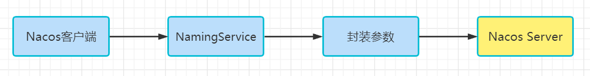
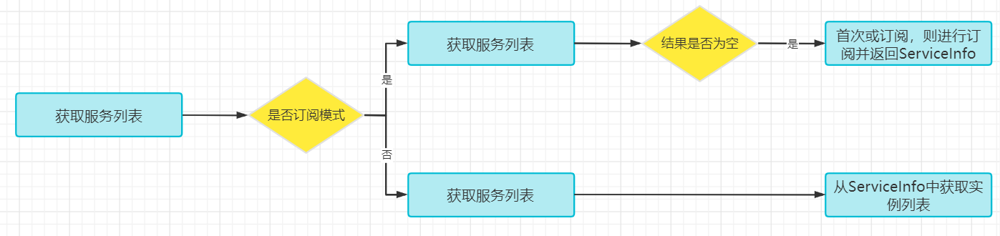
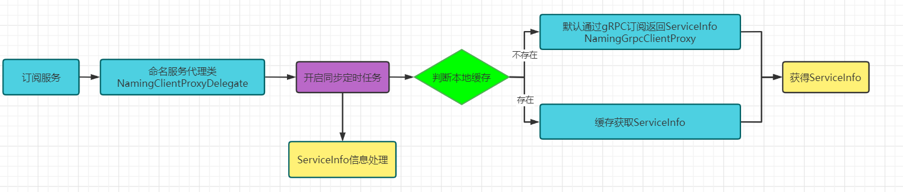

# Nacos客户端服务发现源码分析

## 总体流程	

## Client

首先我们先通过一个图来直观的看一下，Nacos客户端的服务发现，其实就是封装参数、调用服务接口、获得返回实例列表。



​	但是如果我们要是细化这个流程，会发现不仅包括了通过NamingService获取服务列表，在获取服务列表的过程中还涉及到通信流程协议（Http or gRPC）、订阅流程、故障转移流程等。下面我们来详细的捋一捋。

​	入口，其实这个入口我们在之前看过，就在NamingTest中可以看到：

```java
public class NamingTest {
    
    @Test
    public void testServiceList() throws Exception {
   	......
    
        NamingService namingService = NacosFactory.createNamingService(properties);
        namingService.registerInstance("nacos.test.1", instance);
        
        ThreadUtils.sleep(5000L);
        
        List<Instance> list = namingService.getAllInstances("nacos.test.1");
        
        System.out.println(list);
        
    }
}
```

​	在这里我们主要要关注getAllInstances方法，那我们就需要看一下这个方法的具体操作，当然这其中需要经过一系列的重载方法调用

​	其实这里的方法比入口多出了几个参数，这里不仅有服务名称，还有分组名、集群列表、是否订阅，重载方法中的其他参数已经在各种重载方法的调用过程中设置了默认值，比如：

​	分组名称默认：DEFAULT_GROUOP

​	集群列表：默认为空数组

​	是否订阅：订阅

```java
//com.alibaba.nacos.client.naming.NacosNamingService#getAllInstances
    @Override
    public List<Instance> getAllInstances(String serviceName) throws NacosException {
        return getAllInstances(serviceName, new ArrayList<String>());
    }
//com.alibaba.nacos.client.naming.NacosNamingService#getAllInstances
    @Override
    public List<Instance> getAllInstances(String serviceName, List<String> clusters) throws NacosException {
        return getAllInstances(serviceName, clusters, true);
    }
   //com.alibaba.nacos.client.naming.NacosNamingService#getAllInstances  
    @Override
    public List<Instance> getAllInstances(String serviceName, List<String> clusters, boolean subscribe)
            throws NacosException {
        return getAllInstances(serviceName, Constants.DEFAULT_GROUP, clusters, subscribe);
    }
//com.alibaba.nacos.client.naming.NacosNamingService#getAllInstances    
@Override
public List<Instance> getAllInstances(String serviceName, String groupName, List<String> clusters,
                                      boolean subscribe) throws NacosException {
    ServiceInfo serviceInfo;
    String clusterString = StringUtils.join(clusters, ",");
    // 是否是订阅模式
    if (subscribe) {
        // 先从客户端缓存获取服务信息
        serviceInfo = serviceInfoHolder.getServiceInfo(serviceName,  , clusterString);
        if (null == serviceInfo) {
            // 如果本地缓存不存在服务信息，则进行订阅
            serviceInfo = clientProxy.subscribe(serviceName, groupName, clusterString);
        }
    } else {
        // 如果未订阅服务信息，则直接从服务器进行查询
        serviceInfo = clientProxy.queryInstancesOfService(serviceName, groupName, clusterString, 0, false);
    }
    // 从服务信息中获取实例列表
    List<Instance> list;
    if (serviceInfo == null || CollectionUtils.isEmpty(list = serviceInfo.getHosts())) {
        return new ArrayList<Instance>();
    }
    return list;
}
```

```java
//com.alibaba.nacos.client.naming.cache.ServiceInfoHolder#getServiceInfo
public ServiceInfo getServiceInfo(final String serviceName, final String groupName, final String clusters) {
        NAMING_LOGGER.debug("failover-mode: {}", failoverReactor.isFailoverSwitch());
        //groupName@@serviceName
        String groupedServiceName = NamingUtils.getGroupedName(serviceName, groupName);
        //获得组装成的Key,clustersName@@groupName@@serviceName
        String key = ServiceInfo.getKey(groupedServiceName, clusters);
        //故障转移反应堆
        if (failoverReactor.isFailoverSwitch()) {//如果开启故障转移
            return failoverReactor.getService(key);//从故障转移反应堆中，获取  serviceInfo
        }
        return serviceInfoMap.get(key);
    }

```

```java
//进行服务订阅
@Override
    public ServiceInfo subscribe(String serviceName, String groupName, String clusters) throws NacosException {
        NAMING_LOGGER.info("[SUBSCRIBE-SERVICE] service:{}, group:{}, clusters:{} ", serviceName, groupName, clusters);
        String serviceNameWithGroup = NamingUtils.getGroupedName(serviceName, groupName);
        String serviceKey = ServiceInfo.getKey(serviceNameWithGroup, clusters);
        //定时任务：schedule，从服务器查询新的服务信息，判断是否需要更新，如果更新则更新并发布实例更新事件（InstancesChangeEvent）
        serviceInfoUpdateService.scheduleUpdateIfAbsent(serviceName, groupName, clusters);
        //获取缓存中的service info
        ServiceInfo result = serviceInfoHolder.getServiceInfoMap().get(serviceKey);
        if (null == result || !isSubscribed(serviceName, groupName, clusters)) {
            //如果本地缓存中没有服务信息，说明之前没有拉取过，没有订阅过，所有要先订阅服务器的广播
            result = grpcClientProxy.subscribe(serviceName, groupName, clusters);
        }
        serviceInfoHolder.processServiceInfo(result);
        return result;
    }
```


```java
//com.alibaba.nacos.client.naming.core.ServiceInfoUpdateService#scheduleUpdateIfAbsent
public void scheduleUpdateIfAbsent(String serviceName, String groupName, String clusters) {
        //serviceKey:clusterName@@groupName@@serviceName
        String serviceKey = ServiceInfo.getKey(NamingUtils.getGroupedName(serviceName, groupName), clusters);
        //futureMap有serviceKey对应的值，则结束该代码块儿
        if (futureMap.get(serviceKey) != null) {
            return;
        }
        synchronized (futureMap) {
            //双重检查，避免在等待锁的过程中，被放入
            if (futureMap.get(serviceKey) != null) {
                return;
            }
            //放入一个新的任务
            ScheduledFuture<?> future = addTask(new UpdateTask(serviceName, groupName, clusters));
            futureMap.put(serviceKey, future);
        }
    }
//com.alibaba.nacos.client.naming.core.ServiceInfoUpdateService#addTask
    private synchronized ScheduledFuture<?> addTask(UpdateTask task) {
        //DEFAULT_DELAY:1000L；1秒
        return executor.schedule(task, DEFAULT_DELAY, TimeUnit.MILLISECONDS);
    }
```


```java
//com.alibaba.nacos.client.naming.core.ServiceInfoUpdateService.UpdateTask#run
@Override
        public void run() {
            long delayTime = DEFAULT_DELAY;
            
            try {
                //没有订阅过，则取消该任务的执行
                if (!changeNotifier.isSubscribed(groupName, serviceName, clusters) && !futureMap.containsKey(
                        serviceKey)) {
                    NAMING_LOGGER.info("update task is stopped, service:{}, clusters:{}", groupedServiceName, clusters);
                    isCancel = true;
                    return;
                }
                
                ServiceInfo serviceObj = serviceInfoHolder.getServiceInfoMap().get(serviceKey);
                if (serviceObj == null) {//如果本地缓存的ServiceInfo为空，则从服务端查询服务信息并处理。
                    //如果serviceObj  为空，则重新查询，并更新到 serviceInfoHolder中
                    serviceObj = namingClientProxy.queryInstancesOfService(serviceName, groupName, clusters, 0, false);
                    serviceInfoHolder.processServiceInfo(serviceObj);
                    lastRefTime = serviceObj.getLastRefTime();
                    return;
                }
                // 过期服务，服务的最新更新时间小于等于缓存刷新（最后一次拉取数据的时间）时间，从注册中心重新查询
                if (serviceObj.getLastRefTime() <= lastRefTime) {
                    //没有更新，则查询并更新
                    serviceObj = namingClientProxy.queryInstancesOfService(serviceName, groupName, clusters, 0, false);
                    serviceInfoHolder.processServiceInfo(serviceObj);
                }
                //变更最后引用时间
                lastRefTime = serviceObj.getLastRefTime();
                if (CollectionUtils.isEmpty(serviceObj.getHosts())) {
                    incFailCount();
                    return;
                }
                // TODO multiple time can be configured.
                //cacheMillis:1000L,1000L*6,6秒
                delayTime = serviceObj.getCacheMillis() * DEFAULT_UPDATE_CACHE_TIME_MULTIPLE;
                resetFailCount();
            } catch (Throwable e) {
                incFailCount();
                NAMING_LOGGER.warn("[NA] failed to update serviceName: {}", groupedServiceName, e);
            } finally {
                if (!isCancel) {
                    //最后设置任务下次开始执行的时间。最多延迟6W毫秒/60秒/1分钟
                    // 下次调度刷新时间，下次执行的时间与failCount有关，failCount=0，则下次调度时间为6秒，最长为1分钟
                    // 即当无异常情况下缓存实例的刷新时间是6秒
                    executor.schedule(this, Math.min(delayTime << failCount, DEFAULT_DELAY * 60),
                            TimeUnit.MILLISECONDS);
                }
            }
        }
```


```java
//com.alibaba.nacos.client.naming.remote.gprc.NamingGrpcClientProxy#subscribe
@Override
    public ServiceInfo subscribe(String serviceName, String groupName, String clusters) throws NacosException {
        if (NAMING_LOGGER.isDebugEnabled()) {
            NAMING_LOGGER.debug("[GRPC-SUBSCRIBE] service:{}, group:{}, cluster:{} ", serviceName, groupName, clusters);
        }
        redoService.cacheSubscriberForRedo(serviceName, groupName, clusters);
        return doSubscribe(serviceName, groupName, clusters);
    }
//com.alibaba.nacos.client.naming.remote.gprc.NamingGrpcClientProxy#doSubscribe
public ServiceInfo doSubscribe(String serviceName, String groupName, String clusters) throws NacosException {
        SubscribeServiceRequest request = new SubscribeServiceRequest(namespaceId, groupName, serviceName, clusters,
                true);
        SubscribeServiceResponse response = requestToServer(request, SubscribeServiceResponse.class);
        redoService.subscriberRegistered(serviceName, groupName, clusters);
        return response.getServiceInfo();
    }
```


```java
//com.alibaba.nacos.client.naming.remote.gprc.NamingGrpcClientProxy#requestToServer
private <T extends Response> T requestToServer(AbstractNamingRequest request, Class<T> responseClass)
            throws NacosException {
        try {
            request.putAllHeader(
                    getSecurityHeaders(request.getNamespace(), request.getGroupName(), request.getServiceName()));
            Response response =
                    requestTimeout < 0 ? rpcClient.request(request) : rpcClient.request(request, requestTimeout);
            if (ResponseCode.SUCCESS.getCode() != response.getResultCode()) {
                throw new NacosException(response.getErrorCode(), response.getMessage());
            }
            if (responseClass.isAssignableFrom(response.getClass())) {
                return (T) response;
            }
            NAMING_LOGGER.error("Server return unexpected response '{}', expected response should be '{}'",
                    response.getClass().getName(), responseClass.getName());
        } catch (Exception e) {
            throw new NacosException(NacosException.SERVER_ERROR, "Request nacos server failed: ", e);
        }
        throw new NacosException(NacosException.SERVER_ERROR, "Server return invalid response");
    }
```


```java
//com.alibaba.nacos.common.remote.client.RpcClient#request
public Response request(Request request) throws NacosException {
        return request(request, DEFAULT_TIMEOUT_MILLS);
}
//com.alibaba.nacos.common.remote.client.RpcClient#request
public Response request(Request request, long timeoutMills) throws NacosException {
        int retryTimes = 0;
        Response response;
        Exception exceptionThrow = null;
        long start = System.currentTimeMillis();
        while (retryTimes < RETRY_TIMES && System.currentTimeMillis() < timeoutMills + start) {
            boolean waitReconnect = false;
            try {
                if (this.currentConnection == null || !isRunning()) {
                    waitReconnect = true;
                    throw new NacosException(NacosException.CLIENT_DISCONNECT,
                            "Client not connected, current status:" + rpcClientStatus.get());
                }
                response = this.currentConnection.request(request, timeoutMills);
                if (response == null) {
                    throw new NacosException(SERVER_ERROR, "Unknown Exception.");
                }
                if (response instanceof ErrorResponse) {
                    if (response.getErrorCode() == NacosException.UN_REGISTER) {
                        synchronized (this) {
                            waitReconnect = true;
                            if (rpcClientStatus.compareAndSet(RpcClientStatus.RUNNING, RpcClientStatus.UNHEALTHY)) {
                                LoggerUtils.printIfErrorEnabled(LOGGER,
                                        "Connection is unregistered, switch server, connectionId = {}, request = {}",
                                        currentConnection.getConnectionId(), request.getClass().getSimpleName());
                                switchServerAsync();
                            }
                        }
                        
                    }
                    throw new NacosException(response.getErrorCode(), response.getMessage());
                }
                // return response.
                lastActiveTimeStamp = System.currentTimeMillis();
                return response;
                
            } catch (Exception e) {
                if (waitReconnect) {
                    try {
                        // wait client to reconnect.
                        Thread.sleep(Math.min(100, timeoutMills / 3));
                    } catch (Exception exception) {
                        // Do nothing.
                    }
                }
                
                LoggerUtils.printIfErrorEnabled(LOGGER, "Send request fail, request = {}, retryTimes = {}, errorMessage = {}",
                        request, retryTimes, e.getMessage());
                
                exceptionThrow = e;
                
            }
            retryTimes++;
            
        }
        
        if (rpcClientStatus.compareAndSet(RpcClientStatus.RUNNING, RpcClientStatus.UNHEALTHY)) {
            switchServerAsyncOnRequestFail();
        }
        
        if (exceptionThrow != null) {
            throw (exceptionThrow instanceof NacosException) ? (NacosException) exceptionThrow
                    : new NacosException(SERVER_ERROR, exceptionThrow);
        } else {
            throw new NacosException(SERVER_ERROR, "Request fail, unknown Error");
        }
    }
```


```java
//com.alibaba.nacos.client.naming.cache.ServiceInfoHolder#processServiceInfo
public ServiceInfo processServiceInfo(ServiceInfo serviceInfo) {
        String serviceKey = serviceInfo.getKey();
        if (serviceKey == null) {
            return null;
        }
    	//
        ServiceInfo oldService = serviceInfoMap.get(serviceInfo.getKey());
        if (isEmptyOrErrorPush(serviceInfo)) {
            //empty or error push, just ignore
            return oldService;
        }
        serviceInfoMap.put(serviceInfo.getKey(), serviceInfo);
        //判断服务信息是否变更
        boolean changed = isChangedServiceInfo(oldService, serviceInfo);
        if (StringUtils.isBlank(serviceInfo.getJsonFromServer())) {
            serviceInfo.setJsonFromServer(JacksonUtils.toJson(serviceInfo));
        }
        MetricsMonitor.getServiceInfoMapSizeMonitor().set(serviceInfoMap.size());
        if (changed) {
            NAMING_LOGGER.info("current ips:({}) service: {} -> {}", serviceInfo.ipCount(), serviceInfo.getKey(),
                    JacksonUtils.toJson(serviceInfo.getHosts()));
            //如果变更了，发布实例变更事件
            NotifyCenter.publishEvent(new InstancesChangeEvent(serviceInfo.getName(), serviceInfo.getGroupName(),
                    serviceInfo.getClusters(), serviceInfo.getHosts()));
            //将服务信息，写入磁盘缓存。
            DiskCache.write(serviceInfo, cacheDir);
        }
        return serviceInfo;
    }
```


## Server


```java
//com.alibaba.nacos.core.remote.grpc.GrpcRequestAcceptor#request
@Override
    public void request(Payload grpcRequest, StreamObserver<Payload> responseObserver) {
        
        traceIfNecessary(grpcRequest, true);
        String type = grpcRequest.getMetadata().getType();
        
        //server is on starting.
        if (!ApplicationUtils.isStarted()) {
            Payload payloadResponse = GrpcUtils.convert(
                    ErrorResponse.build(NacosException.INVALID_SERVER_STATUS, "Server is starting,please try later."));
            traceIfNecessary(payloadResponse, false);
            responseObserver.onNext(payloadResponse);
            
            responseObserver.onCompleted();
            return;
        }
        
        // server check.
        if (ServerCheckRequest.class.getSimpleName().equals(type)) {
            Payload serverCheckResponseP = GrpcUtils.convert(new ServerCheckResponse(CONTEXT_KEY_CONN_ID.get()));
            traceIfNecessary(serverCheckResponseP, false);
            responseObserver.onNext(serverCheckResponseP);
            responseObserver.onCompleted();
            return;
        }
        //找到对应的请求处理器，总共有13个；RequestHandler类的13个子类
        RequestHandler requestHandler = requestHandlerRegistry.getByRequestType(type);
        //no handler found.
        if (requestHandler == null) {
            Loggers.REMOTE_DIGEST.warn(String.format("[%s] No handler for request type : %s :", "grpc", type));
            Payload payloadResponse = GrpcUtils
                    .convert(ErrorResponse.build(NacosException.NO_HANDLER, "RequestHandler Not Found"));
            traceIfNecessary(payloadResponse, false);
            responseObserver.onNext(payloadResponse);
            responseObserver.onCompleted();
            return;
        }
        
        //check connection status.
        String connectionId = CONTEXT_KEY_CONN_ID.get();
        boolean requestValid = connectionManager.checkValid(connectionId);
        if (!requestValid) {
            Loggers.REMOTE_DIGEST
                    .warn("[{}] Invalid connection Id ,connection [{}] is un registered ,", "grpc", connectionId);
            Payload payloadResponse = GrpcUtils
                    .convert(ErrorResponse.build(NacosException.UN_REGISTER, "Connection is unregistered."));
            traceIfNecessary(payloadResponse, false);
            responseObserver.onNext(payloadResponse);
            responseObserver.onCompleted();
            return;
        }
        
        Object parseObj = null;
        try {
            parseObj = GrpcUtils.parse(grpcRequest);
        } catch (Exception e) {
            Loggers.REMOTE_DIGEST
                    .warn("[{}] Invalid request receive from connection [{}] ,error={}", "grpc", connectionId, e);
            Payload payloadResponse = GrpcUtils.convert(ErrorResponse.build(NacosException.BAD_GATEWAY, e.getMessage()));
            traceIfNecessary(payloadResponse, false);
            responseObserver.onNext(payloadResponse);
            responseObserver.onCompleted();
            return;
        }
        
        if (parseObj == null) {
            Loggers.REMOTE_DIGEST.warn("[{}] Invalid request receive  ,parse request is null", connectionId);
            Payload payloadResponse = GrpcUtils
                    .convert(ErrorResponse.build(NacosException.BAD_GATEWAY, "Invalid request"));
            traceIfNecessary(payloadResponse, false);
            responseObserver.onNext(payloadResponse);
            responseObserver.onCompleted();
            return;
        }
        
        if (!(parseObj instanceof Request)) {
            Loggers.REMOTE_DIGEST
                    .warn("[{}] Invalid request receive  ,parsed payload is not a request,parseObj={}", connectionId,
                            parseObj);
            Payload payloadResponse = GrpcUtils
                    .convert(ErrorResponse.build(NacosException.BAD_GATEWAY, "Invalid request"));
            traceIfNecessary(payloadResponse, false);
            responseObserver.onNext(payloadResponse);
            responseObserver.onCompleted();
            return;
        }
        
        Request request = (Request) parseObj;
        try {
            Connection connection = connectionManager.getConnection(CONTEXT_KEY_CONN_ID.get());
            RequestMeta requestMeta = new RequestMeta();
            requestMeta.setClientIp(connection.getMetaInfo().getClientIp());
            requestMeta.setConnectionId(CONTEXT_KEY_CONN_ID.get());
            requestMeta.setClientVersion(connection.getMetaInfo().getVersion());
            requestMeta.setLabels(connection.getMetaInfo().getLabels());
            connectionManager.refreshActiveTime(requestMeta.getConnectionId());
            //执行对应的处理器的方法。
            Response response = requestHandler.handleRequest(request, requestMeta);
            Payload payloadResponse = GrpcUtils.convert(response);
            traceIfNecessary(payloadResponse, false);
            responseObserver.onNext(payloadResponse);
            responseObserver.onCompleted();
        } catch (Throwable e) {
            Loggers.REMOTE_DIGEST
                    .error("[{}] Fail to handle request from connection [{}] ,error message :{}", "grpc", connectionId,
                            e);
            Payload payloadResponse = GrpcUtils.convert(ErrorResponse.build(
                    (e instanceof NacosException) ? ((NacosException) e).getErrCode() : ResponseCode.FAIL.getCode(),
                    e.getMessage()));
            traceIfNecessary(payloadResponse, false);
            responseObserver.onNext(payloadResponse);
            responseObserver.onCompleted();
        }
        
    }
```


```java
//com.alibaba.nacos.core.remote.RequestHandler#handleRequest
public Response handleRequest(T request, RequestMeta meta) throws NacosException {
        for (AbstractRequestFilter filter : requestFilters.filters) {
            try {
                Response filterResult = filter.filter(request, meta, this.getClass());
                if (filterResult != null && !filterResult.isSuccess()) {
                    return filterResult;
                }
            } catch (Throwable throwable) {
                Loggers.REMOTE.error("filter error", throwable);
            }
            
        }
    //进入对应的处理器的handle方法。
        return handle(request, meta);
    }
```

```java
//com.alibaba.nacos.naming.remote.rpc.handler.SubscribeServiceRequestHandler#handle
	@Override
    @Secured(action = ActionTypes.READ)
    public SubscribeServiceResponse handle(SubscribeServiceRequest request, RequestMeta meta) throws NacosException {
        String namespaceId = request.getNamespace();
        String serviceName = request.getServiceName();
        String groupName = request.getGroupName();
        String app = request.getHeader("app", "unknown");
        String groupedServiceName = NamingUtils.getGroupedName(serviceName, groupName);
        Service service = Service.newService(namespaceId, groupName, serviceName, true);
        Subscriber subscriber = new Subscriber(meta.getClientIp(), meta.getClientVersion(), app, meta.getClientIp(),
                namespaceId, groupedServiceName, 0, request.getClusters());
        //ServiceInfo 对应中，使用hosts变量来保存自己的instance信息
        ServiceInfo serviceInfo = ServiceUtil.selectInstancesWithHealthyProtection(serviceStorage.getData(service),
                metadataManager.getServiceMetadata(service).orElse(null), subscriber);
        if (request.isSubscribe()) {
            //通过service获得client，给client新增一个subscriber
            clientOperationService.subscribeService(service, subscriber, meta.getConnectionId());
        } else {
              //通过service获得client，给client减去一个subscriber
            clientOperationService.unsubscribeService(service, subscriber, meta.getConnectionId());
        }
        //封装返回信息
        return new SubscribeServiceResponse(ResponseCode.SUCCESS.getCode(), "success", serviceInfo);
    }
```

​	

```java
//com.alibaba.nacos.naming.core.v2.service.impl.EphemeralClientOperationServiceImpl#subscribeService
@Override
    public void subscribeService(Service service, Subscriber subscriber, String clientId) {
        Service singleton = ServiceManager.getInstance().getSingletonIfExist(service).orElse(service);//获取service对象
        Client client = clientManager.getClient(clientId);//获得服务的client
        if (!clientIsLegal(client, clientId)) {
            return;
        }
        client.addServiceSubscriber(singleton, subscriber);//服务的client新增一个subscriber;
        client.setLastUpdatedTime();
        NotifyCenter.publishEvent(new ClientOperationEvent.ClientSubscribeServiceEvent(singleton, clientId));//发布客户端订阅服务事件
    }
//com.alibaba.nacos.naming.core.v2.service.impl.EphemeralClientOperationServiceImpl#unsubscribeService
@Override
    public void unsubscribeService(Service service, Subscriber subscriber, String clientId) {
        Service singleton = ServiceManager.getInstance().getSingletonIfExist(service).orElse(service);
        Client client = clientManager.getClient(clientId);
        if (!clientIsLegal(client, clientId)) {
            return;
        }
        client.removeServiceSubscriber(singleton);
        client.setLastUpdatedTime();
        //发布client取消订阅服务事件
        NotifyCenter.publishEvent(new ClientOperationEvent.ClientUnsubscribeServiceEvent(singleton, clientId));
    }
```


此方法的流程图：




​	这个流程基本逻辑为：

​		如果是订阅模式，则直接从本地缓存获取服务信息(ServiceInfo)，然后从中获取实例列表，这是因为订阅机制会自动同步服务器实例的变化到本地。如果本地缓存中没有，那说明是首次调用，则进行订阅，在订阅完成后会获得服务信息。

​		如果是非订阅模式，那就直接请求服务器端，获得服务信息。

## 订阅处理流程

​	在刚才的流程中，涉及到了订阅的逻辑，入口代码为获取实例列表中的方法：

```java
serviceInfo = clientProxy.subscribe(serviceName, groupName, clusterString);
```

​	以下是具体分析。首先这里的clientProxy是NamingClientProxy类的对象，对应的实现类是NamingClientProxyDelegate对应subscribe实现如下：

```java
@Override
public ServiceInfo subscribe(String serviceName, String groupName, String clusters) throws NacosException {
    String serviceNameWithGroup = NamingUtils.getGroupedName(serviceName, groupName);
    String serviceKey = ServiceInfo.getKey(serviceNameWithGroup, clusters);
    // 定时调度UpdateTask
    serviceInfoUpdateService.scheduleUpdateIfAbsent(serviceName, groupName, clusters);
    // 获取缓存中的ServiceInfo
    ServiceInfo result = serviceInfoHolder.getServiceInfoMap().get(serviceKey);
    if (null == result) {
        // 如果为null，则进行订阅逻辑处理，基于gRPC协议
        result = grpcClientProxy.subscribe(serviceName, groupName, clusters);
    }
    // ServiceInfo本地缓存处理
    serviceInfoHolder.processServiceInfo(result);
    return result;
}
```

​	在这段代码中，可以看到在获取服务实例列表时（特别是首次），也进行了订阅逻辑的拓展，基本流程图如下：



​	具体流程分析：

	1. 订阅方法先开启定时任务，这个定时任务的主要作用就是用来定时同步服务端的实例信息，并进行本地缓存更新等操作，但是如果是首次这里将会直接返回来走下一步。
	2. 判断本地缓存是否存在，如果本地缓存存在ServiceInfo信息，则直接返回。如果不存在，则默认采用gRPC协议进行订阅，并返回ServiceInfo。
	 3. grpcClientProxy的subscribe订阅方法就是直接向服务器发送了一个订阅请求，并返回结果。
	  4. 最后，ServiceInfo本地缓存处理。这里会将获得的最新ServiceInfo与本地内存中的ServiceInfo进行比较，更新，发布变更时间，磁盘文件存储等操作。其实，这一步的操作，在订阅定时任务中也进行了处理。

