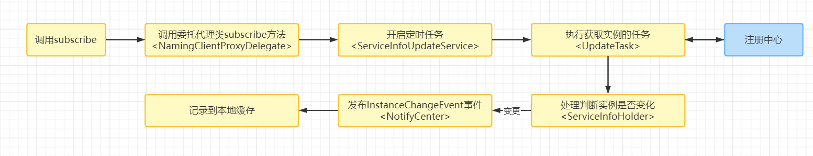
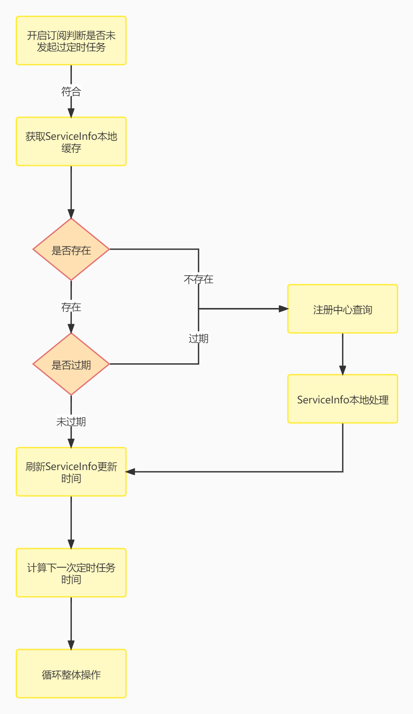

# Nacos客户端服务订阅机制的核心流程

​	说起Nacos的服务订阅机制，大家会觉得比较难理解，那我们就来详细分析一下，那我们先从Nacos订阅的概述说起


## Nacos订阅概述

​	Nacos的订阅机制，如果用一句话来描述就是：Nacos客户端通过一个定时任务，每6秒从注册中心获取实例列表，当发现实例发生变化时，发布变更事件，订阅者进行业务处理（更新实例，更改本地缓存）。

​	以下是订阅方法的主线流程，涉及内容比较多，细节比较复杂，所以这里我们主要学习核心部分。




## 定时任务开启

​	其实订阅本质上就是服务发现的一种方式，也就是在服务发现的时候执行订阅方法，触发定时任务去拉取服务端的数据。

​	NacosNamingService中暴露的许多重载的subscribe，重载的目的就是让大家少写一些参数，这些参数呢，Nacos给默认处理了。最终这些重载方法都会调用到下面这个方法：

```java
@Override
public void subscribe(String serviceName, String groupName, List<String> clusters, EventListener listener)
    throws NacosException {
    if (null == listener) {
        return;
    }
    String clusterString = StringUtils.join(clusters, ",");
    changeNotifier.registerListener(groupName, serviceName, clusterString, listener);
    clientProxy.subscribe(serviceName, groupName, clusterString);
}
```

​	这里我们先来看subscribe方法，大家可能有些眼熟它是clientProxy类型调用的方法，实际上就是NamingClientProxyDelegate.subscribe()，所以其实这里和之前的服务发现中调用的是一个方法，这里其实是在做服务列表的查询，所以得出结论查询和订阅都调用了同一个方法

```java
@Override
public ServiceInfo subscribe(String serviceName, String groupName, String clusters) throws NacosException {
    String serviceNameWithGroup = NamingUtils.getGroupedName(serviceName, groupName);
    String serviceKey = ServiceInfo.getKey(serviceNameWithGroup, clusters);
    // 定时调度UpdateTask
    serviceInfoUpdateService.scheduleUpdateIfAbsent(serviceName, groupName, clusters);
    // 获取缓存中的ServiceInfo
    ServiceInfo result = serviceInfoHolder.getServiceInfoMap().get(serviceKey);
    if (null == result) {//缓存的服务信息为空，
        // 如果为null，则进行订阅逻辑处理，基于gRPC协议
        result = grpcClientProxy.subscribe(serviceName, groupName, clusters);
    }
    // ServiceInfo本地缓存处理
    serviceInfoHolder.processServiceInfo(result);
    return result;
}
```

​	但是这里我们要关注这里的任务调度，该方法包含了构建serviceKey、通过serviceKey判断重复、最后添加UpdateTask，而其中的addTask的实现就是发起了一个定时任务：

```java
public void scheduleUpdateIfAbsent(String serviceName, String groupName, String clusters) {
    String serviceKey = ServiceInfo.getKey(NamingUtils.getGroupedName(serviceName, groupName), clusters);
    if (futureMap.get(serviceKey) != null) {
        return;
    }
    synchronized (futureMap) {
        if (futureMap.get(serviceKey) != null) {
            return;
        }
		//构建UpdateTask
        ScheduledFuture<?> future = addTask(new UpdateTask(serviceName, groupName, clusters));
        futureMap.put(serviceKey, future);
    }
}
```

​	定时任务延迟一秒执行：

```java
private synchronized ScheduledFuture<?> addTask(UpdateTask task) {
    return executor.schedule(task, DEFAULT_DELAY, TimeUnit.MILLISECONDS);
}
```

​	所以在这里我们得出结论，核心为：调用订阅方法和发起定时任务。

## 定时任务执行内容

​	UpdateTask封装了订阅机制的核心业务逻辑，我们来看一下流程图：



​	当我们知道了整体流程以后，我们再来看对应源码：

```java
@Override
public void run() {
    long delayTime = DEFAULT_DELAY;

    try {
        // 判断是服务是否订阅和未开启过定时任务，如果订阅过直接不在执行
        if (!changeNotifier.isSubscribed(groupName, serviceName, clusters) && !futureMap.containsKey(serviceKey)) {
            NAMING_LOGGER
                .info("update task is stopped, service:{}, clusters:{}", groupedServiceName, clusters);
            return;
        }
		
        // 获取缓存的service信息
        ServiceInfo serviceObj = serviceInfoHolder.getServiceInfoMap().get(serviceKey);
        // 如果为空
        if (serviceObj == null) {
            // 根据serviceName从注册中心服务端获取Service信息
            serviceObj = namingClientProxy.queryInstancesOfService(serviceName, groupName, clusters, 0, false);
            // 处理本地缓存
            serviceInfoHolder.processServiceInfo(serviceObj);
            lastRefTime = serviceObj.getLastRefTime();
            return;
        }
		
        // 过期服务，服务的最新更新时间小于等于缓存刷新（最后一次拉取数据的时间）时间，从注册中心重新查询
        if (serviceObj.getLastRefTime() <= lastRefTime) {
            serviceObj = namingClientProxy.queryInstancesOfService(serviceName, groupName, clusters, 0, false);
            // 处理本地缓存
            serviceInfoHolder.processServiceInfo(serviceObj);
        }
        //刷新更新时间
        lastRefTime = serviceObj.getLastRefTime();
        if (CollectionUtils.isEmpty(serviceObj.getHosts())) {
            incFailCount();
            return;
        }
        // 下次更新缓存时间设置，默认6秒
        // TODO multiple time can be configured.
        delayTime = serviceObj.getCacheMillis() * DEFAULT_UPDATE_CACHE_TIME_MULTIPLE;
        // 重置失败数量为0(可能会出现失败情况，没有ServiceInfo，连接失败)
        resetFailCount();
    } catch (Throwable e) {
        incFailCount();
        NAMING_LOGGER.warn("[NA] failed to update serviceName: {}", groupedServiceName, e);
    } finally {
        // 下次调度刷新时间，下次执行的时间与failCount有关，failCount=0，则下次调度时间为6秒，最长为1分钟
        // 即当无异常情况下缓存实例的刷新时间是6秒
        executor.schedule(this, Math.min(delayTime << failCount, DEFAULT_DELAY * 60), TimeUnit.MILLISECONDS);
    }
}
```

​	业务逻辑最后会计算下一次定时任务的执行时间，通过delayTime来延迟执行。delayTime默认为 1000L * 6，也就是6秒。而在finally里面真的发起下一次定时任务。当出现异常时，下次执行的时间与失败次数有关，但最长不超过1分钟。

## 总结：

1. 订阅方法的调用，并进行EventListener的注册，后面UpdateTask要用来进行判断；

2. 通过委托代理类来处理订阅逻辑，此处与获取实例列表方法使用了同一个方法；

3. 通过定时任务执行UpdateTask方法，默认执行间隔为6秒，当发生异常时会延长，但不超过1分钟；

5. UpdateTask方法中会比较本地是否存在缓存，缓存是否过期。当不存在或过期时，查询注册中心，获取最新实例，更新最后获取时间，处理ServiceInfo。

6. 重新计算定时任务时间，循环执行流程。

