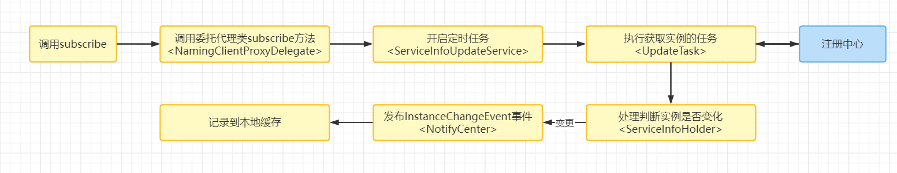
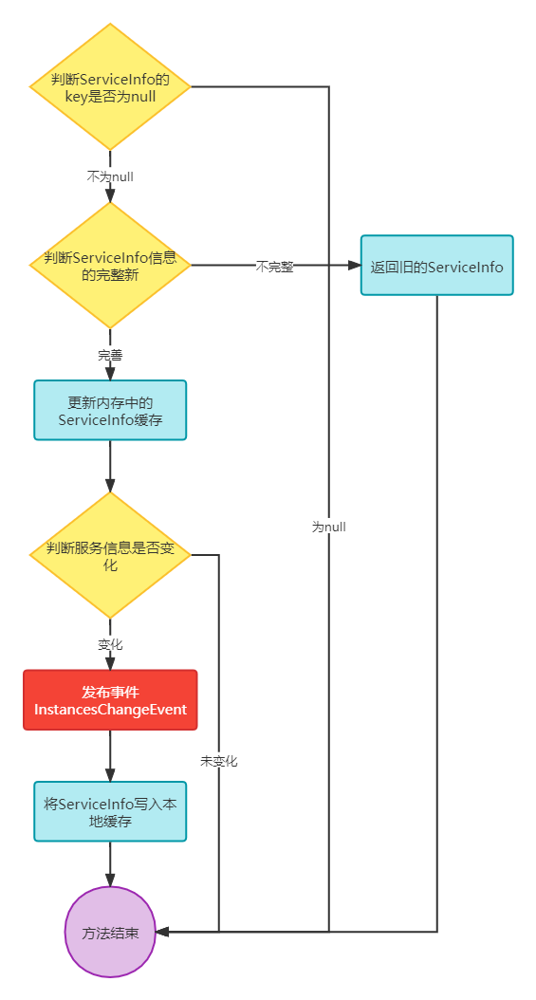
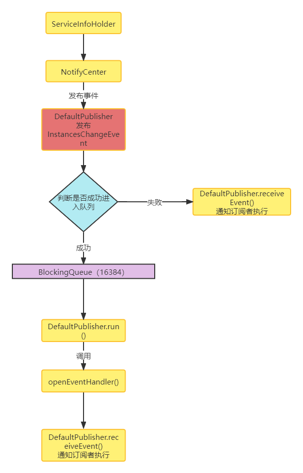

# Nacos客户端服务订阅的事件机制剖析

​	上节课我们已经分析了Nacos客户端订阅的核心流程：Nacos客户端通过一个定时任务，每6秒从注册中心获取实例列表，当发现实例发生变化时，发布变更事件，订阅者进行业务处理，然后更新内存中和本地的缓存中的实例。

​	这节课我们来分析，定时任务获取到最新实例列表之后，整个事件机制是如何处理的，首先我们先回顾整体流程



​	在第一步调用subscribe方法时，会订阅一个EventListener事件。而在定时任务UpdateTask定时获取实例列表之后，会调用ServiceInfoHolder.processServiceInfo方法对ServiceInfo进行本地处理，这其中就包括和事件处理。


## 监听事件的注册

​	在subscribe方法中，通过了下面的源码进行了监听事件的注册：

```java
@Override
public void subscribe(String serviceName, String groupName, List<String> clusters, EventListener listener)
    throws NacosException {
    if (null == listener) {
        return;
    }
    String clusterString = StringUtils.join(clusters, ",");
    //注册监听器:注册自定义的监听器，是一个扩展点
    changeNotifier.registerListener(groupName, serviceName, clusterString, listener);
    clientProxy.subscribe(serviceName, groupName, clusterString);
}
```

​	在这其中我们主要要关注的就是changeNotifier.registerListener，此监听就是进行具体事件注册逻辑的，我们来看一下源码：

​	可以看出，事件的注册便是将EventListener存储在InstancesChangeNotifier的listenerMap属性当中了。同时这里的数据结构为ConcurrentHashMap，key为服务实例的信息的拼接，value为监听事件的集合。

```java
public void registerListener(String groupName, String serviceName, String clusters, EventListener listener) {
    String key = ServiceInfo.getKey(NamingUtils.getGroupedName(serviceName, groupName), clusters);
    ConcurrentHashSet<EventListener> eventListeners = listenerMap.get(key);
    if (eventListeners == null) {
        synchronized (lock) {
            eventListeners = listenerMap.get(key);
            if (eventListeners == null) {
                eventListeners = new ConcurrentHashSet<EventListener>();
                //将EventListener缓存到listenerMap
                listenerMap.put(key, eventListeners);
            }
        }
      }
    eventListeners.add(listener);
}
```

## ServiceInfo处理

​	上面的源码中已经完成了事件的注册，现在就来追溯触发事件的来源，UpdateTask中获取到最新的实例会进行本地化处理，部分源码如下：

```java
// ServiceInfoUpdateService>UpdateTask>run()
ServiceInfo serviceObj = serviceInfoHolder.getServiceInfoMap().get(serviceKey);
if (serviceObj == null) {
    serviceObj = namingClientProxy.queryInstancesOfService(serviceName, groupName, clusters, 0, false);
    // 本地缓存处理
    serviceInfoHolder.processServiceInfo(serviceObj);
    lastRefTime = serviceObj.getLastRefTime();
    return;
}
```

​	这个run方法的详细逻辑昨天已经给大家分析过了，今天我们主要来看其中本地缓存处理的方法serviceInfoHolder.processServiceInfo，我们先来分析流程：

​	这个逻辑简单来说：判断新的ServiceInfo数据是否正确，是否发生了变化。如果数据格式正确，且发生变化，那就发布一个InstancesChangeEvent事件，同时将ServiceInfo写入本地缓存。



```java
public ServiceInfo processServiceInfo(ServiceInfo serviceInfo) {
    String serviceKey = serviceInfo.getKey();
    if (serviceKey == null) {
        return null;
    }
    ServiceInfo oldService = serviceInfoMap.get(serviceInfo.getKey());
    if (isEmptyOrErrorPush(serviceInfo)) {
        //empty or error push, just ignore
        return oldService;
    }
    // 缓存服务信息
    serviceInfoMap.put(serviceInfo.getKey(), serviceInfo);
    // 判断注册的实例信息是否已变更
    boolean changed = isChangedServiceInfo(oldService, serviceInfo);
    if (StringUtils.isBlank(serviceInfo.getJsonFromServer())) {
        serviceInfo.setJsonFromServer(JacksonUtils.toJson(serviceInfo));
    }
    // 监控服务监控缓存Map的大小
    MetricsMonitor.getServiceInfoMapSizeMonitor().set(serviceInfoMap.size());
    // 服务实例以更变
    if (changed) {
        NAMING_LOGGER.info("current ips:({}) service: {} -> {}", serviceInfo.ipCount(), serviceInfo.getKey(),
                           JacksonUtils.toJson(serviceInfo.getHosts()));
        // 添加实例变更事件，会被订阅者执行
        NotifyCenter.publishEvent(new InstancesChangeEvent(serviceInfo.getName(), serviceInfo.getGroupName(),
                                                           serviceInfo.getClusters(), serviceInfo.getHosts()));
        // 记录Service本地文件
        DiskCache.write(serviceInfo, cacheDir);
    }
    return serviceInfo;
}
```

​	分析到这里我们发现其实这个重点应该在服务信息变更之后，发布的InstancesChangeEvent事件，这个事件是NotifyCenter进行发布的，我们来追踪一下源码


## 事件追踪

​	NotifyCenter通知中心的核心流程如下：


​	NotifyCenter中进行事件发布，发布的核心逻辑是：

```xml
1. 根据InstancesChangeEvent事件类型，获得对应的CanonicalName
2. 将CanonicalName作为key，从NotifyCenter.publisherMap中获取对应的事件发布者(EventPublisher)
3. EventPublisher将InstancesChangeEvent事件进行发布
```
核心代码如下：

```java
private static boolean publishEvent(final Class<? extends Event> eventType, final Event event) {
    if (ClassUtils.isAssignableFrom(SlowEvent.class, eventType)) {
        return INSTANCE.sharePublisher.publish(event);
    }
	
    // 根据InstancesChangeEvent事件类型，获得对应的CanonicalName(规范名称)
    final String topic = ClassUtils.getCanonicalName(eventType);

    // 将CanonicalName作为Key，从NotifyCenter#publisherMap中获取对应的事件发布者（EventPublisher）
    EventPublisher publisher = INSTANCE.publisherMap.get(topic);
    if (publisher != null) {
        // 事件发布者publisher发布事件（InstancesChangeEvent）
        return publisher.publish(event);
    }
    LOGGER.warn("There are no [{}] publishers for this event, please register", topic);
    return false;
}
```

​	在这个源码中，其实INSTANCE为NotifyCenter的单例实现，那么这里的publisherMap中key(CanonicalName)和value(EventPublisher)之间的关系是什么时候建立的？

​	其实是在NacosNamingService实例化时调用init初始化方法中进行绑定的：

```java
// Publisher的注册过程在于建立InstancesChangeEvent.class与EventPublisher的关系。
NotifyCenter.registerToPublisher(InstancesChangeEvent.class, 16384);
```

​	这里再继续跟踪registerToPublisher方法就会发现默认采用了DEFAULT_PUBLISHER_FACTORY（默认发布者工厂）来进行构建，我们再继续跟踪会发现，在NotifyCenter中静态代码块，会发现DEFAULT_PUBLISHER_FACTORY默认构建的EventPublisher为DefaultPublisher。

```java
//com.alibaba.nacos.common.notify.NotifyCenter
public static EventPublisher registerToPublisher(final Class<? extends Event> eventType, final int queueMaxSize) {
    return registerToPublisher(eventType, DEFAULT_PUBLISHER_FACTORY, queueMaxSize);
}
--------------------------------------------------------------------------------------------
//NotifyCenter>static中部分代码
DEFAULT_PUBLISHER_FACTORY = (cls, buffer) -> {
    try {
        EventPublisher publisher = clazz.newInstance();
        publisher.init(cls, buffer);//初始化
        return publisher;
    } catch (Throwable ex) {
        LOGGER.error("Service class newInstance has error : ", ex);
        throw new NacosRuntimeException(SERVER_ERROR, ex);
    }
};
```

​	所以我们得出结论NotifyCenter中它维护了事件名称和事件发布者的关系，而默认的事件发布者为DefaultPublisher。


## DefaultPublisher的事件发布

​	我们现在来看一下默认事件发布者的源码，查看以后我们会发现它继承自Thread，也就是说它是一个线程类，同时，它又实现了EventPublisher，也就是发布者

```java
public class DefaultPublisher extends Thread implements EventPublisher
```

​	接下来我们来看它的init初始化方法，从这里我们可以看出当DefaultPublisher被初始化时，是以守护线程的方式运作的，其中还初始化了一个阻塞队列。

```java
//com.alibaba.nacos.common.notify.DefaultPublisher#init
@Override
public void init(Class<? extends Event> type, int bufferSize) {
    // 守护线程
    setDaemon(true);
    // 设置线程名字
    setName("nacos.publisher-" + type.getName());
    this.eventType = type;
    this.queueMaxSize = bufferSize;
    // 阻塞队列初始化
    this.queue = new ArrayBlockingQueue<>(bufferSize);
    start();
}
```

​	最后调用了start()方法：在这其中调用了super.start()启动线程

```java
//com.alibaba.nacos.common.notify.DefaultPublisher#start
@Override
public synchronized void start() {
    if (!initialized) {
        // start just called once
        super.start();
        if (queueMaxSize == -1) {
            queueMaxSize = ringBufferSize;
        }
        initialized = true;
    }
}
```

​	run()方法调用openEventHandler()方法

​	这里写了两个死循环，第一个死循环可以理解为延时效果，也就是说线程启动时最大延时60秒，在这60秒中每隔1秒判断一下当前线程是否关闭，是否有订阅者，是否超过60秒。如果满足一个条件，就可以提前跳出死循环。

​	而第二个死循环才是真正的业务逻辑处理，会从阻塞队列中取出一个事件，然后通过receiveEvent方法进行执行。

```java
@Override
public void run() {
    openEventHandler();
}

void openEventHandler() {
    try {

        // This variable is defined to resolve the problem which message overstock in the queue.
        int waitTimes = 60;
        // To ensure that messages are not lost, enable EventHandler when
        // waiting for the first Subscriber to register
        
        // 死循环延迟，线程启动最大延时60秒，这个主要是为了解决消息积压的问题。
        for (; ; ) {
            if (shutdown || hasSubscriber() || waitTimes <= 0) {
                break;
            }
            ThreadUtils.sleep(1000L);
            waitTimes--;
        }
		
        // 死循环不断的从队列中取出Event，并通知订阅者Subscriber执行Event
        for (; ; ) {
            if (shutdown) {
                break;
            }
            // 从队列中取出Event
            final Event event = queue.take();
            receiveEvent(event);
            UPDATER.compareAndSet(this, lastEventSequence, Math.max(lastEventSequence, event.sequence()));
        }
    } catch (Throwable ex) {
        LOGGER.error("Event listener exception : ", ex);
    }
}
```

​	队列中的事件哪里来的？其实就是DefaultPublisher的发布事件方法被调用了publish往阻塞队列中存入事件，如果存入失败，会直接调用receiveEvent。

​	可以理解为，如果向队列中存入失败，则立即执行，不走队列了。

```java
@Override
public boolean publish(Event event) {
    checkIsStart();
    // 向队列中插入事件元素
    boolean success = this.queue.offer(event);
    // 判断是否成功插入
    if (!success) {
        LOGGER.warn("Unable to plug in due to interruption, synchronize sending time, event : {}", event);
        // 失败直接执行
        receiveEvent(event);
        return true;
    }
    return true;
}
```

​	最后再来看receiveEvent方法的实现：这里其实就是遍历DefaultPublisher的subscribers（订阅者集合），然后执行通知订阅者的方法。

```java
void receiveEvent(Event event) {
    final long currentEventSequence = event.sequence();

    if (!hasSubscriber()) {
        LOGGER.warn("[NotifyCenter] the {} is lost, because there is no subscriber.", event);
        return;
    }

    // Notification single event listener
    // 通知订阅者执行Event
    for (Subscriber subscriber : subscribers) {
        // Whether to ignore expiration events
        if (subscriber.ignoreExpireEvent() && lastEventSequence > currentEventSequence) {
            LOGGER.debug("[NotifyCenter] the {} is unacceptable to this subscriber, because had expire",
                         event.getClass());
            continue;
        }

        // Because unifying smartSubscriber and subscriber, so here need to think of compatibility.
        // Remove original judge part of codes.
        notifySubscriber(subscriber, event);
    }
}
```

​	但是这里还有一个疑问，就是subscribers中订阅者哪里来的，这个还要回到NacosNamingService的init方法中：

```java
// 将Subscribe注册到Publisher
NotifyCenter.registerSubscriber(changeNotifier);


```

​	registerSubscriber方法最终会调用NotifyCenter的addSubscriber方法：核心逻辑就是将订阅事件、发布者、订阅者三者  进行绑定。而发布者与事件通过Map进行维护、发布者与订阅者通过关联关系进行维护。

```java
private static void addSubscriber(final Subscriber consumer, Class<? extends Event> subscribeType,
                                  EventPublisherFactory factory) {

    final String topic = ClassUtils.getCanonicalName(subscribeType);
    synchronized (NotifyCenter.class) {
        // MapUtils.computeIfAbsent is a unsafe method.
        MapUtil.computeIfAbsent(INSTANCE.publisherMap, topic, factory, subscribeType, ringBufferSize);
    }
    // 获取事件对应的Publisher，事件发布者
    EventPublisher publisher = INSTANCE.publisherMap.get(topic);
    if (publisher instanceof ShardedEventPublisher) {
        ((ShardedEventPublisher) publisher).addSubscriber(consumer, subscribeType);
    } else {
        // 添加到subscribers集合
        publisher.addSubscriber(consumer);//事件发布者与订阅者绑定
    }
}
```

​	关系都已经梳理明确了，事件也有了，最后我们看一下DefaulePublisher中的notifySubscriber方法，这里就是真正的订阅者执行事件了。

```java
@Override
public void notifySubscriber(final Subscriber subscriber, final Event event) {

    LOGGER.debug("[NotifyCenter] the {} will received by {}", event, subscriber);
	//执行订阅者事件
    final Runnable job = () -> subscriber.onEvent(event);
    // 执行者
    final Executor executor = subscriber.executor();

    if (executor != null) {
        executor.execute(job);
    } else {
        try {
            job.run();
        } catch (Throwable e) {
            LOGGER.error("Event callback exception: ", e);
        }
    }
}
```

## 总结

​	整体服务订阅的事件机制还是比较复杂的，因为用到了事件的形式，逻辑比较绕，并且其中还有守护线程，死循环，阻塞队列等。

​	需要重点理解NotifyCenter对事件发布者、事件订阅者和事件之间关系的维护，而这一关系的维护的入口就位于NacosNamingService的init方法当中。

### 核心流程梳理

**ServiceInfoHolder中通过NotifyCenter发布了InstancesChangeEvent事件**

**NotifyCenter中进行事件发布，发布的核心逻辑是：**

- 根据InstancesChangeEvent事件类型，获得对应的CanonicalName
- 将CanonicalName作为Key，从NotifyCenter.publisherMap中获取对应的事件发布者（EventPublisher）
- EventPublisher将InstancesChangeEvent事件进行发布

**InstancesChangeEvent事件发布：**

- 通过EventPublisher的实现类DefaultPublisher进行InstancesChangeEvent事件发布
- DefaultPublisher本身以守护线程的方式运作，在执行业务逻辑前，先判断该线程是否启动
- 如果启动，则将事件添加到BlockingQueue中，队列默认大小为16384
- 添加到BlockingQueue成功，则整个发布过程完成
- 如果添加失败，则直接调用DefaultPublisher.receiveEvent方法，接收事件并通知订阅者
- 通知订阅者时创建一个Runnable对象，执行订阅者的Event
- Event事件便是执行订阅时传入的事件

**如果添加到BlockingQueue成功，则走另外一个业务逻辑：**

- DefaultPublisher初始化时会创建一个阻塞（BlockingQueue）队列，并标记线程启动
- DefaultPublisher本身是一个Thread，当执行super.start方法时，会调用它的run方法
- run方法的核心业务逻辑是通过openEventHandler方法处理的
- openEventHandler方法通过两个for循环，从阻塞队列中获取时间信息
- 第一个for循环用于让线程启动时在60s内检查执行条件
- 第二个for循环为死循环，从阻塞队列中获取Event，并调用DefaultPublisher#receiveEvent方法，接收事件并通知订阅者
- Event事件便是执行订阅时传入的事件

