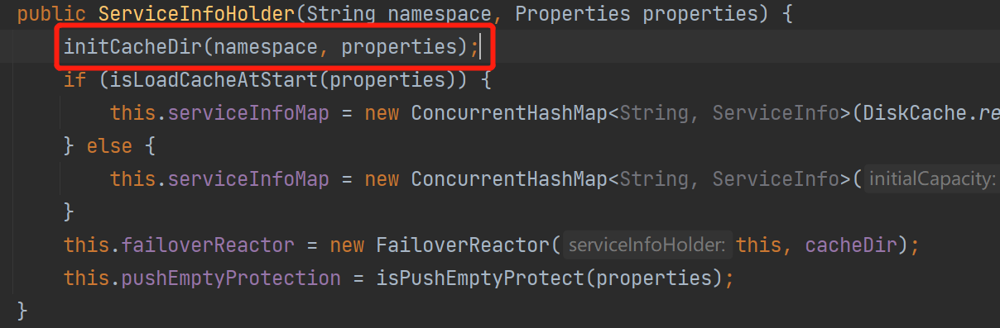

# Nacos客户端本地缓存及故障转移

​	在Nacos本地缓存的时候有的时候必然会出现一些故障，这些故障就需要进行处理，涉及到的核心类为ServiceInfoHolder和FailoverReactor。


​	本地缓存有两方面，第一方面是从注册中心获得实例信息会缓存在内存当中，也就是通过Map的形式承载，这样查询操作都方便。第二方面便是通过磁盘文件的形式定时缓存起来，以备不时之需。

​	故障转移也分两方面，第一方面是故障转移的开关是通过文件来标记的；第二方面是当开启故障转移之后，当发生故障时，可以从故障转移备份的文件中来获得服务实例信息。

## ServiceInfoHolder功能概述

​	ServiceInfoHolder类，顾名思义，服务信息的持有者。每次客户端从注册中心获取新的服务信息时都会调用该类，其中processServiceInfo方法来进行本地化处理，包括更新缓存服务、发布事件、更新本地文件等。


​	除了这些核心功能以外，该类在实例化的时候，还做了本地缓存目录初始化、故障转移初始化等操作，下面我们来分析。

## ServiceInfo的本地内存缓存

​	ServiceInfo，注册服务的信息，其中包含了服务名称、分组名称、集群信息、实例列表信息，上次更新时间等，所以我们由此得出客户端从服务端注册中心获得到的信息在本地都以ServiceInfo作为承载者。

​	而ServiceInfoHolder类又持有了ServiceInfo，通过一个ConcurrentMap来储存

```java
// ServiceInfoHolder
private final ConcurrentMap<String, ServiceInfo> serviceInfoMap;
```

​	这就是Nacos客户端对服务端获取到的注册信息的第一层缓存，并且之前的课程中我们分析processServiceInfo方法时，我们已经看到，当服务信息变更时会第一时间更新ServiceInfoMap中的信息

```java
public ServiceInfo processServiceInfo(ServiceInfo serviceInfo) {
 	....
    //缓存服务信息
    serviceInfoMap.put(serviceInfo.getKey(), serviceInfo);
    // 判断注册的实例信息是否更改
    boolean changed = isChangedServiceInfo(oldService, serviceInfo);
    if (StringUtils.isBlank(serviceInfo.getJsonFromServer())) {
        serviceInfo.setJsonFromServer(JacksonUtils.toJson(serviceInfo));
    }
    ....
    return serviceInfo;
}
```

​	serviceInfoMap的使用就是这样，当变动实例向其中put最新数据即可。当使用实例时，根据key进行get操作即可。

​	serviceInfoMap在ServiceInfoHolder的构造方法中进行初始化，默认创建一个空的ConcurrentMap。但当配置了启动时从缓存文件读取信息时，则会从本地缓存进行加载。

```java
public ServiceInfoHolder(String namespace, Properties properties) {
    initCacheDir(namespace, properties);
    // 启动时是否从缓存目录读取信息，默认false。
    if (isLoadCacheAtStart(properties)) {
        this.serviceInfoMap = new ConcurrentHashMap<String, ServiceInfo>(DiskCache.read(this.cacheDir));
    } else {
        this.serviceInfoMap = new ConcurrentHashMap<String, ServiceInfo>(16);
    }
    this.failoverReactor = new FailoverReactor(this, cacheDir);
    this.pushEmptyProtection = isPushEmptyProtect(properties);
}
```

​	这里我们要注意一下，涉及到了**本地缓存目录**，在我们上节课的学习中我们知道，processServiceInfo方法中，当服务实例变更时，会看到通过DiskCache#write方法向该目录写入ServiceInfo信息。

```java
public ServiceInfo processServiceInfo(ServiceInfo serviceInfo) {
   	.....
    // 服务实例已变更
    if (changed) {
        NAMING_LOGGER.info("current ips:({}) service: {} -> {}", serviceInfo.ipCount(), serviceInfo.getKey(),
                           JacksonUtils.toJson(serviceInfo.getHosts()));
        // 添加实例变更事件InstancesChangeEvent，订阅者
        NotifyCenter.publishEvent(new InstancesChangeEvent(serviceInfo.getName(), serviceInfo.getGroupName(),
                                                           serviceInfo.getClusters(), serviceInfo.getHosts()));
        // 记录Service本地文件
        DiskCache.write(serviceInfo, cacheDir);
    }
    return serviceInfo;
}
```


## 本地缓存目录

​	本地缓存目录cacheDir是ServiceInfoHolder的一个属性，用于指定本地缓存的根目录和故障转移的根目录。


​	在ServiceInfoHolder的构造方法中，初始化并且生成缓存目录



​	这个initCacheDir就不用了细看了，就是生成缓存目录的操作，默认路径：${user.home}/nacos/naming/public，也可以自定义，通过System.setProperty("JM.SNAPSHOT.PATH")自定义

​	这里初始化完目录之后，故障转移信息也存储在该目录下。

```java
private void initCacheDir(String namespace, Properties properties) {
    String jmSnapshotPath = System.getProperty(JM_SNAPSHOT_PATH_PROPERTY);

    String namingCacheRegistryDir = "";
    if (properties.getProperty(PropertyKeyConst.NAMING_CACHE_REGISTRY_DIR) != null) {
        namingCacheRegistryDir = File.separator + properties.getProperty(PropertyKeyConst.NAMING_CACHE_REGISTRY_DIR);
    }

    if (!StringUtils.isBlank(jmSnapshotPath)) {
        cacheDir = jmSnapshotPath + File.separator + FILE_PATH_NACOS + namingCacheRegistryDir
            + File.separator + FILE_PATH_NAMING + File.separator + namespace;
    } else {
        cacheDir = System.getProperty(USER_HOME_PROPERTY) + File.separator + FILE_PATH_NACOS + namingCacheRegistryDir
            + File.separator + FILE_PATH_NAMING + File.separator + namespace;
    }
}
```

## 故障转移

​	在ServiceInfoHolder的构造方法中，还会初始化一个FailoverReactor类，同样是ServiceInfoHolder的成员变量。FailoverReactor的作用便是用来处理故障转移的。


```
public ServiceInfoHolder(String namespace, Properties properties) {
    ....
    // this为ServiceHolder当前对象，这里可以立即为两者相互持有对方的引用
    this.failoverReactor = new FailoverReactor(this, cacheDir);
    .....
}
```

​	我们来看一下FailoverReactor的构造方法，FailoverReactor的构造方法基本上把它的功能都展示出来了：

	1. 持有ServiceInfoHolder的引用
 	2. 拼接故障目录：${user.home}/nacos/naming/public/failover，其中public也有可能是其他的自定义命名空间
 	3. 初始化executorService（执行者服务）
 	4. init方法：通过executorService开启多个定时任务执行

```java
public FailoverReactor(ServiceInfoHolder serviceInfoHolder, String cacheDir) {
    // 持有ServiceInfoHolder的引用
    this.serviceInfoHolder = serviceInfoHolder;
    // 拼接故障目录：${user.home}/nacos/naming/public/failover
    this.failoverDir = cacheDir + FAILOVER_DIR;
    // 初始化executorService
    this.executorService = new ScheduledThreadPoolExecutor(1, new ThreadFactory() {
        @Override
        public Thread newThread(Runnable r) {
            Thread thread = new Thread(r);
            // 守护线程模式运行
            thread.setDaemon(true);
            thread.setName("com.alibaba.nacos.naming.failover");
            return thread;
        }
    });
    // 其他初始化操作，通过executorService开启多个定时任务执行
    this.init();
}
```

## init方法执行

​	在这个方法中开启了三个定时任务，这三个任务其实都是FailoverReactor的内部类：

	1. 初始化立即执行，执行间隔5秒，执行任务SwitchRefresher
 	2. 初始化延迟30分钟执行，执行间隔24小时，执行任务DiskFileWriter
 	3. 初始化立即执行，执行间隔10秒，执行核心操作为DiskFileWriter

```java
public void init() {
	// 初始化立即执行，执行间隔5秒，执行任务SwitchRefresher
    executorService.scheduleWithFixedDelay(new SwitchRefresher(), 0L, 5000L, TimeUnit.MILLISECONDS);
	// 初始化延迟30分钟执行，执行间隔24小时，执行任务DiskFileWriter
    executorService.scheduleWithFixedDelay(new DiskFileWriter(), 30, DAY_PERIOD_MINUTES, TimeUnit.MINUTES);

    // backup file on startup if failover directory is empty.
    // 如果故障目录为空，启动时立即执行，立即备份文件
    // 初始化立即执行，执行间隔10秒，执行核心操作为DiskFileWriter
    executorService.schedule(new Runnable() {
        @Override
        public void run() {
            try {
                File cacheDir = new File(failoverDir);

                if (!cacheDir.exists() && !cacheDir.mkdirs()) {
                    throw new IllegalStateException("failed to create cache dir: " + failoverDir);
                }

                File[] files = cacheDir.listFiles();
                if (files == null || files.length <= 0) {
                    new DiskFileWriter().run();
                }
            } catch (Throwable e) {
                NAMING_LOGGER.error("[NA] failed to backup file on startup.", e);
            }

        }
    }, 10000L, TimeUnit.MILLISECONDS);
}
```

​	这里我们先看DiskFileWriter，这里的逻辑不难，就是获取ServiceInfo中缓存的ServiceInfo，判断是否满足写入磁盘，如果条件满足，就将其写入拼接的故障目录，因为后两个定时任务执行的都是DiskFileWriter，但是第三个定时任务是有前置判断的，只要文件不存在就会立即执行把文件写入到本地磁盘中。

```java
class DiskFileWriter extends TimerTask {

    @Override
    public void run() {
        Map<String, ServiceInfo> map = serviceInfoHolder.getServiceInfoMap();
        for (Map.Entry<String, ServiceInfo> entry : map.entrySet()) {
            ServiceInfo serviceInfo = entry.getValue();
            if (StringUtils.equals(serviceInfo.getKey(), UtilAndComs.ALL_IPS) || StringUtils
                .equals(serviceInfo.getName(), UtilAndComs.ENV_LIST_KEY) || StringUtils
                .equals(serviceInfo.getName(), UtilAndComs.ENV_CONFIGS) || StringUtils
                .equals(serviceInfo.getName(), UtilAndComs.VIP_CLIENT_FILE) || StringUtils
                .equals(serviceInfo.getName(), UtilAndComs.ALL_HOSTS)) {
                continue;
            }
			// 将缓存写入磁盘
            DiskCache.write(serviceInfo, failoverDir);
        }
    }
}
```

​	接下来，我们再来看第一个定时任务SwitchRefresher的核心实现，具体逻辑如下：

	1. 如果故障转移文件不存在，则直接返回（文件开关）
 	2. 比较文件修改时间，如果已经修改，则获取故障转移文件中的内容。
 	3. 故障转移文件中存储了0和1标识。0表示关闭，1表示开启。
 	4. 当为开启状态时，执行线程FailoverFileReader。

```java
class SwitchRefresher implements Runnable {

    long lastModifiedMillis = 0L;

    @Override
    public void run() {
        try {
            File switchFile = new File(failoverDir + UtilAndComs.FAILOVER_SWITCH);
            // 文件不存在则退出
            if (!switchFile.exists()) {
                switchParams.put(FAILOVER_MODE_PARAM, Boolean.FALSE.toString());
                NAMING_LOGGER.debug("failover switch is not found, {}", switchFile.getName());
                return;
            }

            long modified = switchFile.lastModified();
			
            if (lastModifiedMillis < modified) {
                lastModifiedMillis = modified;
                // 获取故障转移文件内容
                String failover = ConcurrentDiskUtil.getFileContent(failoverDir + UtilAndComs.FAILOVER_SWITCH,
                                                                    Charset.defaultCharset().toString());
                if (!StringUtils.isEmpty(failover)) {
                    String[] lines = failover.split(DiskCache.getLineSeparator());

                    for (String line : lines) {
                        String line1 = line.trim();
                        // 1 表示开启故障转移模式
                        if (IS_FAILOVER_MODE.equals(line1)) {
                            switchParams.put(FAILOVER_MODE_PARAM, Boolean.TRUE.toString());
                            NAMING_LOGGER.info("failover-mode is on");
                            new FailoverFileReader().run();
                        // 0 表示关闭故障转移模式
                        } else if (NO_FAILOVER_MODE.equals(line1)) {
                            switchParams.put(FAILOVER_MODE_PARAM, Boolean.FALSE.toString());
                            NAMING_LOGGER.info("failover-mode is off");
                        }
                    }
                } else {
                    switchParams.put(FAILOVER_MODE_PARAM, Boolean.FALSE.toString());
                }
            }

        } catch (Throwable e) {
            NAMING_LOGGER.error("[NA] failed to read failover switch.", e);
        }
    }
}
```

## FailoverFileReader

​	顾名思义，故障转移文件读取，基本操作就是读取failover目录存储的**备份服务信息文件**内容，然后转换成ServiceInfo，并且将所有的ServiceInfo储存在FailoverReactor的ServiceMap属性中。

​	流程如下：

	1. 读取failover目录下的所有文件，进行遍历处理
 	2. 如果文件不存在跳过
 	3. 如果文件是故障转移开关标志文件跳过
 	4. 读取文件中的备份内容，转换为ServiceInfo对象
 	5. 将ServiceInfo对象放入到domMap中
 	6. 最后判断domMap不为空，赋值给serviceMap

```java
class FailoverFileReader implements Runnable {

    @Override
    public void run() {
        Map<String, ServiceInfo> domMap = new HashMap<String, ServiceInfo>(16);

        BufferedReader reader = null;
        try {

            File cacheDir = new File(failoverDir);
            if (!cacheDir.exists() && !cacheDir.mkdirs()) {
                throw new IllegalStateException("failed to create cache dir: " + failoverDir);
            }

            File[] files = cacheDir.listFiles();
            if (files == null) {
                return;
            }

            for (File file : files) {
                if (!file.isFile()) {
                    continue;
                }
				// 如果是故障转移标志文件，则跳过
                if (file.getName().equals(UtilAndComs.FAILOVER_SWITCH)) {
                    continue;
                }

                ServiceInfo dom = new ServiceInfo(file.getName());

                try {
                    String dataString = ConcurrentDiskUtil
                        .getFileContent(file, Charset.defaultCharset().toString());
                    reader = new BufferedReader(new StringReader(dataString));

                    String json;
                    if ((json = reader.readLine()) != null) {
                        try {
                            dom = JacksonUtils.toObj(json, ServiceInfo.class);
                        } catch (Exception e) {
                            NAMING_LOGGER.error("[NA] error while parsing cached dom : {}", json, e);
                        }
                    }

                } catch (Exception e) {
                    NAMING_LOGGER.error("[NA] failed to read cache for dom: {}", file.getName(), e);
                } finally {
                    try {
                        if (reader != null) {
                            reader.close();
                        }
                    } catch (Exception e) {
                        //ignore
                    }
                }
                if (!CollectionUtils.isEmpty(dom.getHosts())) {
                    domMap.put(dom.getKey(), dom);
                }
            }
        } catch (Exception e) {
            NAMING_LOGGER.error("[NA] failed to read cache file", e);
        }
		
        // 读入缓存
        if (domMap.size() > 0) {
            serviceMap = domMap;
        }
    }
}
```

​	但是这里还有一个问题就是serviceMap是哪里用到的，这个其实是我们之前读取实例时候用到的getServiceInfo方法

​	其实这里就是一旦开启故障转移就会先调用failoverReactor.getService方法，此方法便是从serviceMap中获取ServiceInfo

```java
public ServiceInfo getService(String key) {
    ServiceInfo serviceInfo = serviceMap.get(key);

    if (serviceInfo == null) {
        serviceInfo = new ServiceInfo();
        serviceInfo.setName(key);
    }

    return serviceInfo;
}
```

​	调用serviceMap方法getServiceInfo方法就在ServiceInfoHolder中

```java
// ServiceInfoHolder
public ServiceInfo getServiceInfo(final String serviceName, final String groupName, final String clusters) {
    NAMING_LOGGER.debug("failover-mode: {}", failoverReactor.isFailoverSwitch());
    String groupedServiceName = NamingUtils.getGroupedName(serviceName, groupName);
    String key = ServiceInfo.getKey(groupedServiceName, clusters);
    if (failoverReactor.isFailoverSwitch()) {
        return failoverReactor.getService(key);
    }
    return serviceInfoMap.get(key);
}
```


