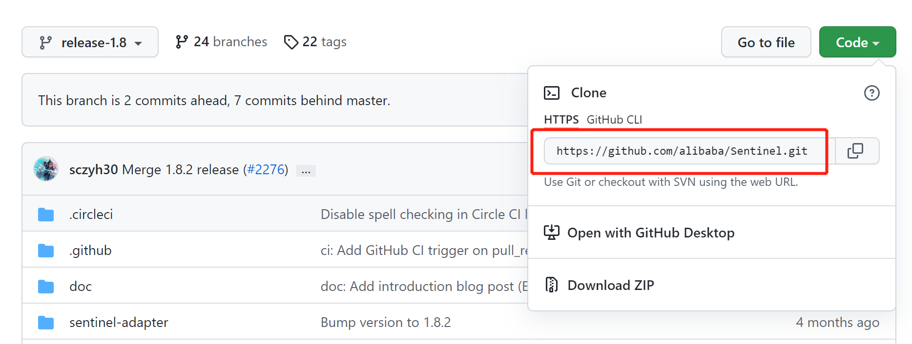
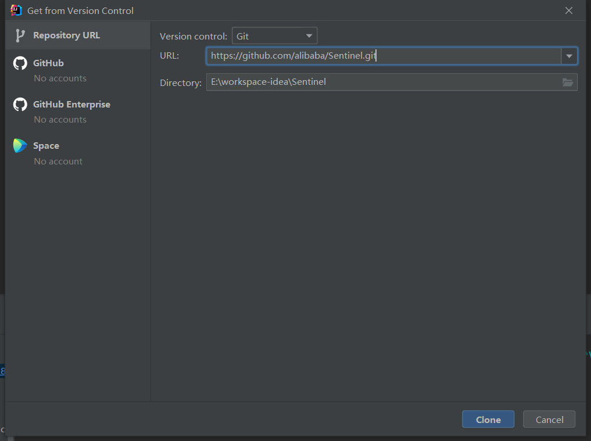

# Sentinel核心源码分析-课程开篇

Sentinel是分布式系统的防御系统。以流量为切入点，通过动态设置的流量控制、服务熔断等手段达到 保护系统的目的，通过服务降级增强服务被拒后用户的体验。

## Sentinel工作原理

**ProcessorSlotChain**

Sentinel 的核心骨架，将不同的 Slot 按照顺序串在一起（责任链模式），从而将不同的功能（限流、降级、系统保护）组合在一起。slot chain 其实可以分为两部分：统计数据构建部分（statistic）和判断部分（rule checking）。核心结构

Sentinel 将 `ProcessorSlot` 作为 SPI 接口进行扩展，使得 Slot Chain 具备了扩展的能力。您可以自行加入自定义的 slot 并编排 slot 间的顺序，从而可以给 Sentinel 添加自定义的功能。

## 官方版本说明

通过官方网站我们可以看到现在应该使用的Sentinel版本，通过官方的要求我们下载对应版本的Sentinel源码：https://github.com/alibaba/spring-cloud-alibaba/wiki/%E7%89%88%E6%9C%AC%E8%AF%B4%E6%98%8E

## Sentinel源码下载

下载地址：https://github.com/alibaba/Sentinel/tree/release-1.8

下载方式，我们可以下载zip包，也可以直接通过idea进行下载和打开

