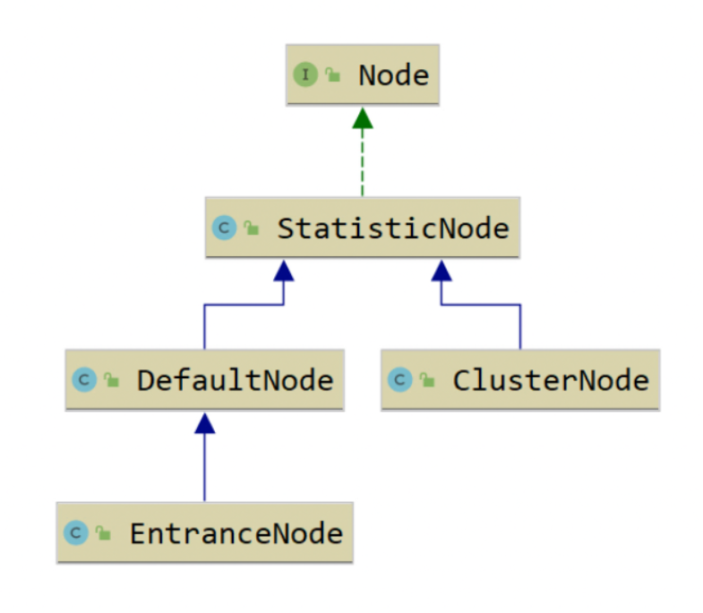
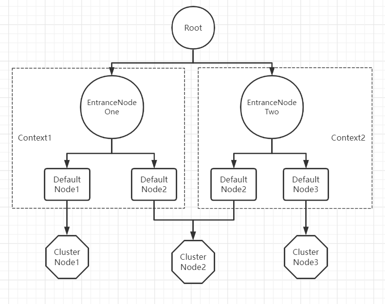

# Sentinel源码解析-Node之间的关系

在上节课我们通过官方演示代码，搞清楚一个Context之中，Resource和Entry的关系，一个Context中可以有多个Resource，每个资源都必须对应一个Entry，这节课我们来研究一下Node之间的关系


## Node 关系官方图解

这张图的上半部分其实体现了Node之间的关系，官方提供的图不够明显，我们需要进行细化


要先理解这个官方提供的图，我们需要看一下源码的关系



从这张图片我们能够提取出几个Node：

- Node：接口，Sentinel 里面的各种种类的统计节点
- StatisticNode：统计节点，是Node的实现类，用于完成数据统计
- EntranceNode：DefaultNode的子类，入口节点，一个Context会有一个入口节点，用于统计当前Context的总体流量数据，统计维度为Context
- DefaultNode：默认节点，用于统计一个resource在当前Context中的流量数据，DefaultNode持有指定的Context和指定的Resource的统计数据，意味着DefaultNode是以Context和Resource为维度的统计节点
- ClusterNode：ClusterNode保存的是同一个Resource的相关的统计信息，是以Resource为维度的，不区分Context，这个是和DefaultNode的区别

## Node之间的关系

Node 接口定义了一个 Node 类所需要提供的各项指标数据统计的相关功能，为外部屏蔽滑动窗口的存在。提供记录请求被拒绝、请求被放行、请求处理异常、请求处理成功的方法，以及获取当前时间窗口统计的请求总数、平均耗时等方法。



## 案例代码改进

昨天我们通过官方提供的演示案例写一个演示代码，那么我们为了理解这个Node之间的关系，我们再来增加一些代码，为了理解Node之间的关系

```java
//增加一个Context
package demo;

import com.alibaba.csp.sentinel.Entry;
import com.alibaba.csp.sentinel.Sph;
import com.alibaba.csp.sentinel.SphU;
import com.alibaba.csp.sentinel.context.ContextUtil;
import com.alibaba.csp.sentinel.slots.block.BlockException;

public class ContextDemo {
    public void ContextUtil(){
        // 创建一个来自appA访问的Context
        // Context的名称为entrance1
        ContextUtil.enter("entrance1", "appA");
        // Entry就是一个资源操作对象
        Entry nodeA = null;
        Entry nodeB = null;
        try {
            // 获取资源resource的entry
            nodeA = SphU.entry("resource1");//后续会展开这个位置
            // 如果代码走到这个位置，就说明当前请求通过了流控，可以继续进行相关业务处理
            nodeB = SphU.entry("resource2");
            // 如果代码走到这个位置，就说明当前请求通过了流控，可以继续进行相关业务处理
        } catch (BlockException e) {
            // 如果没有通过走到了这里，就表示请求被限流，这里进行降级操作
            e.printStackTrace();
        } finally {
            if (nodeA != null) {
                nodeA.exit();
            }
            if (nodeB != null) {
                nodeB.exit();
            }
        }
        // 释放Context
        ContextUtil.exit();

       // ---------------------创建另一个来自appA访问的Context------------------------------

        // 创建一个来自appA访问的Context
        // Context的名称为entrance1
        ContextUtil.enter("entrance2", "appA");
        // Entry就是一个资源操作对象
        Entry nodeC = null;
        try {
            nodeB = SphU.entry("resource2");
            // 如果代码走到这个位置，就说明当前请求通过了流控，可以继续进行相关业务处理
            nodeC = SphU.entry("resource3");
        } catch (BlockException e) {
            // 如果没有通过走到了这里，就表示请求被限流，这里进行降级操作
            e.printStackTrace();
        } finally {
            if (nodeB != null) {
                nodeB.exit();
            }
            if (nodeC != null) {
                nodeC.exit();
            }
        }
        // 释放Context
        ContextUtil.exit();
    }
}
```

