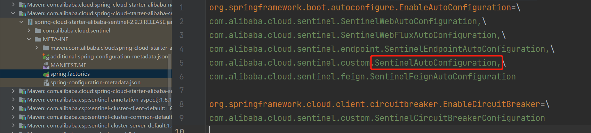

# Sentinel源码解析-源码入口

##  分析入口

在微服务的使用Sentinel实际工作场景中，我们只需要引入对应依赖：spring-cloud-starter-alibaba-sentinel，就会进行自动装配，所以我们之间看META-INF/spring.factories，然后我们这里从SentinelAutoConfiguration开始看起



为了我们方便跟踪，我们在找到这个类型以后，直接通过源码进行查看，然后在这个类型中我们要找到以下代码，之前我们就说过Sentinel是通过AOP的方式进行切入的，从这里我们看到了Aspect关键字，所以我们就从这里跟进去

```java
@Bean
@ConditionalOnMissingBean
public SentinelResourceAspect sentinelResourceAspect() {
    return new SentinelResourceAspect();
}
```

跟进去以后，我们就会发现这里就是再利用AOP通过@SentinelResource为注解来作为切入点，进行切入

```java
@Aspect //切面
public class SentinelResourceAspect extends AbstractSentinelAspectSupport {

    //指定切入点为SentinelResource注解
    @Pointcut("@annotation(com.alibaba.csp.sentinel.annotation.SentinelResource)")
    public void sentinelResourceAnnotationPointcut() {
    }
...
}
```

再往下跟我们会发现，还有@Around注解进行环绕通知，根据我们之前学习的知道我们从这里可以得知，其实这就是是利用@SentinelResource注解作为切点，然后在通过AOP环绕通知，来进行增强，在执行原方法前，来执行对应操作，当然这里我们可以看出，一旦出现了限流或者限流就会走BlockException。

```java
// 环绕通知
@Around("sentinelResourceAnnotationPointcut()")
public Object invokeResourceWithSentinel(ProceedingJoinPoint pjp) throws Throwable {
    Method originMethod = resolveMethod(pjp);

    SentinelResource annotation = originMethod.getAnnotation(SentinelResource.class);
    if (annotation == null) {
        // Should not go through here.
        throw new IllegalStateException("Wrong state for SentinelResource annotation");
    }
    String resourceName = getResourceName(annotation.value(), originMethod);
    EntryType entryType = annotation.entryType();
    int resourceType = annotation.resourceType();
    Entry entry = null;
    try {
        // 创建资源操作对象
        entry = SphU.entry(resourceName, resourceType, entryType, pjp.getArgs());
        // 调用原方法
        return pjp.proceed();
    } catch (BlockException ex) {
        return handleBlockException(pjp, annotation, ex);
    } catch (Throwable ex) {
        Class<? extends Throwable>[] exceptionsToIgnore = annotation.exceptionsToIgnore();
        // The ignore list will be checked first.
        if (exceptionsToIgnore.length > 0 && exceptionBelongsTo(ex, exceptionsToIgnore)) {
            throw ex;
        }
        if (exceptionBelongsTo(ex, annotation.exceptionsToTrace())) {
            traceException(ex);
            return handleFallback(pjp, annotation, ex);
        }

        // No fallback function can handle the exception, so throw it out.
        throw ex;
    } finally {
        if (entry != null) {
            entry.exit(1, pjp.getArgs());
        }
    }
}
```

在以上的这段代码中还有一个问题，我们在之前就说过，在创建资源操作对象的时候我们需要先创建Context，但是明显这里没有显示创建，但是实际上我们如果看Context概念的话，就会知道，如果程序中未指定Context，会创建name为"sentinel_default_context"的默认Context，然后我们继续往下跟踪。

```java
public static Entry entry(String name, int resourceType, EntryType trafficType, Object[] args)
    throws BlockException {
    //限流方法
    return Env.sph.entryWithType(name, resourceType, trafficType, 1, args);
}
```

进入到entry方法中，这里的entryWithType方法就是我们要看的真正的限流的方法，具体的实现方法在**com.alibaba.csp.sentinel.CtSph.entryWithType**

```java
@Override
public Entry entryWithType(String name, int resourceType, EntryType entryType, int count, Object[] args)
    throws BlockException {
    return entryWithType(name, resourceType, entryType, count, false, args);
}

@Override
public Entry entryWithType(String name, int resourceType, EntryType entryType, int count, boolean prioritized,
                           Object[] args) throws BlockException {
    // 这里将资源的名称和信息封装称为资源对象
    StringResourceWrapper resource = new StringResourceWrapper(name, entryType, resourceType);
    // 返回一个Entry资源操作对象
    // prioritized属性表示优先级，默认值为false，表示当前请求不按照优先级执行，直接执行
    return entryWithPriority(resource, count, prioritized, args);
}
```

我们接下来来具体分析核心方法entryWithPriority

```java
private Entry entryWithPriority(ResourceWrapper resourceWrapper, int count, boolean prioritized, Object... args)
    throws BlockException {
    // 从当前线程中获取Context
    // 一个请求会占用一个线程，并且绑定一个Context
    Context context = ContextUtil.getContext();
    // 一个请求对应一个Context
   	// 如果当前类型为NullContext，表示此时请求已经超出了阈值，无需检测规则
    if (context instanceof NullContext) {
        // The {@link NullContext} indicates that the amount of context has exceeded the threshold,
        // so here init the entry only. No rule checking will be done.
        return new CtEntry(resourceWrapper, null, context);
    }
	
    // 此时如果获取Context为空，就创建默认的sentinel_default_context，并且会放入到当前线程中
    if (context == null) {
        // Using default context.
        context = InternalContextUtil.internalEnter(Constants.CONTEXT_DEFAULT_NAME);
    }

    // 判断全局开关，如果是关闭状态，直接返回无需检测规则
    // Global switch is close, no rule checking will do.
    if (!Constants.ON) {
        return new CtEntry(resourceWrapper, null, context);
    }
    /**
     * 这里是整个架构的核心所在，这里是在构建一个处理链，这个处理链是一个单向链表结构，类似于Filter一样，构建这个链条的
     * 原因是对业务进行解耦，像限流资源保护有很多，比如限流、降级、热点参数、系统降级等等，如果都写在一起就耦合很严重，我们知道oop的
     * 思想就是让每个类确定各自的职责，不要让他做不相干的事情，所以这里将业务进行全面解耦，然后在解耦的同时又通过链式编程将它们串起来
     */
    ProcessorSlot<Object> chain = lookProcessChain(resourceWrapper);

    /*
         * Means amount of resources (slot chain) exceeds {@link Constants.MAX_SLOT_CHAIN_SIZE},
         * so no rule checking will be done.
         */
    if (chain == null) {
        return new CtEntry(resourceWrapper, null, context);
    }

    Entry e = new CtEntry(resourceWrapper, chain, context);
    try {
        // 针对资源操作
        chain.entry(context, resourceWrapper, null, count, prioritized, args);
    } catch (BlockException e1) {
        e.exit(count, args);
        throw e1;
    } catch (Throwable e1) {
        // This should not happen, unless there are errors existing in Sentinel internal.
        RecordLog.info("Sentinel unexpected exception", e1);
    }
    return e;
}
```

