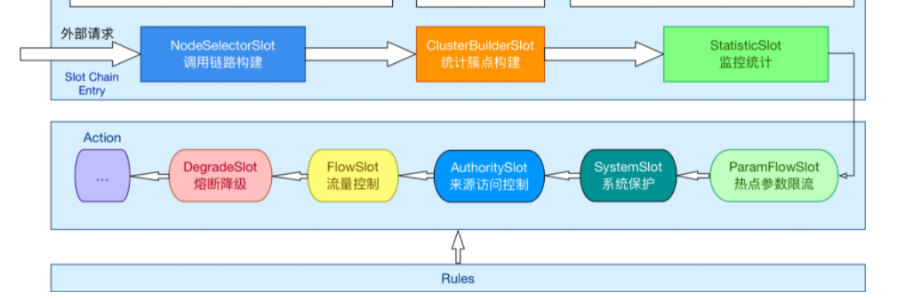

# Sentinel源码解析-SlotChain入口解析


## 默认Chain解析

​	我们从这里继续分析，这个位置的chain.entry方法，但是此时这个chain是谁？

```java
//CtSph中
try {
    // 针对资源操作
    chain.entry(context, resourceWrapper, null, count, prioritized, args);
} catch (BlockException e1) {
    e.exit(count, args);
    throw e1;
} catch (Throwable e1) {
    // This should not happen, unless there are errors existing in Sentinel internal.
    RecordLog.info("Sentinel unexpected exception", e1);
}
```

那么这个位置开始，我们就要分析一下如下代码

官方定义：Sentinel 将 ProcessorSlot作为 SPI 接口进行扩展（1.7.2 版本以前 SlotChainBuilder作为 SPI），使得 Slot Chain 具备了扩展的能力。您可以自行加入自定义的 slot 并编排 slot 间的顺序，**从而可以给 Sentinel 添加自定义的功能。**

lookProcessChain()用于构建一个责任链。Sentinel的处理核心都在这个责任链中，链中每一个节点是一个Slot实例，这个链通过BlockException异常来告知调用入口最终的执行情况

```java
// 获取chain链
ProcessorSlot<Object> chain = lookProcessChain(resourceWrapper);
//-------------------具体看lookProcessChain方法---------------------
ProcessorSlot<Object> lookProcessChain(ResourceWrapper resourceWrapper) {
    // 先从chainMap获取，若是存在，则直接返回
    ProcessorSlotChain chain = chainMap.get(resourceWrapper);
    if (chain == null) {
        synchronized (LOCK) {
            chain = chainMap.get(resourceWrapper);
            if (chain == null) {
                // Entry size limit.
                if (chainMap.size() >= Constants.MAX_SLOT_CHAIN_SIZE) {
                    return null;
                }
				// 通过SlotChainProvider创建一个slot链
                chain = SlotChainProvider.newSlotChain();
                Map<ResourceWrapper, ProcessorSlotChain> newMap = new HashMap<ResourceWrapper, ProcessorSlotChain>(
                    chainMap.size() + 1);
                newMap.putAll(chainMap);
                // 添加到Map缓存中
                newMap.put(resourceWrapper, chain);
                chainMap = newMap;
            }
        }
    }
    return chain;
}
```

这个位置我们要具体分析**SlotChainProvider**这个类型，它的主要作用就是通过已解析的槽链构建器，创建槽链的提供者

从这里我们可以看出SlotChainBuilder及ProcessorSlot 使用Java SPI技术实现可配置化，即在/META-INF/services/接口全限命名 的文件中配置实现类，然后由ServiceLoader实现加载，这种技术在SpringBoot中都有使用。不作讲解。

```java
package com.alibaba.csp.sentinel.slotchain;

import com.alibaba.csp.sentinel.log.RecordLog;
import com.alibaba.csp.sentinel.slots.DefaultSlotChainBuilder;
import com.alibaba.csp.sentinel.spi.SpiLoader;

/**
 * A provider for creating slot chains via resolved slot chain builder SPI.
 *
 * @author Eric Zhao
 * @since 0.2.0
 */
public final class SlotChainProvider {

    private static volatile SlotChainBuilder slotChainBuilder = null;

    /**
     * The load and pick process is not thread-safe, but it's okay since the method should be only invoked
     * via {@code lookProcessChain} in {@link com.alibaba.csp.sentinel.CtSph} under lock.
     *
     * @return new created slot chain
     */
    public static ProcessorSlotChain newSlotChain() {
        if (slotChainBuilder != null) {
            return slotChainBuilder.build();
        }

        // 读取配置文件在/META-INF/services/接口全限定命名的文件中配置实现类.
        slotChainBuilder = SpiLoader.of(SlotChainBuilder.class).loadFirstInstanceOrDefault();

        if (slotChainBuilder == null) {
            // Should not go through here.
            RecordLog.warn("[SlotChainProvider] Wrong state when resolving slot chain builder, using default");
            //使用默认的DefaultSlotChainBuilder来构建ProcessorSlotChain
            slotChainBuilder = new DefaultSlotChainBuilder();
        } else {
            RecordLog.info("[SlotChainProvider] Global slot chain builder resolved: {}",
                slotChainBuilder.getClass().getCanonicalName());
        }
        //使用DefaultSlotChainBuilder构建
        return slotChainBuilder.build();
    }

    private SlotChainProvider() {}
}
```

到这里我们就清楚的知道了其实现在使用的是使用DefaultSlotChainBuilder.build()来创建的，以下是源码

在这个其中，做了几件事：

	1. 创建DefaultProcessorSlotChain
	2. 读取/META-INF/services/中的配置文件
	 3. 强制转型为AbstractLinkedProcessorSlot（所有插槽的抽象父类）

```java
@Spi(isDefault = true)
public class DefaultSlotChainBuilder implements SlotChainBuilder {

    @Override
    public ProcessorSlotChain build() {
        // 创建DefaultProcessorSlotChain
        ProcessorSlotChain chain = new DefaultProcessorSlotChain();
		// 读取配置文件在/META-INF/services/接口全限定命名的文件
        List<ProcessorSlot> sortedSlotList = SpiLoader.of(ProcessorSlot.class).loadInstanceListSorted();
        for (ProcessorSlot slot : sortedSlotList) {
            if (!(slot instanceof AbstractLinkedProcessorSlot)) {
                RecordLog.warn("The ProcessorSlot(" + slot.getClass().getCanonicalName() + ") is not an instance of AbstractLinkedProcessorSlot, can't be added into ProcessorSlotChain");
                continue;
            }

            chain.addLast((AbstractLinkedProcessorSlot<?>) slot);
        }

        return chain;
    }
}
```

具体读取的内容如下：

```java
# Sentinel default ProcessorSlots 
com.alibaba.csp.sentinel.slots.nodeselector.NodeSelectorSlot
com.alibaba.csp.sentinel.slots.clusterbuilder.ClusterBuilderSlot
com.alibaba.csp.sentinel.slots.logger.LogSlot
com.alibaba.csp.sentinel.slots.statistic.StatisticSlot
com.alibaba.csp.sentinel.slots.block.authority.AuthoritySlot
com.alibaba.csp.sentinel.slots.system.SystemSlot
com.alibaba.csp.sentinel.slots.block.flow.FlowSlot
com.alibaba.csp.sentinel.slots.block.degrade.DegradeSlot
```

这些就是Sentinel提供的默认功能插槽



## NodeSelectorSlot解析

分析到这里我们就可以回到CtSph中，查看entry方法这个时候我们就知道了实际上调用entry方法的是DefaultProcessorSlotChain

```java
 try {
     // 针对资源操作
     chain.entry(context, resourceWrapper, null, count, prioritized, args);
 } catch (BlockException e1) {
     e.exit(count, args);
     throw e1;
 } catch (Throwable e1) {
     // This should not happen, unless there are errors existing in Sentinel internal.
     RecordLog.info("Sentinel unexpected exception", e1);
 }
```

那我们向下跟踪

```java
@Override
public void entry(Context context, ResourceWrapper resourceWrapper, Object t, int count, boolean prioritized, Object... args)
    throws Throwable {
    // 转到下一个节点
    first.transformEntry(context, resourceWrapper, t, count, prioritized, args);
}
```

这个位置是转入到下一个节点，那么下一个节点明显就是NodeSelectorSlot，那我们来看具体操作

```java
void transformEntry(Context context, ResourceWrapper resourceWrapper, Object o, int count, boolean prioritized, Object... args)
    throws Throwable {
    T t = (T)o;
      //NodeSelectorSlot
    entry(context, resourceWrapper, t, count, prioritized, args);
}
```

NodeSelectorSlot具体内容官网有给出解释：

这个 slot 主要负责收集资源的路径，并将这些资源的调用路径，以树状结构存储起来，用于根据调用路径来限流降级。

DefaultNode用于统计一个resource在当前Context中的流量数据，所以再结合NodeSelectorSlot，最终得出结论：处理不同的Context name，同一个Resource name的情况


```java
@Override
public void entry(Context context, ResourceWrapper resourceWrapper, Object obj, int count, boolean prioritized, Object... args)
    throws Throwable {

    // 从缓存中获取，创建DefaultNode
    DefaultNode node = map.get(context.getName());
    // 双重判断，如果判断为空
    if (node == null) {
        synchronized (this) {
            node = map.get(context.getName());
            if (node == null) {
                // 创建一个DefaultNode并且放入到缓存中
                node = new DefaultNode(resourceWrapper, null);
                HashMap<String, DefaultNode> cacheMap = new HashMap<String, DefaultNode>(map.size());
                cacheMap.putAll(map);
                cacheMap.put(context.getName(), node);
                map = cacheMap;
                // Build invocation tree
                // 将新建的Node添加到调用树中
                ((DefaultNode) context.getLastNode()).addChild(node);
            }

        }
    }
	
    context.setCurNode(node);
    // 触发下一个节点
    fireEntry(context, resourceWrapper, node, count, prioritized, args);
}
```

