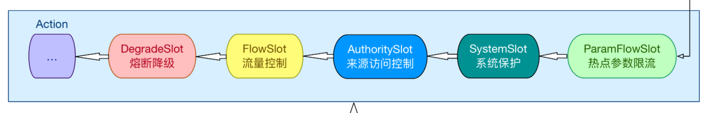

# Sentinel源码解析-Slot分析后续1

这节课我们继续分析Sentinel调用链路中的Slot，那么我们还是先来分析StatisticSlot：

## StatisticSlot定义：

StatisticSlot 是 Sentinel 最为重要的类之一，用于根据规则判断结果进行相应的统计操作。

entry 的时候：依次执行后面的判断 slot。每个 slot 触发流控的话会抛出异常（BlockException的子类）。若有 BlockException抛出，则记录 block 数据；若无异常抛出则算作可通过（pass），记录 pass 数据。

exit 的时候：若无 error（无论是业务异常还是流控异常），记录 complete（success）以及 RT，线程数-1。

记录数据的维度：线程数+1、记录当前 DefaultNode 数据、记录对应的 originNode 数据（若存在 origin）、累计 IN 统计数据（若流量类型为 IN）。

## 分析源码核心方法

首先我们从ClusterNodeSlot中的entry方法中找到调用下一节点方法，然后向下跟踪，道理和之前的都一样，调用的是父级方法

```java
fireEntry(context, resourceWrapper, node, count, prioritized, args);
//-------------------父级方法-----------------------------
@Override
public void fireEntry(Context context, ResourceWrapper resourceWrapper, Object obj, int count, boolean prioritized, Object... args)
    throws Throwable {
    if (next != null) {
        next.transformEntry(context, resourceWrapper, obj, count, prioritized, args);
    }
}    
```

找到transformEntry方法，然后此时的下一个节点必然是StatisticSlot

```java
@SuppressWarnings("unchecked")
void transformEntry(Context context, ResourceWrapper resourceWrapper, Object o, int count, boolean prioritized, Object... args)
    throws Throwable {
    T t = (T)o;
    //StatisticSlot
    entry(context, resourceWrapper, t, count, prioritized, args);
}
```

然后我们来看StatisticSlot的核心方法，这里的核心思想就是：封装了基础的流量统计和获取方法

```java
@Override
public void entry(Context context, ResourceWrapper resourceWrapper, DefaultNode node, int count,
                  boolean prioritized, Object... args) throws Throwable {
    try {
        // Do some checking.
        // 此位置会调用SlotChain中后续的所有Slot，完成所有规则检测。
        fireEntry(context, resourceWrapper, node, count, prioritized, args);

        // Request passed, add thread count and pass count.
        // 代码运行到这个位置，就证明之前的所有Slot检测都通过了，此时就可以统计请求的相应数据了。
        // 增加线程数（+1）
        node.increaseThreadNum();
        // 增加通过请求的数量(这里涉及到滑动窗口算法)
        node.addPassRequest(count);
		// .....以下全部是流量统计的方法
}
```

看到这里以后，我们对StatisticSlot作用已经比较了解了，那么现在我们主要要分析这个位置，也就是说向下分析一下的节点

```java
fireEntry(context, resourceWrapper, node, count, prioritized, args);
```

这里向下的节点调用方式和之前的都一样，所以剩下的节点非别为：



但是其实这里的ParamFlowSlot包括SystemSlot和AuthoritySlot我们在操作的时候其实就已经知道了它们就是根据不同维度进行统计和检测，那么这三个我们就不再详细分析，这条链路中我们要主要分析流控和熔断：FlowSlot、DegradeSlot

## FlowSlot定义：

这个slot 主要根据预设的资源的统计信息，按照固定的次序，依次生效。如果一个资源对应两条或者多条流控规则，则会根据如下次序依次检验，直到全部通过或者有一个规则生效为止:

- 指定应用生效的规则，即针对调用方限流的；
- 调用方为 other 的规则；
- 调用方为 default 的规则。

## 分析核心方法

进入到核心方法的方式和之前的都一样，所以我们直接来看

```java
@Override
public void entry(Context context, ResourceWrapper resourceWrapper, DefaultNode node, int count,
                  boolean prioritized, Object... args) throws Throwable {
    //检测并且应用流量规则
    checkFlow(resourceWrapper, context, node, count, prioritized);
    //触发下一个Slot
    fireEntry(context, resourceWrapper, node, count, prioritized, args);
}
```

那我们先来分析checkFlow方法

```java
void checkFlow(ResourceWrapper resource, Context context, DefaultNode node, int count, boolean prioritized)
    throws BlockException {
    // 在这里继续跟踪
    checker.checkFlow(ruleProvider, resource, context, node, count, prioritized);
}
//---------------checkFlow具体实现----------------------
public void checkFlow(Function<String, Collection<FlowRule>> ruleProvider, ResourceWrapper resource,
                      Context context, DefaultNode node, int count, boolean prioritized) throws BlockException {
    // 判断规则和资源不能为空
    if (ruleProvider == null || resource == null) {
        return;
    }
    // 获取到指定资源的所有流控规则
    Collection<FlowRule> rules = ruleProvider.apply(resource.getName());
    // 逐个应用流控规则。若无法通过则抛出异常，后续规则不再应用
    if (rules != null) {
        for (FlowRule rule : rules) {
            if (!canPassCheck(rule, context, node, count, prioritized)) {
                // FlowException继承BlockException
                throw new FlowException(rule.getLimitApp(), rule);
            }
        }
    }
}
```

这里我们需要注意一下FlowRule（流控规则），它继承自AbstractRule，那我们来看一下AbstractRule其中的两个类型，分别是资源名称和资源的来源

```java
private String resource;
private String limitApp;
```

那么通过这里我们就可以得知，流控的规则设置其实就是通过这个FlowRule来完成的，同样它的数据来源，就是我们使用的Sentinel-dashboard，当然也可以通过代码来进行设置

```java
public class FlowRule extends AbstractRule {

    public FlowRule() {
        super();
        // 来源默认Default
        setLimitApp(RuleConstant.LIMIT_APP_DEFAULT);
    }

    public FlowRule(String resourceName) {
        super();
        // 资源名称
        setResource(resourceName);
        setLimitApp(RuleConstant.LIMIT_APP_DEFAULT);
    }

    /**
     * The threshold type of flow control (0: thread count, 1: QPS).
     */
    // 设置阈值类型0是线程1为QPS
    private int grade = RuleConstant.FLOW_GRADE_QPS;

    /**
     * Flow control threshold count.
     */
    // 单机阈值
    private double count;

    /**
     * Flow control strategy based on invocation chain.
     * 直接流控
     * {@link RuleConstant#STRATEGY_DIRECT} for direct flow control (by origin);
     * 关联流控
     * {@link RuleConstant#STRATEGY_RELATE} for relevant flow control (with relevant resource);
     * 链路流控
     * {@link RuleConstant#STRATEGY_CHAIN} for chain flow control (by entrance resource).
     */
    // 流控模式
    private int strategy = RuleConstant.STRATEGY_DIRECT;

    /**
     * Reference resource in flow control with relevant resource or context.
     */
    // 关联流控模式，关联的资源设置
    private String refResource;

    /**
     * Rate limiter control behavior.
     * 0. default(reject directly), 1. warm up, 2. rate limiter, 3. warm up + rate limiter
     */
    // 流控效果 0快速失败 1预热（令牌桶算法） 2排队等待（漏斗算法） 3预热+排队等待（目前控制台没有）
    private int controlBehavior = RuleConstant.CONTROL_BEHAVIOR_DEFAULT;

    // warp up预热时长
    private int warmUpPeriodSec = 10;

    /**
     * Max queueing time in rate limiter behavior.
     */
    // 排队等待的超时时间
    private int maxQueueingTimeMs = 500;

    // 是否为集群模式
    private boolean clusterMode;
    /**
     * Flow rule config for cluster mode.
     */
    // 集群模式配置
    private ClusterFlowConfig clusterConfig;

    /**
     * The traffic shaping (throttling) controller.
     */
    private TrafficShapingController controller;

   // ....省略以下方法
}

```

这里还涉及到两个算法：令牌桶算法和漏斗算法

- 令牌桶算法：令牌桶算法的原理是系统会以一个恒定的速度往桶里放入令牌，而如果请求需要被处理，则需要先从桶里获取一个令牌，当桶里没有令牌可取时，则拒绝服务。
- 漏斗算法：漏桶算法思路很简单，请求先进入到漏桶里，漏桶以固定的速度出水，也就是处理请求，当水加的过快，则会直接溢出，也就是拒绝请求，可以看出漏桶算法能强行限制数据的传输速率。


