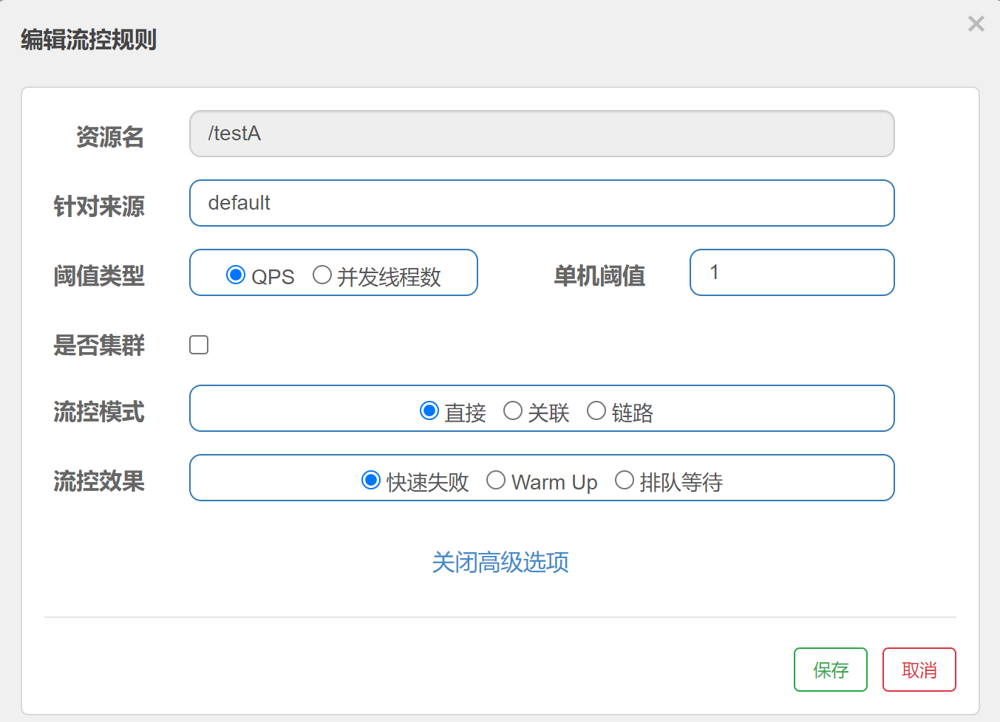
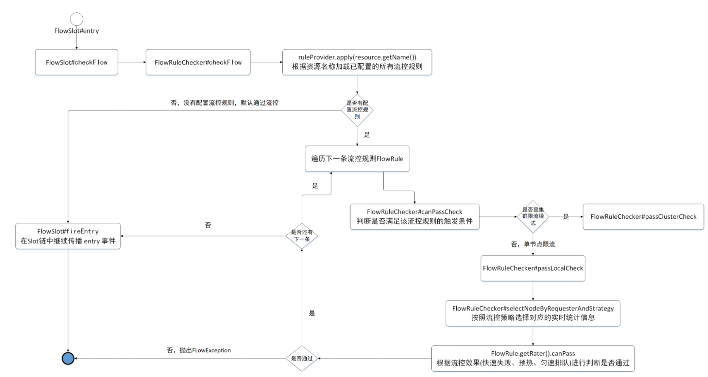

# Sentinel源码解析-Slot分析后续2

这节课我们继续分析Sentinel调用链路中的Slot，那么我们还是继续分析FlowSlot

## FlowSlot获取全部流控规则

上节课我们分析到这个位置，这节课我们主要研究一下如何获取全部的流控规则

```java
// 获取到指定资源的所有流控规则
Collection<FlowRule> rules = ruleProvider.apply(resource.getName());
// 逐个应用流控规则。若无法通过则抛出异常，后续规则不再应用
if (rules != null) {
    for (FlowRule rule : rules) {
        if (!canPassCheck(rule, context, node, count, prioritized)) {
            // FlowException继承BlockException
            throw new FlowException(rule.getLimitApp(), rule);
        }
    }
}
-------------------------------------------------------------------------------------------
// 这里调用的apply方法就是FlowSlot中的对应方法
private final Function<String, Collection<FlowRule>> ruleProvider = new Function<String, Collection<FlowRule>>() {
    @Override
    public Collection<FlowRule> apply(String resource) {
        // Flow rule map should not be null.
        // 获取所有资源和对应的流控规则 key为资源名称，value为该资源对应的所有流控规则
        Map<String, List<FlowRule>> flowRules = FlowRuleManager.getFlowRuleMap();
        // 获取指定资源的流控规则
        return flowRules.get(resource);
    }
};
```

那我们来看apply方法，要注意的是其中的**FlowRuleManager**其实如果我们通过代码的方式来设置流控就会使用到它，因为它提供了对应的方法FlowRuleManager.loadRules()

```java
/**
* Load {@link FlowRule}s, former rules will be replaced.
* 添加新的流控规则
* @param rules new rules to load.
*/
public static void loadRules(List<FlowRule> rules) {
    currentProperty.updateValue(rules);
}
```

但是现在这个位置源码用的FlowRuleManager.getFlowRuleMap()，其实通过这个方法我们就可以得知，FlowRuleManager的作用就是设置对应资源的流控规则，资源对应的流控规则(list集合)组成一个Map

```java
// 获取所有资源和对应的流控规则 key为资源名称，value为该资源对应的所有流控规则
Map<String, List<FlowRule>> flowRules = FlowRuleManager.getFlowRuleMap();
```

那我们现在来看FlowRuleChecker.checkFlow()方法如何应用规则，这里我们要注意遍历

```java
public void checkFlow(Function<String, Collection<FlowRule>> ruleProvider, ResourceWrapper resource,
                      Context context, DefaultNode node, int count, boolean prioritized) throws BlockException {
    // 判断规则和资源不能为空
    if (ruleProvider == null || resource == null) {
        return;
    }
    // 获取到指定资源的所有流控规则
    Collection<FlowRule> rules = ruleProvider.apply(resource.getName());
    // 逐个应用流控规则。若无法通过则抛出异常，后续规则不再应用
    if (rules != null) {
        for (FlowRule rule : rules) {
            // 遍历规则，应用规则，判断是否能够通过规则
            if (!canPassCheck(rule, context, node, count, prioritized)) {
                // FlowException继承BlockException
                throw new FlowException(rule.getLimitApp(), rule);
            }
        }
    }
}
```

那我们需要跟进去看一下canPassCheck方法

```java
public boolean canPassCheck(/*@NonNull*/ FlowRule rule, Context context, DefaultNode node, int acquireCount,boolean prioritized) {
    // 从规则中获取要限定的来源
    String limitApp = rule.getLimitApp();
    // 如果来源为空，则请求直接通过
    if (limitApp == null) {
        return true;
    }

    // 处理集群流控
    if (rule.isClusterMode()) {
        return passClusterCheck(rule, context, node, acquireCount, prioritized);
    }

    // 处理单机流控
    return passLocalCheck(rule, context, node, acquireCount, prioritized);
}
```

那么这里我们要关注的是处理单机流控的方法passLocalCheck

```java
private static boolean passLocalCheck(FlowRule rule, Context context, DefaultNode node, int acquireCount,
                                      boolean prioritized) {
    // 根据请求选择节点
    Node selectedNode = selectNodeByRequesterAndStrategy(rule, context, node);
    if (selectedNode == null) {
        return true;
    }

    // 根据配置FlowRule配置的流控效果(流控效果:直接拒绝、排队等待、预热)，选择不同的Controller，判断是否通过
    return rule.getRater().canPass(selectedNode, acquireCount, prioritized);
}
```

在这里我们来看一下根据请求来选择节点

```java
static Node selectNodeByRequesterAndStrategy(/*@NonNull*/ FlowRule rule, Context context, DefaultNode node) {
    // The limit app should not be empty.
    // 获取限定来源(调用方)、流控模式（直接）、获取context中的调用方（从当前上下文环境中获取）
    String limitApp = rule.getLimitApp();
    int strategy = rule.getStrategy();
    String origin = context.getOrigin();

    // 判断来源如果不是Default（默认）和Other（其他）
    if (limitApp.equals(origin) && filterOrigin(origin)) {
        if (strategy == RuleConstant.STRATEGY_DIRECT) {//直接
            // Matches limit origin, return origin statistic node.
            return context.getOriginNode();
        }

        return selectReferenceNode(rule, context, node);
        //如果是默认来源
    } else if (RuleConstant.LIMIT_APP_DEFAULT.equals(limitApp)) {
        // 是否是直接流控模式
        if (strategy == RuleConstant.STRATEGY_DIRECT) {//直接
            // Return the cluster node.
            // 返回统计数据
            return node.getClusterNode();
        }

        return selectReferenceNode(rule, context, node);
        // 其他来源other
    } else if (RuleConstant.LIMIT_APP_OTHER.equals(limitApp)
               && FlowRuleManager.isOtherOrigin(origin, rule.getResource())) {
        if (strategy == RuleConstant.STRATEGY_DIRECT) {
            return context.getOriginNode();
        }

        return selectReferenceNode(rule, context, node);
    }

    return null;
}
```

那到这为止，我们就知道如何获取流控规则和针对不同来源的不同操作，那么现在还有一个问题就是，就是这个位置的解析

```java
// 根据配置FlowRule配置的流控效果(流控效果:直接拒绝、排队等待、预热)，选择不同的Controller，判断是否通过
return rule.getRater().canPass(selectedNode, acquireCount, prioritized);
```

## 流控效果对应的Controller

其实这个位置的rule.getRater()的返回值类型为TrafficShapingController，而这里的类结构为：

```java
TrafficShapingController getRater() {
    return controller;
}
```


其实从这里我们就能看出针对不同的流控模式，针对不同的控制器来进行处理，那么我们这里演示一个DefaultController



那我们现在来看一下具体DefaultController的操作，在DefaultController中，首先获取当前的线程数或者QPS数，如果当前的线程数或者QPS+申请的数量>配置的总数，则不通过，如果当前线程数或者QPS+申请的数量<=配置的总数，则直接通过

```java
public class DefaultController implements TrafficShapingController {

    private static final int DEFAULT_AVG_USED_TOKENS = 0;

    private double count;
    private int grade;

    public DefaultController(double count, int grade) {
        this.count = count;
        this.grade = grade;
    }

    @Override
    public boolean canPass(Node node, int acquireCount) {
        return canPass(node, acquireCount, false);
    }

    @Override
    public boolean canPass(Node node, int acquireCount, boolean prioritized) {
        //获取当前node节点的线程数或者请求通过的qps总数
        int curCount = avgUsedTokens(node);
        //当前请求数（请求的令牌）+申请总数是否（已经消耗的令牌）>该资源配置的总数（阈值）
        if (curCount + acquireCount > count) {
            if (prioritized && grade == RuleConstant.FLOW_GRADE_QPS) {
                long currentTime;
                long waitInMs;
                currentTime = TimeUtil.currentTimeMillis();
                waitInMs = node.tryOccupyNext(currentTime, acquireCount, count);
                if (waitInMs < OccupyTimeoutProperty.getOccupyTimeout()) {
                    node.addWaitingRequest(currentTime + waitInMs, acquireCount);
                    node.addOccupiedPass(acquireCount);
                    sleep(waitInMs);

                    // PriorityWaitException indicates that the request will pass after waiting for {@link @waitInMs}.
                    throw new PriorityWaitException(waitInMs);
                }
            }
            return false;
        }
        return true;
    }

    private int avgUsedTokens(Node node) {
        if (node == null) {
            return DEFAULT_AVG_USED_TOKENS;
        }
        return grade == RuleConstant.FLOW_GRADE_THREAD ? node.curThreadNum() : (int)(node.passQps());
    }

    private void sleep(long timeMillis) {
        try {
            Thread.sleep(timeMillis);
        } catch (InterruptedException e) {
            // Ignore.
        }
    }
}
```

## 流程总结

