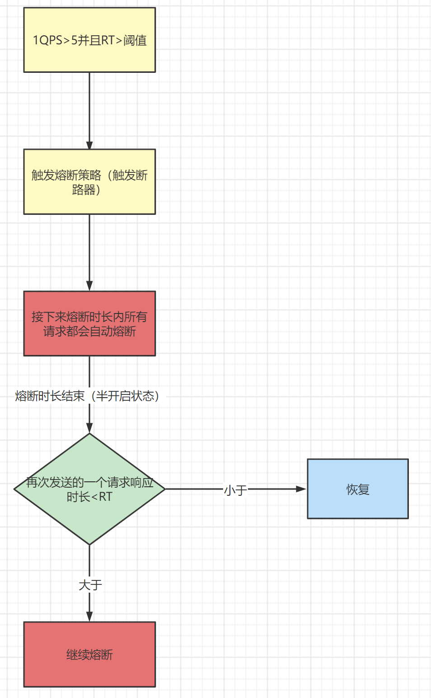
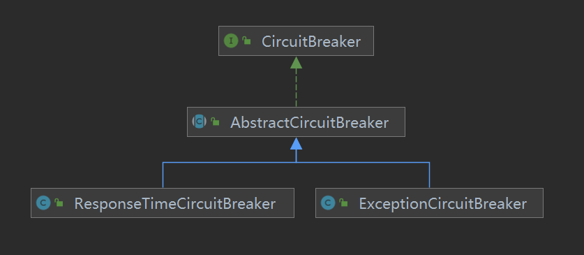
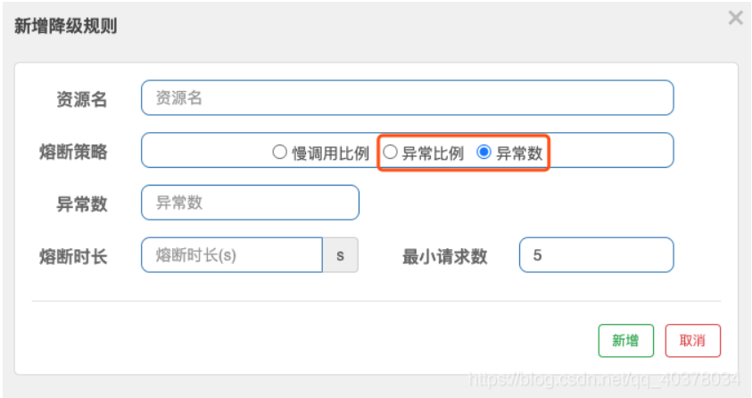

# Sentinel源码解析-熔断降级DegradeSlot解析

上节课我们分析完了限流FlowSlot，那么我们继续想下一个链路中的元素来看，下一个就是熔断降级的Slot，那我们直接来看核心方法

```java
//DegradeSlot.entry
@Override
public void entry(Context context, ResourceWrapper resourceWrapper, DefaultNode node, int count,
                  boolean prioritized, Object... args) throws Throwable {
    // 熔断降级检测
    performChecking(context, resourceWrapper);
    // 触发下一个节点
    fireEntry(context, resourceWrapper, node, count, prioritized, args);
}
```

那我们先来跟踪熔断降级检测的方法，在这里我们可以看见，这里其实就是对熔断器的状态进行判断

```java
void performChecking(Context context, ResourceWrapper r) throws BlockException {
    // 获取所有资源的熔断器
    List<CircuitBreaker> circuitBreakers = DegradeRuleManager.getCircuitBreakers(r.getName());
    // 判断是否获取到熔断器，如果为空直接结束
    if (circuitBreakers == null || circuitBreakers.isEmpty()) {
        return;
    }
    for (CircuitBreaker cb : circuitBreakers) {
          // 判断所有熔断器的状态，如果是开启状态直接抛出异常
        if (!cb.tryPass(context)) {
            // 此异常继承于BlockException
            throw new DegradeException(cb.getRule().getLimitApp(), cb.getRule());
        }
    }
}
```

而真正判断是否需要开启熔断器是在exit方法中进行的，这个方法是在业务方法执行以后调用了，熔断器需要收集业务异常或者业务的执行时间来判断是开启熔断

```java
@Override
public void exit(Context context, ResourceWrapper r, int count, Object... args) {
    // 如果当前其他的Slot已经有了BlockException，就直接跳过
    Entry curEntry = context.getCurEntry();
    if (curEntry.getBlockError() != null) {
        fireExit(context, r, count, args);
        return;
    }
    // 通过资源名称获取熔断器
    List<CircuitBreaker> circuitBreakers = DegradeRuleManager.getCircuitBreakers(r.getName());
    if (circuitBreakers == null || circuitBreakers.isEmpty()) {
        fireExit(context, r, count, args);
        return;
    }

    if (curEntry.getBlockError() == null) {
        // passed request
        // 调用CircuitBreaker的onRequestComplete()方法
        for (CircuitBreaker circuitBreaker : circuitBreakers) {
            circuitBreaker.onRequestComplete(context);
        }
    }

    fireExit(context, r, count, args);
}
```

在这个代码中，有一个比较关键的地方就是CircuitBreaker（熔断器），那我们来分析一下：

## CircuitBreaker熔断器

首先我们要知道其实CircuitBreaker是一个接口

```java
/**
 * 熔断器中将三种熔断策略封装（慢调用比例/异常比例/异常数）为两种熔断器：
 * 响应时间熔断器、异常熔断器
 */
public interface CircuitBreaker {

    /**
     * Get the associated circuit breaking rule.
     *
     * @return associated circuit breaking rule
     * 获取熔断规则
     */
    DegradeRule getRule();

    /**
     * Acquires permission of an invocation only if it is available at the time of invoking.
     *
     * @param context context of current invocation
     * @return {@code true} if permission was acquired and {@code false} otherwise
     * 判断是否需要降级 返回值为false开启降级
     */
    boolean tryPass(Context context);

    /**
     * Get current state of the circuit breaker.
     *
     * @return current state of the circuit breaker
     * 当前熔断器状态
     */
    State currentState();

    /**
     * <p>Record a completed request with the context and handle state transformation of the circuit breaker.</p>
     * <p>Called when a <strong>passed</strong> invocation finished.</p>
     *
     * @param context context of current invocation
     * 回调方法 当请求通过后触发
     */
    void onRequestComplete(Context context);

    /**
     * Circuit breaker state.
     * 三种熔断器状态：
     * OPEN开启
     * HALF_OPEN半开启
     * CLOSED关闭
     */
    enum State {
        /**
         * In {@code OPEN} state, all requests will be rejected until the next recovery time point.
         */
        OPEN,
        /**
         * In {@code HALF_OPEN} state, the circuit breaker will allow a "probe" invocation.
         * If the invocation is abnormal according to the strategy (e.g. it's slow), the circuit breaker
         * will re-transform to the {@code OPEN} state and wait for the next recovery time point;
         * otherwise the resource will be regarded as "recovered" and the circuit breaker
         * will cease cutting off requests and transform to {@code CLOSED} state.
         */
        HALF_OPEN,
        /**
         * In {@code CLOSED} state, all requests are permitted. When current metric value exceeds the threshold,
         * the circuit breaker will transform to {@code OPEN} state.
         */
        CLOSED
    }
}

```

以上代码中其中三种熔断状态对应的原理如下（这个原理在基础应用讲过）



## 熔断策略

对应的实现类有两个ExceptionCircuitBreaker（异常熔断器）、ResponseTimeCircuitBreaker（响应时间熔断器），这个我们可以从类图看到



那我们这里来看看ExceptionCircuitBreaker(异常熔断器)，对应的策略是



我们来看对应回调方法ExceptionCircuitBreaker.onRequestComplete

```java
@Override
public void onRequestComplete(Context context) {
    Entry entry = context.getCurEntry();
    if (entry == null) {
        return;
    }
    Throwable error = entry.getError();
    // 异常事件窗口计数器
    SimpleErrorCounter counter = stat.currentWindow().value();
    // 如果有异常，异常数+1
    if (error != null) {
        counter.getErrorCount().add(1);
    }
    // 总异常数+1
    counter.getTotalCount().add(1);

    handleStateChangeWhenThresholdExceeded(error);
}

private void handleStateChangeWhenThresholdExceeded(Throwable error) {
    // 如果熔断器已经开启直接返回
    if (currentState.get() == State.OPEN) {
        return;
    }

    // 进入半开启状态
    if (currentState.get() == State.HALF_OPEN) {
        // In detecting request
        if (error == null) {
            // 本次请求没有出现异常，关闭熔断器
            fromHalfOpenToClose();
        } else {
            // 本次请求出现异常，打开熔断
            fromHalfOpenToOpen(1.0d);
        }
        return;
    }

    List<SimpleErrorCounter> counters = stat.values();
    long errCount = 0; //异常数量
    long totalCount = 0; //总异常数
    for (SimpleErrorCounter counter : counters) {
        errCount += counter.errorCount.sum();
        totalCount += counter.totalCount.sum();
    }
    // 请求数量<最小的请求数量时不开启熔断
    if (totalCount < minRequestAmount) {
        return;
    }
    double curCount = errCount;
    // 熔断策略为慢调用比例
    if (strategy == DEGRADE_GRADE_EXCEPTION_RATIO) {
        // Use errorRatio
        // 计算百分比
        curCount = errCount * 1.0d / totalCount;
    }
    // 错误率或者错误数大于阈值时开启熔断
    if (curCount > threshold) {
        transformToOpen(curCount);
    }
}
```


