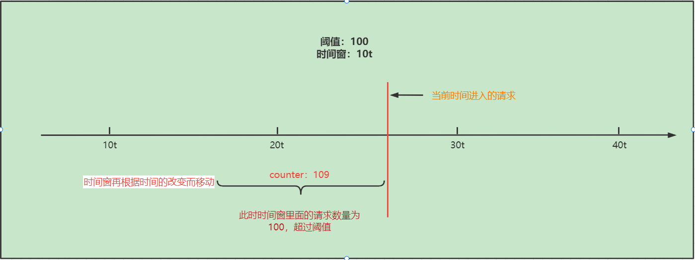
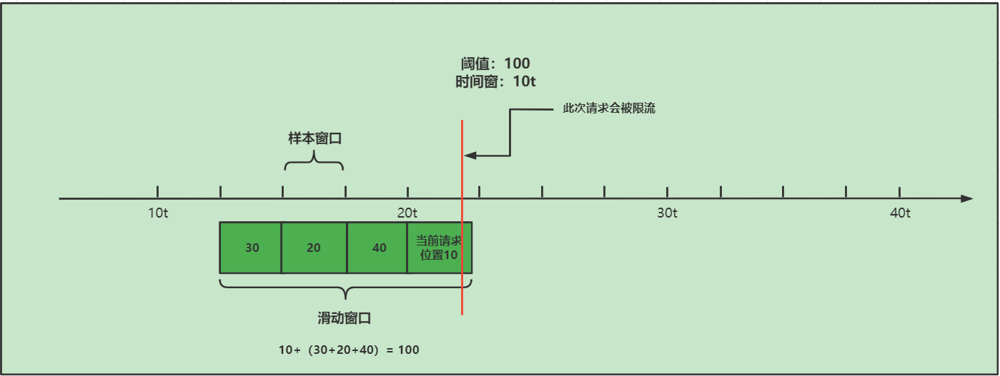
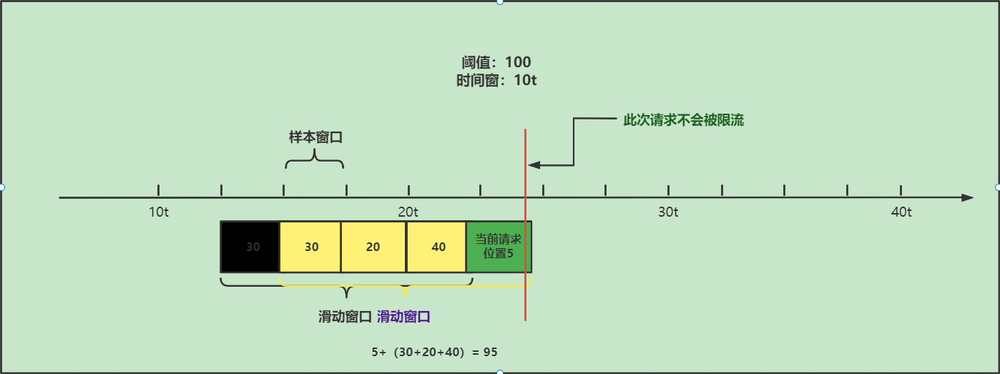

# Sentinel源码分析-滑动时间窗口算法原理

在之前的学习中，我们已经学习完成了Sentinel源码的Node关系、责任链调用，那么这节课我们就要学习Sentinel核心源码中的一个非常重要的算法“滑动时间窗口算法”

## 时间窗算法

那么在了解滑动时间窗算法之前，我们先要来了解时间窗算法，也可以称之为：固定时间窗算法

概念：固定时间窗口计数器算法思想：在固定的时间窗口内，可以允许固定数量的请求进入。超过数量就拒绝或者排队，等下一个时间段进入。

那我们来看图分析：

具体分析一下：

1. 将当前的时间分为10t大小的几个时间窗
2. 规则是阈值为100个请求数，每个时间窗里面的请求数量不能超过阈值100
3. 10t到16t进入请求10个，16t到20t进入请求50个，总数60个请求，没有超过阈值100
4. 20t到26t进入请求60个，26t到30t进入请求20个，总数80个请求，没有超过阈值100
5. 30t到40t之间进入请求120个，超过阈值20个，所以20个请求无法进入

存在问题：16t到26t之间也是10t大小的一个时间窗，但是请求总数为110，超过阈值，这种固定时间窗无法处理这部分超出的请求，解决办法就是使用滑动时间窗。

## 滑动时间窗算法

使用滑动时间窗的原因，就在于虽然以上提到超出阈值的部分分别在两个时间窗中，但是实际上我们要清楚，我们系统限流的目的是要在任意时间都要能应对突然的流量暴增，如果使用以上的算法，就会造成在16t和26t之间的请求无法限流，从而严重会导致服务雪崩。

要解决的话，我们就需要使用滑动时间窗算法，具体原理如下：

滑动时间窗限流算法解决了固定时间窗限流算法的问题。其没有划分固定的时间窗起点与终点，而是将每一次请求的到来时间点作为统计时间窗的终点，起点则是终点向前推时间窗长度的时间点。这种时间窗称为“滑动时间窗”

看图分析：

此图中我们可以分析中，实际上当前的时间窗不再是固定的，而是可以从时间的起始位置一直向右滑动

这样的话就可以解决固定时间窗带来的问题，如图所示：

其原理就是：

1. 当前时间窗口为滑动窗口，可以从左向右按照时间顺序进行滑动，并且大小为10t，同时此时的阈值为100
2. 红色线的位置进入一个请求，此时想要判断这个请求是否能够正常通过，就要看当前滑动窗口中的请求数量是否达到阈值，如果当前没有达到阈值100，就可以正常通过，但是如果一旦超过阈值，就会被进行限流。

没有超过阈值：

超过阈值：

但是此时滑动时间窗还是有问题的，问题就是会出现大量的重复统计，造成系统效率下降，如下图所示：

在此图中我们就可以看出，这个蓝色的区域就是重复统计的区域，也就是说每一次移动时间窗口，都需要重新统计重复区域的请求数量，从而导致浪费大量的系统资源。

 ## 滑动时间窗口算法-改进

想要解决以上的问题，我们就需要更加细粒度话的计算，增加多个子时间窗口：样本窗口

概念：

1. 样本窗口的长度必须小于滑动窗口长度，如果等于滑动窗口长度就会变成固定时间窗口
2. 一般滑动窗口长度是样本窗口的整数倍，比如：4*样本窗口=1个滑动窗口
3. 每个样本窗口在到达终点时间时，会统计本样本窗口中的流量数据并且记录下来。
4. 当一个请求达到时，会统计当前请求时间点所在的样本窗口中的流量数据，然后在获取当前请求时间的样本窗口以外的同一个滑动窗口中的样本窗口的统计数据，进行求和，如果没有超出阈值，则通过，否则就会被限流。

原理图：

下一个进入请求的时间点

此时这个请求将不会被限流，因为本次请求的时间的对应的样本窗口只有5个请求加上之前重复的样本窗口统计的流量值，没有超过阈值100，所以本次请求会通过。

