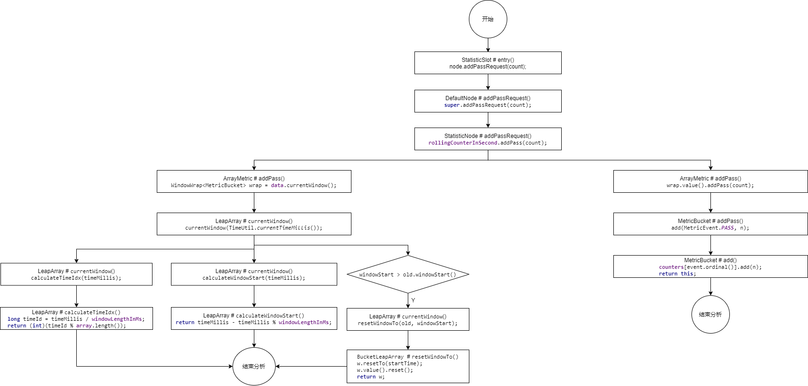
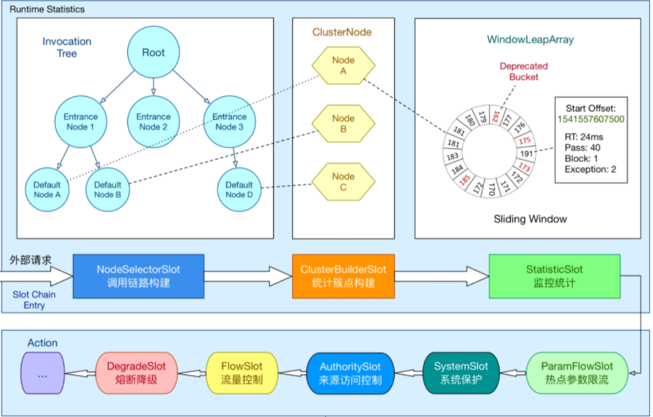
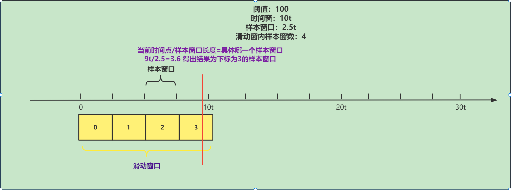
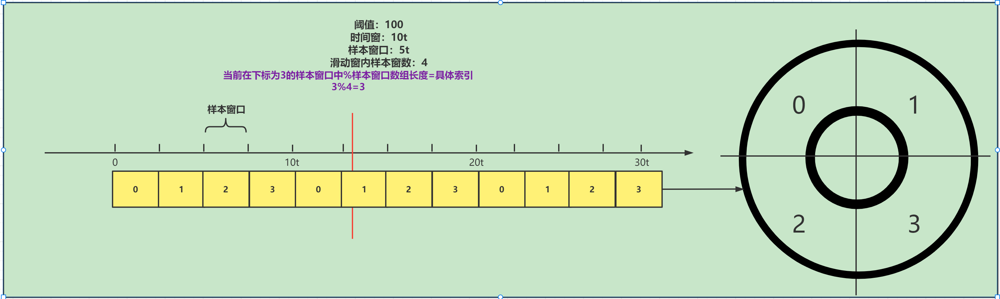
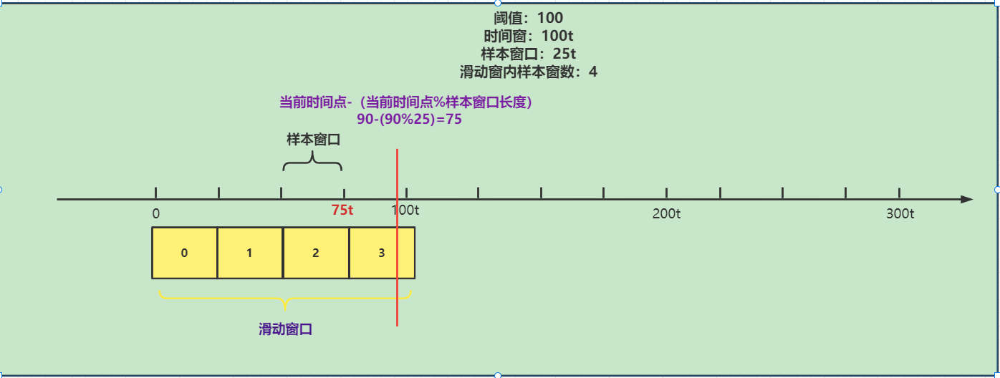
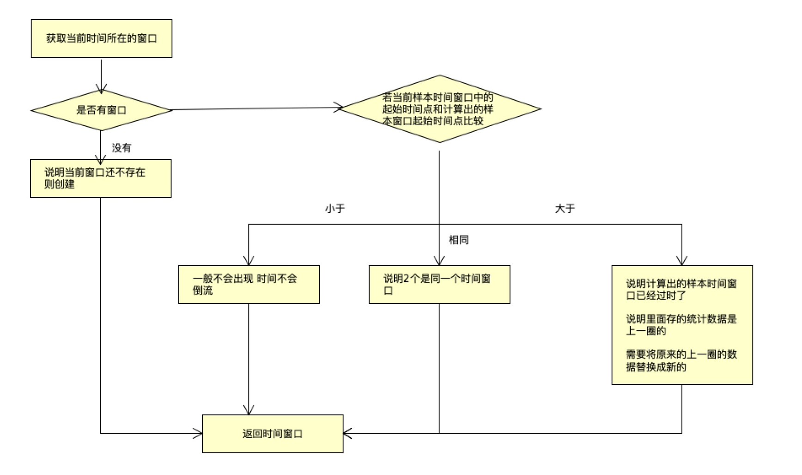
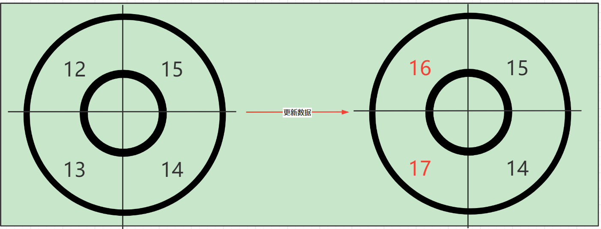

# Sentinel源码分析-Sentinel滑动时间窗口算法源码解析

上节课我们分析了Sentinel的滑动时间窗口算法原理，那么这节课我们来研究一下源码中的具体实现

## 整体流程图



## 源码分析

那我们就按照这个流程图来从头分析

首先看StatisticSlot.entry方法中node.addPassRequest(count)方法，这里我之前就提到过用到了滑动窗口算法，那我们来具体分析

```java
// 增加通过请求的数量(这里涉及到滑动窗口算法)
node.addPassRequest(count);
```

进入方法DefaultNode.addPassRequest

```java
@Override
public void addPassRequest(int count) {
    super.addPassRequest(count);
    this.clusterNode.addPassRequest(count);
}
```

继续向下跟踪

```java
@Override
public void addPassRequest(int count) {
    // 为滑动计数器增加本次的访问数据
    rollingCounterInSecond.addPass(count);
    rollingCounterInMinute.addPass(count);
}
```

最后进入ArrayMetric.addPass，这是一个使用数组保存数据的计量器类

```java
@Override
public void addPass(int count) {
    // 获取当前时间点所在的样本窗口
    WindowWrap<MetricBucket> wrap = data.currentWindow();
    // 将当前请求的计数量添加到当前样本窗口的统计数据中
    wrap.value().addPass(count);
}
```

先来跟踪data.currentWindow();

```java
public WindowWrap<T> currentWindow() {
    // 获取当前时间所在的样本窗口
    return currentWindow(TimeUtil.currentTimeMillis());
}
```

这里就会进入LeapArray（环形数组）中的currentWindow方法中,这个环形数组，其实就是Sentinel官方提供的原理图中的环形数组WindowLeapArray



```java
// 环形数组
public abstract class LeapArray<T> {
    // 样本窗口长度
    protected int windowLengthInMs;
    // 一个时间窗中包含的时间窗数量
    protected int sampleCount;
    // 时间窗长度
    protected int intervalInMs;
    private double intervalInSecond;
 
    // 这一个数组，元素为WindowWrap样本窗口
    // 注意，这里的泛型 T 实际为 MetricBucket 类型
    protected final AtomicReferenceArray<WindowWrap<T>> array;
 ......   
}  
```

这里要注意这个数组，这个数组里面所存放的类型就是WindowWrap窗口类型，泛型T是MetricBucket这里我们来看一下这个类型

```java
public WindowWrap(long windowLengthInMs, long windowStart, T value) {
    //样本窗口长度
    this.windowLengthInMs = windowLengthInMs;
    //样本窗口的起始时间戳
    this.windowStart = windowStart;
    //当前样本窗口的统计数据 其类型为MetricBucket
    this.value = value;
}
```

```java
//..LeapArray
public WindowWrap<T> currentWindow() {
    // 获取当前时间所在的样本窗口
    return currentWindow(TimeUtil.currentTimeMillis());
}
//------------------------------------------------------------
public WindowWrap<T> currentWindow(long timeMillis) {
        if (timeMillis < 0) {
            return null;
        }
        // 计算当前时间所在的样本窗口id，即在计算数组LeapArray中的索引
        int idx = calculateTimeIdx(timeMillis);
        // Calculate current bucket start time.
     	// 计算当前样本窗口的开始时间点
        long windowStart = calculateWindowStart(timeMillis);
     .....
 }
```

在这里我们先分析calculateTimeIdx方法

```java
private int calculateTimeIdx(/*@Valid*/ long timeMillis) {
    // 计算当前时间在那个样本窗口（样本窗口下标），当前时间/样本窗口长度
    long timeId = timeMillis / windowLengthInMs;
    // Calculate current index so we can map the timestamp to the leap array.
    // 计算具体索引，这个array就是装样本窗口的数组
    return (int)(timeId % array.length());
}
```

timeId（样本窗口下标）原理如下：



具体索引原理：



这里分析完成我们接着分析这里，计算当前样本窗口的起点

```java
// 计算当前样本窗口的开始时间点
long windowStart = calculateWindowStart(timeMillis);
//------------------------------
protected long calculateWindowStart(/*@Valid*/ long timeMillis) {
    // 计算当前样本窗口的起点 当前时间点-（当前时间点%样本窗口长度）
    return timeMillis - timeMillis % windowLengthInMs;
}
```

原理如下：



这里分析完成之后我们继续向下分析

```java
while (true) {
    // 获取到当前时间所在的样本窗口
    WindowWrap<T> old = array.get(idx);
    // 如果获取不到，表示没有创建
    if (old == null) {
        /*
                 *     B0       B1      B2    NULL      B4
                 * ||_______|_______|_______|_______|_______||___
                 * 200     400     600     800     1000    1200  timestamp
                 *                             ^
                 *                          time=888
                 *            bucket is empty, so create new and update
                 *
                 * If the old bucket is absent, then we create a new bucket at {@code windowStart},
                 * then try to update circular array via a CAS operation. Only one thread can
                 * succeed to update, while other threads yield its time slice.
                 */
        // 创建新的时间窗口
        WindowWrap<T> window = new WindowWrap<T>(windowLengthInMs, windowStart, newEmptyBucket(timeMillis));
        // 通过CAS方式将新建窗口放入Array
        if (array.compareAndSet(idx, null, window)) {
            // Successfully updated, return the created bucket.
            return window;
        } else {
            // Contention failed, the thread will yield its time slice to wait for bucket available.
            Thread.yield();
        }
        // 若当前样本窗口的起始时间点与计算出的样本窗口起始点相同，则说明两个是同一个样本窗口
    } else if (windowStart == old.windowStart()) {
        /*
                 *     B0       B1      B2     B3      B4
                 * ||_______|_______|_______|_______|_______||___
                 * 200     400     600     800     1000    1200  timestamp
                 *                             ^
                 *                          time=888
                 *            startTime of Bucket 3: 800, so it's up-to-date
                 *
                 * If current {@code windowStart} is equal to the start timestamp of old bucket,
                 * that means the time is within the bucket, so directly return the bucket.
                 */
        return old;
        // 若当前样本窗口的起始时间点 大于 计算出的样本窗口起始时间点，说明计算出的样本窗口已经过时了，
        // 需要将原来的样本窗口替换
    } else if (windowStart > old.windowStart()) {
        /*
                 *   (old)
                 *             B0       B1      B2    NULL      B4
                 * |_______||_______|_______|_______|_______|_______||___
                 * ...    1200     1400    1600    1800    2000    2200  timestamp
                 *                              ^
                 *                           time=1676
                 *          startTime of Bucket 2: 400, deprecated, should be reset
                 *
                 * If the start timestamp of old bucket is behind provided time, that means
                 * the bucket is deprecated. We have to reset the bucket to current {@code windowStart}.
                 * Note that the reset and clean-up operations are hard to be atomic,
                 * so we need a update lock to guarantee the correctness of bucket update.
                 *
                 * The update lock is conditional (tiny scope) and will take effect only when
                 * bucket is deprecated, so in most cases it won't lead to performance loss.
                 */
        if (updateLock.tryLock()) {
            try {
                // Successfully get the update lock, now we reset the bucket.
                // 替换掉老的样本窗口
                return resetWindowTo(old, windowStart);
            } finally {
                updateLock.unlock();
            }
        } else {
            // Contention failed, the thread will yield its time slice to wait for bucket available.
            Thread.yield();
        }
        // 当前样本窗口的起始时间点 小于 计算出的样本窗口起始时间点，
        // 这种情况一般不会出现，因为时间不会倒流。除非人为修改了系统时钟
    } else if (windowStart < old.windowStart()) {
        // Should not go through here, as the provided time is already behind.
        return new WindowWrap<T>(windowLengthInMs, windowStart, newEmptyBucket(timeMillis));
    }
}
```

这里的原理如下：



具体是如何替换的拿，我们来看源码

```java
// 替换掉老的样本窗口
return resetWindowTo(old, windowStart);
//------------------------------------------------------------
// BucketLeapArray.resetWindowTo
@Override
protected WindowWrap<MetricBucket> resetWindowTo(WindowWrap<MetricBucket> w, long startTime) {
    // Update the start time and reset value.
    // 更新窗口起始时间
    w.resetTo(startTime);
    // 将多维度统计数据清零
    w.value().reset();
    return w;
}
```

更新数据分析

```java
public MetricBucket reset() {
    // 将每个维度的统计数据清零
    for (MetricEvent event : MetricEvent.values()) {
        counters[event.ordinal()].reset();
    }
    initMinRt();
    return this;
}
```

最后我们再来看一下具体是那个维度，其实是通过维度

```java
@Override
public void addPass(int count) {
    // 获取当前时间点所在的样本窗口
    WindowWrap<MetricBucket> wrap = data.currentWindow();
    // 将当前请求的计数量添加到当前样本窗口的统计数据中
    wrap.value().addPass(count);
}
//----------------------------------------
public void addPass(int n) {
    add(MetricEvent.PASS, n);
}
```

