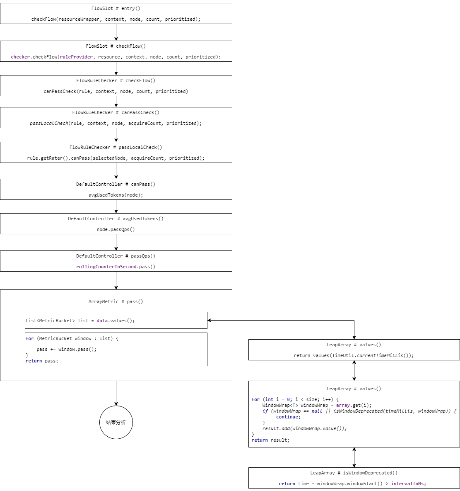
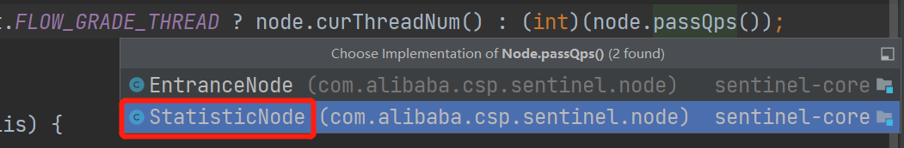

# Sentinel 源码分析-滑动窗口数据统计解析

## 源码结构图



## 分析源码

上节课我们通过分析源码已经知道了滑动窗口算法在Sentinel中的应用，那么这节课我们来研究一些其中的数据统计，首先入口我们就从限流的Slot：FlowSlot的entry方法入手：

```java
@Override
public void entry(Context context, ResourceWrapper resourceWrapper, DefaultNode node, int count,
                  boolean prioritized, Object... args) throws Throwable {
    //检测并且应用流控规则
    checkFlow(resourceWrapper, context, node, count, prioritized);
    //触发下一个Slot
    fireEntry(context, resourceWrapper, node, count, prioritized, args);
}

void checkFlow(ResourceWrapper resource, Context context, DefaultNode node, int count, boolean prioritized)
    throws BlockException {
    // 从这里进入
    checker.checkFlow(ruleProvider, resource, context, node, count, prioritized);
}
```

checkFlow方法里面找到遍历所有规则的canPassCheck方法然后在进入canPass方法，找到DefaultController对应实现，快速失败的流控效果，我们从这里来看，这里我们要关注的是avgUsedTokens方法，这个方法实际上就是获取当前时间窗里面的已经统计的数据

```java
@Override
public boolean canPass(Node node, int acquireCount, boolean prioritized) {
    //获取当前node节点的线程数或者请求通过的qps总数
    //获取当前时间窗已经统计的数据
    int curCount = avgUsedTokens(node);
    //当前请求数（请求的令牌）+申请总数是否（已经消耗的令牌）>该资源配置的总数（阈值）
    // 以前的数据+新的数据
    if (curCount + acquireCount > count) {
        if (prioritized && grade == RuleConstant.FLOW_GRADE_QPS) {
            long currentTime;
            long waitInMs;
            currentTime = TimeUtil.currentTimeMillis();
            waitInMs = node.tryOccupyNext(currentTime, acquireCount, count);
            if (waitInMs < OccupyTimeoutProperty.getOccupyTimeout()) {
                node.addWaitingRequest(currentTime + waitInMs, acquireCount);
                node.addOccupiedPass(acquireCount);
                sleep(waitInMs);

                // PriorityWaitException indicates that the request will pass after waiting for {@link @waitInMs}.
                throw new PriorityWaitException(waitInMs);
            }
        }
        return false;
    }
    return true;
}
```

所以这里我们跟进一下，看如何获取已经统计的数据

```java
private int avgUsedTokens(Node node) {
    // 如果没有选出node，代表没有做统计工作，直接返回0
    if (node == null) {
        return DEFAULT_AVG_USED_TOKENS;
    }
    // 判断阈值类型，如果为QPS，则返回当前统计的QPS
    // 如果为线程数，则返回当前的线程数总量
    return grade == RuleConstant.FLOW_GRADE_THREAD ? node.curThreadNum() : (int)(node.passQps());
}
```

这里实际上就是判断阈值类型，我们这里看QPS类型的统计



```java
@Override
public double passQps() {
    // rollingCounterInSecond.pass() 当前时间窗中统计的通过请求数量
    // rollingCounterInSecond.getWindowIntervalInSec() 时间窗口长度
    // 这两个数相除，计算出的就是QPS
    return rollingCounterInSecond.pass() / rollingCounterInSecond.getWindowIntervalInSec();
}
```

那么这里就需要查看pass方法，看是如何统计通过请求总量的

```java
@Override
public long pass() {
    // 更新array中当前时间点所在样本窗口实例中的数据
    data.currentWindow();
    long pass = 0;
    // 将当前时间窗口中的所有样本窗口统计的value读取出来，并且记录
    List<MetricBucket> list = data.values();
	
    for (MetricBucket window : list) {
        pass += window.pass();
    }
    return pass;
}
```

那么这里我们先跟踪values()，其实这里就是拿出没有过时有效的样本窗口数据

```java
public List<T> values() {
    return values(TimeUtil.currentTimeMillis());
}
// ----------------------------
public List<T> values(long timeMillis) {
    if (timeMillis < 0) {
        return new ArrayList<T>();
    }
    int size = array.length();
    List<T> result = new ArrayList<T>(size);
    // 这个遍历array中的每一个样本窗口实例
    for (int i = 0; i < size; i++) {
        WindowWrap<T> windowWrap = array.get(i);
        // 若当前遍历实例为空或者已经过时，则继续下一个
        if (windowWrap == null || isWindowDeprecated(timeMillis, windowWrap)) {
            continue;
        }
        result.add(windowWrap.value());
    }
    return result;
}
```

判断位置过时判断逻辑：

```java
public boolean isWindowDeprecated(long time, WindowWrap<T> windowWrap) {
    // 当前时间-样本窗口起始时间>时间窗口  说明过时了
    return time - windowWrap.windowStart() > intervalInMs;
}
```

那么这里分析完成以后我们再回到ArrayMetric中的pass方法中，看遍历方法，就是将所有的有效并且是通过维度的数据统计出来进行求和，看是否超过阈值。

```java
@Override
public long pass() {
    // 更新array中当前时间点所在样本窗口实例中的数据
    data.currentWindow();
    long pass = 0;
    // 将当前时间窗口中的所有样本窗口统计的value读取出来，并且记录
    List<MetricBucket> list = data.values();
	
    // 将List中所有pass维度的统计数据并取出求和
    for (MetricBucket window : list) {
        // 通过维度
        pass += window.pass();
    }
    return pass;
}
```

