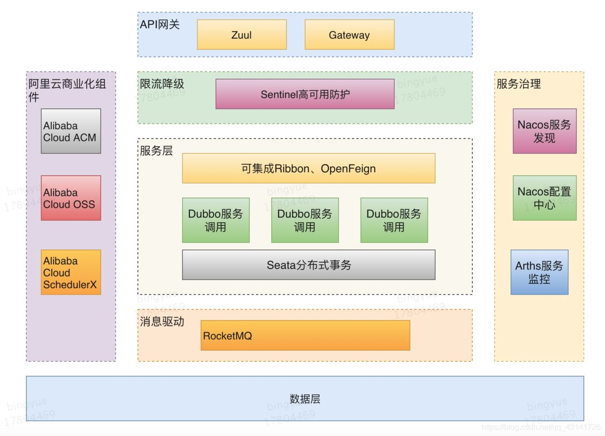

# Spring Cloud Alibaba 实战与源码深入剖析-导学篇

## 简介

Spring Cloud Alibaba 致力于提供微服务开发的一站式解决方案。此项目包含开发分布式应用微服务的必需组件，方便开发者通过 Spring Cloud 编程模型轻松使用这些组件来开发分布式应用服务。

依托 Spring Cloud Alibaba，您只需要添加一些注解和少量配置，就可以将 Spring Cloud 应用接入阿里微服务解决方案，通过阿里中间件来迅速搭建分布式应用系统。

### SpringCloudAlibaba整合SpringCloudNetflix

spring cloud Netflix 相关技术整体进入维护模式 Ribbon、Hystrix、zuul、Eureka、config等
spring cloud 整合Netflix
spring cloud alibaba 包含Netflix功能
中文介绍：https://github.com/alibaba/spring-cloud-alibaba/blob/master/README-zh.md

## 主要功能

1. 服务限流降级：默认支持 WebServlet、WebFlux, OpenFeign、RestTemplate、Spring Cloud Gateway, Zuul, Dubbo 和 RocketMQ 限流降级功能的接入，可以在运行时通过控制台实时修改限流降级规则，还支持查看限流降级 Metrics 监控。
2. 服务注册与发现：适配 Spring Cloud 服务注册与发现标准，默认集成了 Ribbon 的支持。
3. 分布式配置管理：支持分布式系统中的外部化配置，配置更改时自动刷新。
4. 消息驱动能力：基于 Spring Cloud Stream 为微服务应用构建消息驱动能力。
5. 分布式事务：使用 @GlobalTransactional 注解， 高效并且对业务零侵入地解决分布式事务问题。。
6. 阿里云对象存储：阿里云提供的海量、安全、低成本、高可靠的云存储服务。支持在任何应用、任何时间、任何地点存储和访问任意类型的数据。
7. 分布式任务调度：提供秒级、精准、高可靠、高可用的定时（基于 Cron 表达式）任务调度服务。同时提供分布式的任务执行模型，如网格任务。网格任务支持海量子任务均匀分配到所Worker（schedulerx-client）上执行。
8. 阿里云短信服务：覆盖全球的短信服务，友好、高效、智能的互联化通讯能力，帮助企业迅速搭建客户触达通道。
  

## 功能组件

1. Nacos：一个更易于构建云原生应用的动态服务发现、配置管理和服务管理平台。
2. Sentinel：把流量作为切入点，从流量控制、熔断降级、系统负载保护等多个维度保护服务的稳定性
3. RocketMQ：一款开源的分布式消息系统，基于高可用分布式集群技术，提供低延时的、高可靠的消息发布与订阅服务。
4. Dubbo：Apache Dubbo™ 是一款高性能 Java RPC 框架。
5. Seata：阿里巴巴开源产品，一个易于使用的高性能微服务分布式事务解决方案。
6. Alibaba Cloud OSS: 阿里云对象存储服务（Object Storage Service，简称 OSS），是阿里云提供的海量、安全、低成本、高可靠的云存储服务。您可以在任何应用、任何时间、任何地点存储和访问任意类型的数据。
7. Alibaba Cloud SchedulerX: 阿里中间件团队开发的一款分布式任务调度产品，提供秒级、精准、高可靠、高可用的定时（基于 Cron 表达式）任务调度服务。
8. Alibaba Cloud SMS: 覆盖全球的短信服务，友好、高效、智能的互联化通讯能力，帮助企业迅速搭建客户触达通道。

## 课程介绍

所有课程介绍内容和课程内容，都在课程链接中：https://www.mashibing.com/course/939

## 学习问题

1. 如果没有接触过SpringCloud，可以直接学习吗？

   可以直接学习，从头讲起

2. SpringCloudNetflix和Alibaba学习那个？

   NetFlix可以简单过一下，重点学习Alibaba

3. 现在市场上常用的SpringCloud解决方案是那种？

   不用考虑，就是SpringCloudAlibaba