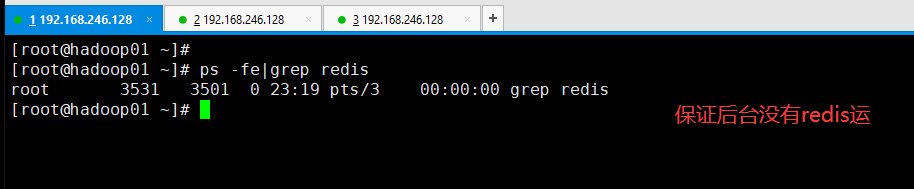
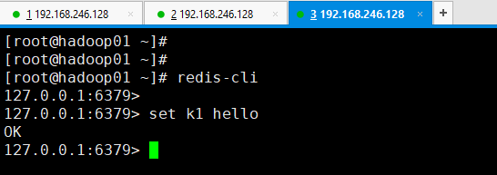
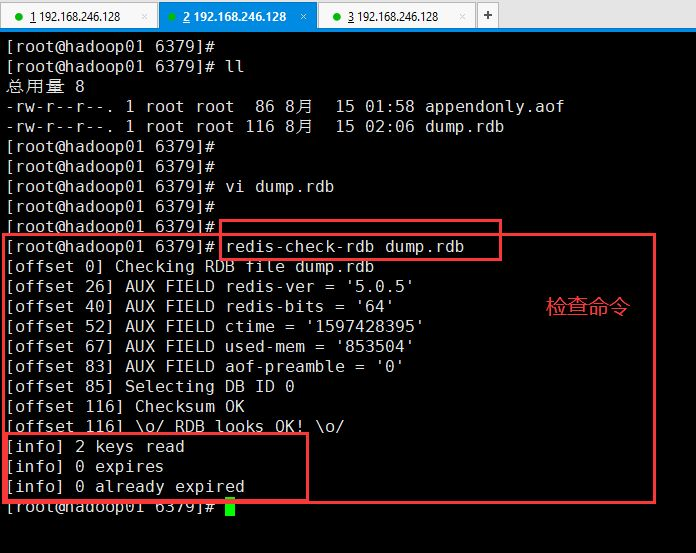

参考https://zhuanlan.zhihu.com/p/181647494

# 1.**fork()，从父进程分出一个子进程出来**

# 2.混合持久化：RDB+AOF

## RDB:

​	优点:速度快，体积小

​    缺点：缺失数据比较多

## AOF:

​	优点：缺失数据比较少

 	缺点：速度慢，体积大

# Redis（三）：持久化RDB，fork.copyonwrite，AOF，RDB&AOF混合使用

Redis的数据全部在内存里，如果突然宕机，数据就会全部丢失，因此必须有一种机制来保证Redis的数据不会因为故障而丢失，这种机制就是Redis的持久化机制。

Redis的持久化有两种，第一种是快照，第二种是AOF日志。快照是一次性全量备份，AOF日志是连续的增量备份。

第一种快照是内存数据的二进制序列化形式，在存储上非常紧凑，而第二种AOF日志记录的是内存数据修改的指令记录文本。

AOF日志在长期的运行过程中会变得无比庞大，数据库重启时需要加载AOF日志进行指令重放，这个时间就会很漫长，所以需要定期进行AOF重写，给AOF日志瘦身。

------

## 快照（RDB）的原理：

Redis是单线程程序，这个线程要同时负责：

```text
1、多个客户端socket的并发读写操作
2、内存数据结构的逻辑重写
```

在服务线上请求的同时，Redis还需要进行内存快照，内存快照要求Redis必须进行文件io操作，可是文件io操作不能使用多路复用的API。

这就意味着单线程在服务器上请求的同时，还要进行文件io操作，而文件io操作会严重拖累服务器的性能。

另外，为了不阻塞线上的业务，Redis需要一边持久化，一边相应客户端的请求。持久化的同时，内存数据结构还在变化，比如一个大型的hash字典正在持久化的时候，这时一个请求过来把它给删掉了，或者修改了，可是还没持久化完毕，这怎么办？Redis使用操作系统的多进程COW（Copy on Write）机制来实现快照持久化

------

## Fork多进程

Redis在持久化的时候会调用glicb的函数fork产生一个子进程，快照持久化完全交给子进程来处理，父进程继续处理客户端业务请求。子进程刚刚产生的时候和父进程共享内存里的代码段和数据段。

子进程做数据持久化的时候，不会修改现有内存数据结构，它只是对数据结构进行遍历读取，然后序列化写到磁盘上。

但是父进程不一样，必须持续服务客户端的请求，然后对内存数据结构进行不断的修改。这个时候就会使用OS的COW机制来进行数据段页面的分离。


如上图所示，数据段是由很多操作系统的页面组合而成，当父进程对其中一个页面的数据进行修改时，会将被共享的页面复制一份分离出来，然后对复制的这个页面进行修改。这时子进程相应的页面是没有变化的，还是进程产生时那一瞬间的数据。

随着父进程修改操作的持续进行，越来越多的共享页面被分离出来，内存就会持续增长，但是也不会超过原有数据的2倍大小。另外Redis实例里的冷数据占的比例往往是比较高的，所以很少会出现所有的页面都被分离的情况，被分离的往往只有其中一部分页面。每个页面的大小只有4KB，一个Redis实例里面一般都会有成千上万个页面。

子进程因为数据没有变化，它能看到的内存里的数据在进程产生的那一瞬间就凝固了，再也不会发生改变。这也是为何Redis的持久化叫做“快照”的原因了。接下来子进程就可以安心的遍历数据，进行序列化写到磁盘中了。

那现在就有一个问题了，父进程如果占了10G，那么子进程也占10G，redis的空间够不够呢？持久化的时候速度快不快呢？**其实父进程和子进程只保存了物理机的内存的地址，两份地址而已，指向的都是内存。所就不存在两个都占10G了。而父进程和子进程是通过fork（）出来的，还有就是子进程也不是一下就创建出来，其中的COW是copy on write，意思是写的时候才复制地址。创建子进程并不发生复制，玩的是指针。**

**例如看一下fork ：**

**输入 man 2 fork 命令**


然后输入/copy


NOTES

Under Linux, fork() is implemented using copy-on-write pages, so the only

penalty that it incurs is the time and memory required to duplicate the parent’s

page tables, and to create a unique task structure for the child.


Since version 2.3.3, rather than invoking the kernel’s fork() system call, the

glibc fork() wrapper that is provided as part of the NPTL threading implementa-

tion invokes clone(2) with flags that provide the same effect as the traditional

system call. The glibc wrapper invokes any fork handlers that have been estab-

lished using pthread_atfork(3).

在Linux下，fork()是使用写时复制的页面实现的，因此它带来的唯一损失是复制父页面表和为子页面创建唯一的任务结构所需的时间和内存。自从2.3.3版本以来，作为NPTL线程实现一部分提供的glibc fork()包装器没有调用内核的fork()系统调用，而是使用提供与传统系统调用相同效果的标志调用clone(2)。glibc包装器调用使用pthread_atfork(3)建立的任何fork处理程序。


就是父进程进行修改的时候，会新创建一个，然后指向，而子进程还是指向原来的。

```text
fork是系统调用，copy on write是内核机制。
redis调用fork（）优点是速度快，占用空间小。
```

关机维护的时候，用save命令，其余的一般都是bgsave


达到60秒了 操作数达到10000，满足其中一个，就会写rdb。依次类推，如果到900秒了，操作数达到1笔的时候，满足其中一个，就会写RDB。

Redis默认是开启RDB的，如果想关闭，那么就把下图中这个删除，或者 save ""


那么持久化的RDB文件存储在哪呢？继续往下翻：


## RDB的优缺点：

优点：1，压缩后的二进制文件，适用于备份、全量复制，用于灾难恢复

2，加载RDB恢复数据远快于AOF方式

缺点：1，无法做到实时持久化，每次都要创建子进程，频繁操作成本过高

2，保存后的二进制文件，存在老版本不兼容新版本rdb文件的问题

3，不支持拉链，只有一个dump.rdb

4，丢失数据相对较多，窗口数据容易丢失，8点做了一个rdb，假设9点又要做一个rdb，此时断电了，那么就丢了一个小时的数据。这是全量备份技术的通用的缺点。

**以上是RDB。**

------

## 针对RDB不适合实时持久化，redis提供了AOF持久化方式来解决

**AOF（append only file ）（只会向文件追加）**AOF日志存储的是Redis服务器的顺序指令序列，AOF日志只记录对内存进行修改的指令记录，假设AOF日志记录了自Redis实例创建以来所有的修改性指令序列，那么就可以通过对一个空的Redis实例顺序执行所有的指令--也就是“重放”，来恢复Redis当前实例的内存数据结构的状态。

Redis会在收到**客户端**修改指令后，进行参数校验、逻辑处理，如果没问题，就立即将该指令文本存储到AOF日志中，**也就是说，先执行指令才将日志存盘。这点不同于hbase等存储引擎，他们都是先存储日志再做逻辑处理的。**

**Redis**在长期运行的过程中，AOF日志会越来越长，如果实例宕机重启，重放整个AOF日志会非常耗时，导致Redis长时间无法对外提供服务，所以需要对AOF日志瘦身。

## AOF重写：

Redis 提供了 bgrewriteaof 指令用于对AOF日志进行瘦身，原理是开辟一个子进程对内存进行遍历，转换成一系列Redis的操作指令，序列化到一个新的AOF日志文件中。序列化完毕后再将操作期间发生增量AOF日志追加到这个新的AOF日志文件中，追加完毕后就立即替代旧的AOF日志文件了，瘦身工作就完成了。**而重写的意义是以后加载速度变快，减小AOF体积，比如set k1 a set k1 b set k1 c,就会在aof文件中出现这些记录，而此时k1对应的value是C，a和b是没用的，经过bgrewriteaof命令后，aof文件中将不再有a和b的影子，就只保留了k1 c。**

## fsync：

AOF日志是以文件的形式存在的，当程序对AOF日志文件进行写操作时，实际上是将内容写到了内核为文件描述符（File Descriptors ，简称fd ，很多fd就是 fds）分配到一个内存缓冲中，然后内核会异步将脏数据刷回到磁盘。这就意味着如果突然宕机，AOF日志内容可能还没来得及完全刷到磁盘中，这个时候就会出现日志丢失，这怎么办？不急，Linux的glibc提供了 fsync（int fd）函数可以将指定文件的内容强制从内核缓存刷到磁盘。只要Redis进程实时调用fsync函数就可以保证AOF日志不丢失。但是fsync是磁盘io操作，很慢，如果Redis执行一条指令就要 fsync 一次，那么Redis高性能的地位就不保了。所以在生产环境的服务器中，Redis通常是每隔1s左右执行一次 fsync 操作，这个1s周期是可以配置的。这是在数据安全性和性能之间做的一个折中，在保持高性能的同时，尽可能是数据少丢失。

**在Redis的主节点不会进行持久化操作，因为无论是AOF还是RDB都比较耗资源，持久化操作主要在从节点进行。从节点是备份节点，没有来自客户端请求的压力，它的操作系统资源往往比较充沛。**但是如果出现网络分区，从节点长期连不上主节点，就会出现数据不一致的问题，特别是在网络分区出现的情况下，主节点一旦不小心宕机了，那么数据就会丢失，所以在生产环境下要做好实时监控工作，保证网络畅通或者能快速修复。另外还应该再增加一个从节点以降低网络分区的概率，只要有一个从节点数据同步正常，数据也就不会轻易丢失。


假设AOF文件是10T，那么恢复的时候不会内存溢出，因为只要写写写直到AOF文件成了10T,但凡能写到10个T，那肯定没有内存溢出。所以恢复的时候也不会内存溢出。如果要溢出的话，那么早就溢出了，还能把AOF文件写到10个T么？

下来说AOF的配置：


vi 6379.conf， 不是vim 用 vi 打开 上面写错了。


总是，每秒，从不。红框中的，fsync上面说过了

## Redis4.0混合持久化：

重启Redis时，很少使用rdb的方式恢复内存状态，因为rdb会丢失大量数据。通常使用AOF日志重放，但是重放AOF日志相对于使用rdb来说慢很多，这样在Redis实例很大的情况下，启动需要花很长的时间。

**Redis4.0带来了一个新的持久化选项--混合持久化。将rdb的内容和增量的AOF日志文件存在一起。这里的AOF不再是全量的日志，而是自持久化开始到持久化结束的这段时间发生的增量AOF日志，通常这部分AOF日志很小。一定是重写之后才开始混合，比如开启了混合持久化后，set k1 v1 set k1 v2 等等 一定是输入 bgrewriteaof 命令后，前面的一系列操作就变成了 RDB形式，保存在aof文件中，后续继续set k3 v3 的时候，是以明文的形式追加到aof文件中**

于是，在Redis重启的时候，可以先加载rdb的内容，然后再重放增量AOF日志，就可以完全替代之前的AOF全量文件重放，重启效率得到大幅提升。

------

下来演示一下redis持久化




下来改配置文件：来验证rdb和aof是什么概念

vi /etc/redis/6379.conf


把daemonize yes改成daemonize no ，表示不让redis变成后台服务进程运行，成为前台阻塞的运行。


打开AOF持久化，因为RDB是默认开启的不用管

原来是no，改成yes

然后把混合持久化关闭


现在准备工作已经做好了，打开了aof，打开了rdb（默认开启），关闭了混合持久化。

我现在是在root根目录：


然后把1号shell窗口切换到etc下的redis目录：


然后切换到2号shell窗口：


然后切回到1号shell窗口，启动redis


然后切回到2号shell窗口，LL看一下


然后 vi appendonly.aof，发现什么都没有记录


然后在3号shell打开 redis 6379 客户端


然后设置一个kv。set k1 hello



然后切回到2号shell。LL看一下，因为不满足rdb的那三个条件


所以可以看到还是只落了一个aof文件


打开这个aof文件看一下


*2代表：两个元素组成 一个是 select 另一个是 0号库


然后在3号shell 继续输入 set k2 xxoo


然后切换到2号shell 查看 aof文件：


然后想一下 把这两笔数据 弄到rdb里面去。在3号shell 输入 bgsave


然后在2号shell查看：


然后1号shell窗口 会发生


然后切换到2号shell，打开这个dump.rdb




下来看一下 aof 的重写功能：


那么aof文件会相应的增长很多对k1的操作：


那现在k1的最终value是c，所以以上k1之前的value值都是垃圾。所以给aof文件瘦身一下：瘦身前是170字节


然后在3号shell 窗口 ：输入bgrewriteaof


然后在2号shell 看一下 目前 aof的大小 ：


然后打开aof文件：


------

然后在1号shell 中 ctrl +c 结束：


把3号shell的客户端 也退出去 exit，把2号的aof和rdb文件也全部删除 rm -fr ./*

然后切到1号shell，改配置：


开启混合持久化：


保存后，启动redis：


然后2号shell 里还是一个空的 aof，没毛病


然后3号shell开启redis客户端 ：set 两次


然后在2号shell 看一下：然并卵，不是混合持久化。


然后继续3号shell 写，写完后bgrewriteaof


现在是混合持久化：所以查看2号shell：没有增量前是103字节


打开，可以看到变成了二进制的rdb了。和以前的aof文件不一样


然后继续set两条记录 3号shell：


然后转到2号shell：查看aof文件：变成104字节了。


我不知道为什么，我打开看不到增量的内容，可能是io的延迟吧，不知道出什么bug了。


这下能看了：


dump.rdb


appendonly.aof


appendonly yes (默认不开启，为no)