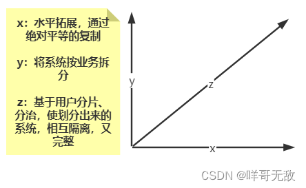
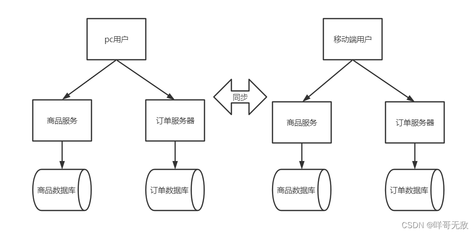

**微服务akf**

2022-05-20 16:44:01

AKF是指可拓展模型，有3个坐标轴，分别是x，y，z

为了更好的诠释AKF原则，下面假定有一个系统
基于x轴拓展：
这种方式只能拓展无状态服务，是通过复制系统应用到其他服务器上，再通过给集群做负载均衡，来达到获取更大的吞吐量，这种方式拓展系统简单高效，开发成本几乎为零。

这种方式在随着业务量增加，所有的业务请求都打入到同一个数据库导致数据库操作变慢时，此时可以按照业务拆分，即AKF原则中的基于Y轴拓展。

基于y轴拓展：

例如按照读写操作把单机数据库拓展为主备分布式数据库，主库支持读写操作，备库只支持读操作。在业务中把商品功能拆分到一个服务中，把订单功能拆分到一个服务中。随着粒度的变小，数据库的规模也更小，性能也会随之提升。但维护成本和开发成本会提高。

基于z轴拓展：
z 轴扩展通常是指基于请求者或用户独特的需求，关系型数据库中分库分表就是按z轴拓展的最好实践。如下图不同的用户群组有不同的服务节点
